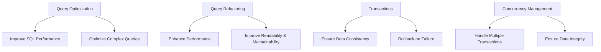
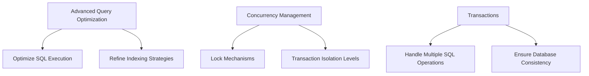
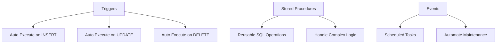
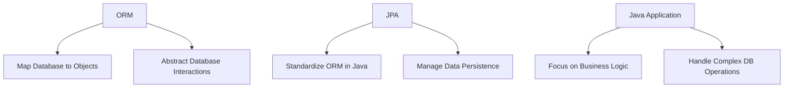

# Summert of Database Solution topics
## Important Note:
*This summary is not intended for learning material. For the exam, you must review the details of the respective weeks in GitHub and the provided lecture notes in Moodle.* 

## Week 1: Logical Design and Database Concepts

**Introduction**  
Logical design is a crucial step in the database design process, where a conceptual data model is translated into a logical data model. This week covers foundational concepts such as database performance simulation, indexing techniques, and temporal databases.

**Key Concepts:**
- **Logical Design**: Focuses on defining the structure of data elements and their relationships, independent of physical implementation.
- **Database Performance Simulation**: Involves testing different scenarios to assess how factors like indexing and query optimization impact performance.
- **Indexing**: Enhances data retrieval speed by creating a data structure that allows for fast access to rows in a table.
- **Temporal Database**: Keeps track of historical data, making it suitable for time-sensitive applications like financial systems.

_Practical Example:_ A retail system where indexing is used to speed up product searches, and a temporal database is applied to track pricing changes over time.

```mermid
graph TD
    A[Logical Design] --> B[Define Data Structure]
    A --> C[Define Data Relationships]
    D[Database Performance Simulation] --> E[Analyze Indexing]
    D --> F[Simulate Query Performance]
    G[Indexing] --> H[Improve Data Retrieval Speed]
    I[Temporal Database] --> J[Track Historical Data]
    I --> K[Manage Time-Sensitive Data]

```

---

## Week 2: Query Optimization and Transactions in MariaDB

**Introduction**  
This week focuses on optimizing SQL queries and managing database transactions. Topics include query refactoring for performance improvements and concurrency management to ensure data consistency in multi-user environments.

**Key Concepts:**
- **Query Optimization in MariaDB**: Techniques to ensure SQL queries are executed efficiently.
- **Query Refactoring**: Modifying queries for better performance without changing their functionality.
- **Transactions**: Ensure a sequence of SQL operations is executed as a single unit of work, maintaining data integrity.
- **Concurrency Management**: MariaDB uses locks and isolation levels to handle multiple transactions simultaneously without data conflicts.

_Practical Example:_ Optimizing an e-commerce system's checkout process to reduce transaction times and prevent data inconsistencies when multiple users are purchasing items.



---

## Week 3: Advanced Query Optimization and Concurrency

**Introduction**  
Building on the concepts from Week 2, this week delves deeper into advanced query optimization and the mechanisms MariaDB uses to handle concurrency. These are essential for managing complex, high-traffic systems.

**Key Concepts:**
- **Advanced Query Optimization**: Further techniques to improve SQL performance.
- **Concurrency Management**: Prevents conflicts when multiple transactions access the same data.
- **Transactions and Rollbacks**: Ensure the database remains consistent even when operations fail.

_Practical Example:_ A social media platform optimizing database queries for user activity feeds while managing concurrent actions like posting comments and likes.


---

## Week 4: Triggers, Stored Procedures, and Events

**Introduction**  
This week introduces automation in databases with triggers, stored procedures, and scheduled events. These tools enable databases to handle routine tasks efficiently and respond to changes in real-time.

**Key Concepts:**
- **Triggers**: Automatically execute actions like updating timestamps when certain events (INSERT, UPDATE, DELETE) occur.
- **Stored Procedures**: Reusable SQL code blocks that can handle complex operations.
- **Events**: Automate tasks such as regular data cleanup or report generation at scheduled intervals.

_Practical Example:_ A payroll system where triggers automatically log changes to employee salary records and events schedule monthly payroll calculations.



---

## Week 5: ORM and JPA in Java Applications

**Introduction**  
This week covers the basics of Object-Relational Mapping (ORM) and the Java Persistence API (JPA), essential tools for simplifying database interactions in Java applications.

**Key Concepts:**
- **ORM**: Abstracts database interactions into an object-oriented paradigm.
- **JPA**: Provides a standard for ORM in Java applications, simplifying data handling.
  
_Practical Example:_ Developing a blogging platform where JPA is used to manage posts, comments, and user profiles, streamlining database operations while focusing on business logic.




---

## Week 6: Entity Relationships in ORM (One-to-One, Many-to-Many)

**Introduction**  
Entity relationships are crucial for mapping data in relational databases. This week explores one-to-one and many-to-many associations and how to manage these relationships using JPA annotations.

**Key Concepts:**
- **One-to-One Association**: Connects two entities where each instance relates to only one instance of the other entity.
- **Many-to-Many Association**: Connects multiple instances of two entities.
- **Join Tables**: Used in many-to-many relationships to map associations.
- **Cascading and Fetching**: Defines how relationships propagate operations and how data is retrieved.

_Practical Example:_ A school management system where students and courses are linked through a many-to-many relationship, allowing for easy association between enrolled students and available courses.


```mermaid
graph TD
    A[One-to-One Association] --> B[Person] --> C[Password]
    A --> D[@OneToOne Annotation]
    E[Many-to-Many Association] --> F[Student] --> G[Course]
    E --> H[@ManyToMany Annotation]
    I[Join Table] --> J[Map Relationship Between Entities]
    K[Cascading] --> L[Cascade Operations]
    K --> M[Fetching] --> N[Control Data Loading]


```


---

## Week 7: Object-Level Concurrency and Locking in JPA

**Introduction**  
Concurrency in object-relational mapping is vital for ensuring data consistency in multi-user applications. This week focuses on managing concurrent transactions using optimistic and pessimistic locking techniques in JPA.

**Key Concepts:**
- **Optimistic Locking**: Assumes no conflicts will occur and checks for consistency when committing transactions.
- **Pessimistic Locking**: Locks data to prevent conflicts during simultaneous transactions.
- **Implementation in JPA**: Uses the `@Version` annotation to handle versioning and prevent concurrent data modifications.

_Practical Example:_ A collaborative document editing application where optimistic locking is used to prevent overwriting changes when multiple users are editing the same document simultaneously.


```mermaid
graph TD
    A[Optimistic Locking] --> B[Assume No Conflicts]
    A --> C[Check for Conflicts at Commit]
    D[Implementation in JPA] --> E[@Version Annotation]
    F[Pessimistic Locking] --> G[Lock Data on Access]
    F --> H[Prevent Conflicts in Real-Time]
    I[Concurrent Transactions] --> J[Manage Simultaneous Data Access]


```

