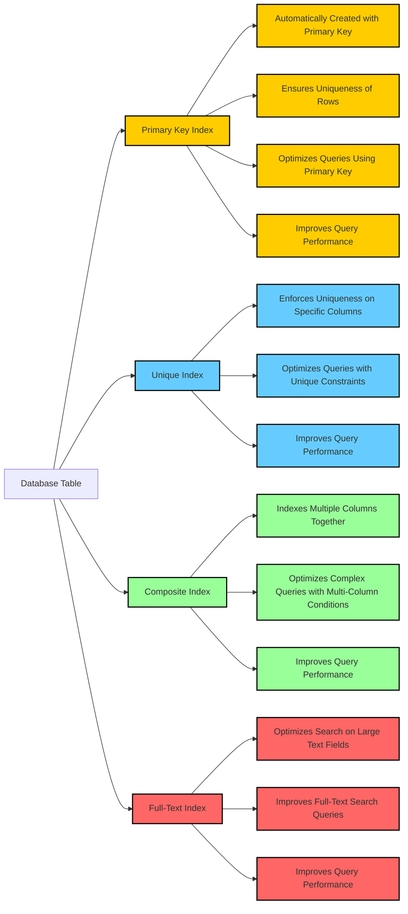

# Topics that we'll cover in Week 1
1. [Database Performance Simulations](#Database-Performance-Simulations)
2. [Database Normalization](#Database-Normalization)
3. [Indexing in Databases](#Indexing-in-Databases)
4. [Temporal Database Design](#Temporal-Database-Design)
5. [Modeling-History-Tables](#Modeling-History-Tables)

_______________________________________________________________________________________________________________________________________________________________________

# Database Performance Simulations

## Introduction  
Understanding database performance is critical for ensuring efficiency, scalability, and reliability in database systems. This guide provides a structured and practical overview of concepts, tools, and methodologies used to simulate and analyze database performance. Whether you are a developer, database administrator, or performance engineer, this material will help you grasp key concepts and techniques.

   - ### Potential scenario:
      - An e-commerce platform is experiencing slow performance during peak shopping periods, such as Black Friday sales. The database is struggling to handle the large number of concurrent users,       high transaction volume, and complex queries for product searches, order processing, and inventory management.
      - To identify the root cause and optimize the database, a performance simulation is conducted.
---

## Table of Contents  

1. [Why Simulate Database Performance?](#why-simulate-database-performance)  
2. [Key Concepts](#key-concepts)  
   - [Workloads](#workloads)  
   - [Metrics](#metrics)  
   - [Bottlenecks](#bottlenecks)  
3. [Tools and Environments](#tools-and-environments)  
   - [Simulation Tools](#simulation-tools)  
   - [Test Databases](#test-databases)  
4. [Setting Up a Simulation](#setting-up-a-simulation)  
   - [Step-by-Step Guide](#step-by-step-guide)  
   - [Example Scenarios](#example-scenarios)  
5. [Analyzing Simulation Results](#analyzing-simulation-results)  
   - [Performance Metrics](#performance-metrics)  
   - [Visualization Techniques](#visualization-techniques)  
6. [Best Practices](#best-practices)  
7. [Conclusion](#conclusion)  
8. [Further Reading](#further-reading)  

---

## Why Simulate Database Performance?  
Simulating database performance is essential for:  
- **Identifying Bottlenecks:** Pinpoint areas that limit database performance.  
- **Testing Configurations:** Evaluate the impact of different settings, such as indexing or cache size.  
- **Capacity Planning:** Understand system behavior under increasing workloads for scalability.  
- **Resource Optimization:** Ensure efficient use of CPU, memory, and I/O resources.  
- **Performance Tuning:** Achieve faster query execution and improved overall responsiveness.  

---

## Key Concepts  

### Workloads  
A **workload** represents the set of database operations (e.g., queries, transactions) executed within a simulation. Workloads should reflect real-world usage to ensure accurate results.

### Metrics  
Performance metrics provide quantifiable insights into database behavior:  
- **Latency:** Time taken to process a single operation.  
- **Throughput:** Number of operations completed per unit of time.  
- **Resource Utilization:** CPU, memory, and I/O usage.  
- **Concurrency:** Number of simultaneous transactions or queries.  

### Bottlenecks  
A **bottleneck** is any component (e.g., CPU, disk, or network) that restricts database performance. Identifying and mitigating bottlenecks is a key focus of performance simulations.

---

## Tools and Environments  

### Simulation Tools  
The following tools are commonly used for database performance simulations:  
- [**Apache JMeter:**](https://jmeter.apache.org/) An open-source tool for load testing and performance measurement.  
- [**Sysbench:**](https://manpages.ubuntu.com/manpages/trusty/man1/sysbench.1.html) A scriptable, multi-threaded benchmarking tool for evaluating database performance.  
- [**HammerDB:**](https://www.hammerdb.com/) A load testing and benchmarking tool specifically designed for databases.  

### Test Databases  
Use industry-standard benchmarks to simulate real workloads:  
- [**TPC-C:**](https://www.tpc.org/tpcc/) Measures OLTP (Online Transaction Processing) performance.  
- [**TPC-H:**](https://www.tpc.org/tpch/) Simulates decision-support and data warehousing workloads.  

---

## Setting Up a Simulation  

### Step-by-Step Guide  
1. **Define Objectives:** Determine what you want to analyze (e.g., bottlenecks, configuration changes).  
2. **Select Tools:** Choose appropriate tools for the simulation (e.g., [JMeter](https://jmeter.apache.org/), [Sysbench](https://manpages.ubuntu.com/manpages/trusty/man1/sysbench.1.html)).  
3. **Prepare Environment:** Set up a controlled test environment to isolate variables.  
4. **Create Workloads:** Design realistic workloads that simulate actual database usage.  
5. **Run Simulations:** Execute the workloads and collect performance metrics.  
6. **Analyze Results:** Interpret the data to identify bottlenecks and optimization opportunities.  

### Example Scenarios  
- **Configuration Changes:** Test the effect of different indexing strategies or cache sizes.  
- **Hardware Upgrades:** Measure performance improvements from adding CPUs, RAM, or faster storage.  
- **Scaling Workloads:** Simulate increasing user loads to plan for horizontal or vertical scaling.  

---

## Analyzing Simulation Results  

### Performance Metrics  
Key metrics to analyze include:  
- **Latency:** Monitor delays for query execution.  
- **Throughput:** Evaluate the number of queries or transactions processed per second.  
- **Resource Utilization:** Assess CPU, memory, and I/O usage to find inefficiencies.  

### Visualization Techniques  
Visualizing simulation results helps identify patterns and trends:  

- [**Grafana:**](https://grafana.com/) Create interactive dashboards for performance data.  
- **Excel/Google Sheets:** Generate charts and graphs for simple analysis.  
- **Tableau:** Advanced visualization for large datasets.  

---

## Best Practices  
To ensure reliable simulations and actionable results:  
1. **Isolate Variables:** Change one parameter at a time to understand its effect.  
2. **Repeat Tests:** Run simulations multiple times to confirm consistency.  
3. **Use Realistic Workloads:** Simulate workloads that match production scenarios.  
4. **Monitor System Health:** Keep an eye on CPU, memory, and disk usage during tests.  
5. **Document Results:** Maintain a clear record of test configurations, results, and findings.  

---

## Conclusion  
Database performance simulation is an invaluable technique for optimizing database systems, planning for scalability, and diagnosing performance issues. By leveraging tools, benchmarks, and best practices, you can gain deep insights into database behavior and make data-driven decisions to improve efficiency.  

---

## Further Reading  
For additional learning and resources:  
- [Database Benchmarking Guide](https://www.example.com/database-benchmarking-guide)  
- [Performance Tuning for SQL Databases](https://www.example.com/sql-performance-tuning)  
- [Load Testing with Apache JMeter](https://www.example.com/jmeter-load-testing)  

---

This guide is structured to be clear, actionable, and easy to follow, making it an excellent resource for anyone looking to understand and improve database performance.  

---------------------------------------------------------------------------------------------------

# Database Normalization  

## Table of Contents  
1. [Introduction](#introduction)  
2. [Why Normalize?](#why-normalize)  
3. [Normalization Forms](#normalization-forms)  
   - [First Normal Form (1NF)](#first-normal-form-1nf)  
   - [Second Normal Form (2NF)](#second-normal-form-2nf)  
   - [Third Normal Form (3NF)](#third-normal-form-3nf)  
   - [Boyce-Codd Normal Form (BCNF)](#boyce-codd-normal-form-bcnf)  
4. [Examples](#examples)  
5. [Conclusion](#conclusion)  
6. [Further Reading](#further-reading)  

---

## Introduction  
Database normalization is a process used to organize a database into tables and columns. The main aim is to reduce data redundancy and improve data integrity. The process involves dividing large tables into smaller ones and defining relationships between them.

---

## Why Normalize?  
Database normalization helps to:  
- **Eliminate Redundant Data:** Avoid storing the same data in multiple places.  
- **Ensure Data Dependencies Make Sense:** Store related data together logically.  
- **Improve Data Integrity:** Maintain accuracy and consistency of data throughout its lifecycle.  
- **Optimize Queries:** Simplify and speed up database queries.  

---

## Normalization Forms  
Normalization is divided into multiple stages called "normal forms," with each step building upon the previous one. The most common normal forms are **1NF, 2NF, 3NF,** and **BCNF**.  

### First Normal Form (1NF)  
- **Definition:** A table is in 1NF if:  
  - It contains only atomic (indivisible) values.  
  - Each column has a single value and a unique name.  
  - All data entries in a column are of the same type.  
  - The order of data does not matter.  

**Example:**  

| StudentID | Name       | Courses           |  
|-----------|------------|-------------------|  
| 1         | Alice      | Math, Physics     |  
| 2         | Bob        | Math, Chemistry   |  

**Normalized to 1NF:**  

| StudentID | Name  | Course    |  
|-----------|-------|-----------|  
| 1         | Alice | Math      |  
| 1         | Alice | Physics   |  
| 2         | Bob   | Math      |  
| 2         | Bob   | Chemistry |  

---

### Second Normal Form (2NF)  
- **Definition:** A table is in 2NF if:  
  - It is already in 1NF.  
  - It has no partial dependency (i.e., no non-prime attribute depends on part of a candidate key).  

**Example:**  

| StudentID | Course    | Instructor |  
|-----------|-----------|------------|  
| 1         | Math      | Prof. A    |  
| 1         | Physics   | Prof. B    |  
| 2         | Math      | Prof. A    |  
| 2         | Chemistry | Prof. C    |  

**Normalized to 2NF:**  

**Students Table:**  

| StudentID | Name  |  
|-----------|-------|  
| 1         | Alice |  
| 2         | Bob   |  

**Courses Table:**  

| CourseID | Course    | Instructor |  
|----------|-----------|------------|  
| 101      | Math      | Prof. A    |  
| 102      | Physics   | Prof. B    |  
| 103      | Chemistry | Prof. C    |  

**Enrollment Table:**  

| StudentID | CourseID |  
|-----------|----------|  
| 1         | 101      |  
| 1         | 102      |  
| 2         | 101      |  
| 2         | 103      |  

---

### Third Normal Form (3NF)  
- **Definition:** A table is in 3NF if:  
  - It is already in 2NF.  
  - It has no transitive dependencies (i.e., no non-prime attribute depends on another non-prime attribute).  

**Example:**  

**Courses Table:**  

| CourseID | Course    | InstructorID |  
|----------|-----------|--------------|  
| 101      | Math      | 1            |  
| 102      | Physics   | 2            |  
| 103      | Chemistry | 3            |  

**Instructors Table:**  

| InstructorID | InstructorName |  
|--------------|----------------|  
| 1            | Prof. A        |  
| 2            | Prof. B        |  
| 3            | Prof. C        |  

---

### Boyce-Codd Normal Form (BCNF)  
- **Definition:** A table is in BCNF if:  
  - It is already in 3NF.  
  - For every non-trivial functional dependency `X -> Y`, `X` must be a superkey.  

---

## Examples  

### Example 1: Employee Database  

**Unnormalized Table:**  

| EmpID | EmpName | Dept     | DeptHead |  
|-------|---------|----------|----------|  
| 1     | John    | IT       | Alice    |  
| 2     | Jane    | HR       | Bob      |  
| 3     | Jake    | IT       | Alice    |  

**1NF:**  

| EmpID | EmpName | Dept     | DeptHead |  
|-------|---------|----------|----------|  
| 1     | John    | IT       | Alice    |  
| 2     | Jane    | HR       | Bob      |  
| 3     | Jake    | IT       | Alice    |  

**2NF:**  

**Employee Table:**  

| EmpID | EmpName |  
|-------|---------|  
| 1     | John    |  
| 2     | Jane    |  
| 3     | Jake    |  

**Department Table:**  

| DeptID | DeptName | DeptHead |  
|--------|----------|----------|  
| 1      | IT       | Alice    |  
| 2      | HR       | Bob      |  

**EmployeeDepartment Table:**  

| EmpID | DeptID |  
|-------|--------|  
| 1     | 1      |  
| 2     | 2      |  
| 3     | 1      |  

**3NF and BCNF:**  
No further changes are needed as there are no transitive dependencies.  

---

## Conclusion  
Database normalization is crucial for designing efficient, logical, and reliable databases. By following normalization steps like 1NF, 2NF, 3NF, and BCNF, you can eliminate redundancy, improve data integrity, and optimize query performance.  

---

## Further Reading  
- [Database Normalization Basics](https://www.studytonight.com/dbms/database-normalization.php)  
- [A Guide to Database Normalization](https://www.lifewire.com/database-normalization-1019735)  
- [Normalization in DBMS: 1NF, 2NF, 3NF and BCNF](https://www.guru99.com/database-normalization.html)  


_____________________________________________________________________________________________


# Indexing-in-Databases

## Table of Contents
1. [Introduction](#introduction)
2. [Why Use Indexes?](#why-use-indexes)
3. [Types of Indexes](#types-of-indexes)
    - [Primary Index](#primary-index)
    - [Secondary Index](#secondary-index)
    - [Unique Index](#unique-index)
    - [Bitmap Index](#bitmap-index)
    - [Full-Text Index](#full-text-index)
4. [Index Structures](#index-structures)
    - [B-Tree Index](#b-tree-index)
    - [Hash Index](#hash-index)
    - [Bitmap Index Structure](#bitmap-index-structure)
5. [Design Considerations](#design-considerations)
    - [Choosing Columns to Index](#choosing-columns-to-index)
    - [Index Maintenance](#index-maintenance)
    - [Indexing and Performance](#indexing-and-performance)
6. [Examples](#examples)
7. [Best Practices](#best-practices)
8. [Conclusion](#conclusion)
9. [Further Reading](#further-reading)

---

## Introduction
Indexing is a technique used in databases to improve the speed of data retrieval operations. An index is a data structure that allows for fast access to the rows in a table based on the values of one or more columns.


## Why Use Indexes?
- **Improve Query Performance:** Indexes significantly reduce the amount of data that needs to be scanned for query execution.
- **Enhance Search Speed:** They make data retrieval operations faster.
- **Efficient Sorting:** Indexes can be used to speed up sorting and ordering of query results.
- **Enforce Uniqueness:** Unique indexes ensure that no duplicate values are entered in specific columns.

## Types of Indexes

### Primary Index
- **Definition:** An index on a set of fields that includes the unique primary key.
- **Example:** Index on the `EmployeeID` column in an `Employees` table.

### Secondary Index
- **Definition:** An index that is not a primary index and can be on any field or combination of fields.
- **Example:** Index on the `LastName` column in an `Employees` table.

### Unique Index
- **Definition:** An index that ensures all the values in the indexed column are unique.
- **Example:** Unique index on the `Email` column in a `Users` table.

### Bitmap Index
- **Definition:** An index that uses bitmaps and is efficient for columns with a low cardinality.
- **Example:** Bitmap index on the `Gender` column in a `Customers` table.

### Full-Text Index
- **Definition:** An index that allows for efficient searching of text within large text columns.
- **Example:** Full-text index on the `Description` column in a `Products` table.

---

## Dense Indexing
- **Definition:** Dense indexing is a type of indexing in databases where an index entry is created for every single record in the table.

### Key Concepts of Dense Indexing
1. **Every Record Indexed:** Each record in the table has a corresponding entry in the index.
2. **Index Size:** Larger than sparse indexes but provides faster access.
3. **Use Case:** Useful for queries that frequently access specific records.

### Example of Dense Indexing

**Table Structure:**

| student_id | name         | age | major            |
|------------|--------------|-----|------------------|
| 1          | Alice Smith  | 20  | Computer Science |
| 2          | Bob Johnson  | 22  | Mathematics      |
| 3          | Carol White  | 19  | Physics          |
| 4          | David Brown  | 21  | Chemistry        |

**Dense Index on `student_id`:**

| student_id | Row Pointer      |
|------------|------------------|
| 1          | Pointer to Row 1 |
| 2          | Pointer to Row 2 |
| 3          | Pointer to Row 3 |
| 4          | Pointer to Row 4 |

**SQL to Create Dense Index:**
```sql
CREATE INDEX idx_student_id ON students (student_id);
```

### Advantages
- Efficient lookups and consistent performance.
- Simplified index management.

### Disadvantages
- Storage overhead.
- Update overhead for insert, delete, or update operations.

---

## Thin (Sparse) Indexing
- **Definition:** Thin indexing, or sparse indexing, involves creating index entries for only a subset of the records, usually at intervals.

### Example of Thin Indexing
**Table Structure:**

| product_id | name       | price | category_id |
|------------|------------|-------|-------------|
| 1          | Widget A   | 10.99 | 1           |
| 2          | Widget B   | 12.99 | 1           |
| 100        | Widget Z   | 9.99  | 3           |

**Sparse Index:**

| product_id | Row Pointer   |
|------------|---------------|
| 100        | Pointer to Row 100 |
| 200        | Pointer to Row 200 |

**SQL to Create Sparse Index:**
```sql
CREATE INDEX idx_product_id ON products (product_id);
```

### Advantages
- Space efficiency.
- Reduced maintenance overhead.

### Disadvantages
- Slower lookups for unindexed records.
- Complex management logic.

---

## Index Structures

### B-Tree Index
- **Definition:** A balanced tree data structure that maintains sorted data for efficient insertion, deletion, and search operations.
- **Usage:** Best for range queries.

> [Watch this YouTube video](https://www.youtube.com/watch?v=aZjYr87r1b8&t=2232s)

### Hash Index
- **Definition:** An index using a hash table to map keys to values.
- **Usage:** Best for exact match queries.

### Bitmap Index Structure
- **Definition:** Uses bitmaps to represent data presence or absence.
- **Usage:** Effective for low-cardinality columns.

---

## Design Considerations

### Choosing Columns to Index
- **Frequency of Use:** Index frequently queried columns.
- **Selectivity:** High selectivity columns are ideal.
- **Update Frequency:** Minimize indexing frequently updated columns.

### Index Maintenance
- **Rebuilding Indexes:** Regularly defragment and rebuild indexes.
- **Monitoring:** Track index performance continuously.

### Indexing and Performance
- **Trade-offs:** Indexes improve read performance but slow write operations.
- **Size Considerations:** Balance the number and size of indexes.

---

## Examples

### Example 1: Employee Database
**Creating an Index on `LastName`:**
```sql
CREATE INDEX idx_lastname ON Employees (LastName);
```
**Creating a Unique Index on Email:**
```sql
CREATE UNIQUE INDEX idx_email ON Users (Email);
```

### Example 2: E-commerce Database
**Creating a Full-Text Index on ProductDescription:**
```sql
CREATE FULLTEXT INDEX ft_idx_description ON Products (Description);
```
**Creating a Bitmap Index on Category:**
```sql
CREATE BITMAP INDEX idx_category ON Products (Category);
```

---

## Best Practices
- **Use Indexes Sparingly:** Index only necessary columns.
- **Composite Indexes:** Create composite indexes for multi-column queries.
- **Analyze Query Patterns:** Regularly analyze query performance.
- **Monitor Performance:** Continuously monitor and adjust indexes.

---

## Conclusion
Indexing is a powerful tool for improving database performance. Understanding the different types of indexes, structures, and use cases allows you to design efficient and balanced indexing strategies.

---

## Further Reading
- [Database Indexing Basics](https://www.studytonight.com/dbms/database-indexing)
- [Index Types in SQL Server](https://www.sqlservertutorial.net/sql-server-indexes/)
- [Oracle Indexing Techniques](https://oracle-base.com/articles/misc/indexes-in-oracle)

---

------------------------------------------------------------------------------------

# Temporal-Database-Design

## Table of Contents
1. [Introduction](#introduction)
2. [Why Temporal Databases?](#why-temporal-databases)
3. [Types of Temporal Data](#types-of-temporal-data)
    - [Valid Time](#valid-time)
    - [Transaction Time](#transaction-time)
    - [Decision Time](#decision-time)
4. [Temporal Data Models](#temporal-data-models)
    - [Snapshot Model](#snapshot-model)
    - [Interval Model](#interval-model)
5. [Design Considerations](#design-considerations)
    - [Time Dimensions](#time-dimensions)
    - [Primary and Foreign Keys](#primary-and-foreign-keys)
    - [Normalization](#normalization)
6. [Examples](#examples)
7. [Best Practices](#best-practices)
8. [Conclusion](#conclusion)
9. [Further Reading](#further-reading)

## Introduction
A **temporal database** is a type of database designed to store and manage time-sensitive data, allowing it to track changes over time. These databases are crucial for applications that require maintaining a historical record of data states, enabling businesses and organizations to make informed decisions based on both current and past data.

## Why Temporal Databases?
Temporal databases are necessary for several reasons:
- **Historical Data Management**: Track and manage the history of changes to data.
- **Audit Trails**: Keep records of changes for regulatory compliance and auditing purposes.
- **Trend Analysis**: Analyze historical data to detect patterns and trends over time.
- **Data Corrections**: Reverse or correct errors by retrieving previous versions of data.

## Types of Temporal Data

### Valid Time
- **Definition**: The time period during which a fact is true in the real world, i.e., the fact's validity.
- **Example**: A product's price might be valid from 2023-01-01 to 2023-12-31, representing its real-world validity during that period.

### Transaction Time
- **Definition**: The time period during which a fact is recorded in the database.
- **Example**: A record of a product's price change might be stored in the database at 2023-06-01, reflecting when it was actually recorded.

### Decision Time
- **Definition**: The point in time when a fact is known or a decision is made about it.
- **Example**: A manager's decision to approve an employee's salary raise might be recorded on 2023-07-01, which reflects when the decision was made.

## Temporal Data Models

### Snapshot Model
- **Definition**: The snapshot model stores data as it exists at specific points in time. Each record represents a specific moment's state.
- **Example**: An employee's data over time is represented as individual records, each capturing their state at a given date.

| EmployeeID | Name  | Department | EffectiveDate |
|------------|-------|------------|---------------|
| 1          | Alice | IT         | 2023-01-01    |
| 1          | Alice | HR         | 2024-01-01    |

### Interval Model
- **Definition**: The interval model stores data over time intervals. Each record represents a continuous period during which the data is valid.
- **Example**: An employee's department membership is recorded with a start date and an end date, reflecting their department over time.

| EmployeeID | Name  | Department | StartDate   | EndDate     |
|------------|-------|------------|-------------|-------------|
| 1          | Alice | IT         | 2023-01-01  | 2023-12-31  |
| 1          | Alice | HR         | 2024-01-01  | 9999-12-31  |

## Design Considerations

### Time Dimensions
- **Multiple Time Dimensions**: Temporal databases often use both valid time and transaction time for a complete historical record.
- **Time Granularity**: Define the level of granularity for time (e.g., day, month, year) based on the application’s needs.

### Primary and Foreign Keys
- **Composite Keys**: Temporal databases often use composite keys that combine time with other attributes to uniquely identify records.
- **Referential Integrity**: Ensure that foreign keys maintain relationships across time, ensuring that historical data integrity is preserved.

### Normalization
- Normalization principles should still apply to temporal databases, but they may need to be adapted to account for the complexities of time-dependent data.

## Examples

### Example 1: Employee Temporal Database

#### Employee Table:

| EmployeeID | Name  | StartDate   | EndDate     |
|------------|-------|-------------|-------------|
| 1          | Alice | 2023-01-01  | 9999-12-31  |

#### Employee Department Table:

| EmployeeID | Department | StartDate   | EndDate     |
|------------|------------|-------------|-------------|
| 1          | IT         | 2023-01-01  | 2023-12-31  |
| 1          | HR         | 2024-01-01  | 9999-12-31  |

### Example 2: Product Pricing Database

#### Product Table:

| ProductID | Name        | StartDate   | EndDate     |
|-----------|-------------|-------------|-------------|
| 101       | Widget A    | 2023-01-01  | 9999-12-31  |

#### Product Price Table:

| ProductID | Price | StartDate   | EndDate     |
|-----------|-------|-------------|-------------|
| 101       | 10.00 | 2023-01-01  | 2023-06-30  |
| 101       | 12.00 | 2023-07-01  | 9999-12-31  |

## Best Practices
- **Use Standardized Date Formats**: Ensure consistency in date formats (e.g., ISO 8601).
- **Index Temporal Columns**: Improve query performance by indexing time-related columns (e.g., start date, end date).
- **Handle Temporal Anomalies**: Implement mechanisms to handle issues like overlapping intervals or missing data.
- **Document Temporal Design**: Clearly document the temporal aspects of your database schema to ensure maintainability.

## Conclusion
Temporal databases are essential tools for managing time-sensitive data, especially when historical data management, trend analysis, and regulatory compliance are necessary. By carefully designing the schema to accommodate temporal data, using appropriate models like snapshot or interval models, and considering key design factors such as time dimensions and referential integrity, you can build efficient and robust temporal database systems.

## Further Reading
- [Temporal Data & the Relational Model](https://www.oreilly.com/library/view/temporal-data-and/9781558608559/)
- [Temporal Database Management](https://www.researchgate.net/publication/319702238_Temporal_Database_Management)
- [Temporal Database Concepts](https://en.wikipedia.org/wiki/Temporal_database)

____________________________________________________________

# Modeling-History-Tables

Historical data modeling is essential for maintaining an audit trail, tracking data changes, and supporting temporal queries. Below is a detailed explanation of how to model history tables and fields in a database schema, including different approaches, considerations, and examples.

## 1. Introduction to Historical Data Modeling

Historical data modeling involves creating a database schema that can capture and store the state of data at different points in time. This is crucial for scenarios where it's necessary to:

- Audit changes made to records.
- Restore previous states of data.
- Analyze trends over time.

## 2. Approaches to Historical Data Modeling

### A. Using History Tables

History tables are separate tables that store old versions of records from a main table. When a record in the main table is modified or deleted, the previous version of the record is inserted into the history table.

#### Structure of a History Table:

- **Primary Key**: A unique identifier for each record in the history table, often including a composite key of the original record's primary key and a version or timestamp.
- **Data Columns**: These mirror the columns of the main table, capturing the state of the data at the time of change.
- **Metadata Columns**: Additional columns to capture metadata about the change, such as:
  - `operation_type` (e.g., INSERT, UPDATE, DELETE)
  - `transaction_time` (e.g., using NOW() to record the exact time of the change)
  - `user_id` (to capture who made the change, if applicable)

#### Example:

Suppose you have a `persons` table:

```sql
CREATE TABLE persons (
    person_id SERIAL PRIMARY KEY,
    name VARCHAR(255),
    age INT,
    address TEXT,
    created_at TIMESTAMP,
    updated_at TIMESTAMP
);
```
The corresponding history table might look like this:

```sql
CREATE TABLE persons_history (
    history_id SERIAL PRIMARY KEY,
    person_id INT,
    name VARCHAR(255),
    age INT,
    address TEXT,
    transaction_time TIMESTAMP,
    operation_type VARCHAR(10),
    user_id INT
) with system versioning;
```

# B. Using Temporal Columns in the Main Table
Another approach is to store historical information directly within the main table by adding temporal columns.

Common Temporal Columns:
_ valid_from: The timestamp when the record became valid.
_ valid_to: The timestamp when the record was superseded or deleted.
_ created_at, updated_at: Timestamps for when the record was inserted and last modified.

Example:
```sql
CREATE TABLE persons (
    person_id SERIAL PRIMARY KEY,
    name VARCHAR(255),
    age INT,
    address TEXT,
    valid_from TIMESTAMP DEFAULT NOW(),
    valid_to TIMESTAMP DEFAULT '9999-12-31',  -- Indicates the record is currently valid
    created_at TIMESTAMP,
    updated_at TIMESTAMP
);
```
## Implementation:
When a record is updated, the valid_to field of the current record is set to the current time, and a new record is inserted with an updated valid_from timestamp.

Update Example:


```sql
-- Mark current record as expired
UPDATE persons
SET valid_to = NOW(), updated_at = NOW()
WHERE person_id = 1 AND valid_to = '9999-12-31';

-- Insert new record with updated information
INSERT INTO persons (person_id, name, age, address, valid_from, created_at)
VALUES (1, 'John Doe', 31, ...
```
# 3. Considerations in Historical Data Modeling
Performance: History tables can grow large, so indexing and partitioning strategies might be necessary to maintain performance.

Data Integrity: Ensure that your triggers or procedures are correctly implemented to avoid data inconsistencies.

Retention Policies: Decide how long to keep historical data and whether to archive or purge old records periodically.

Compliance and Security: Historical data often contains sensitive information, so ensure it’s stored securely and complies with relevant regulations (e.g., GDPR).

Querying Historical Data: Ensure your schema supports efficient querying of historical data. This might involve using specific SQL constructs like FOR SYSTEM_TIME in SQL Server for temporal tables or designing queries that join the main table with the history table.


# 4. Conclusion
Modeling history tables and fields in your schema is a powerful way to track data changes and maintain a comprehensive audit trail. By carefully designing your schema and implementing the right strategies for managing historical data, you can ensure that your application can handle temporal queries effectively, maintain data integrity, and support long-term data analysis.


```sql

```
```sql

```
```sql

```


## Best Practices
- **Use Standardized Date Formats:** Ensure consistency in date formats.
- **Index Temporal Columns:** Improve query performance by indexing time-related columns.
- **Handle Temporal Anomalies:** Implement mechanisms to handle overlapping intervals and missing data.
- **Document Temporal Design:** Clearly document the temporal aspects of the database schema.

## Conclusion
Temporal database design is essential for applications requiring historical data management and audit trails. By carefully designing the database to handle temporal data, you can ensure data integrity, optimize performance, and facilitate complex queries involving time-based data.

## Further Reading
- [Temporal Data & the Relational Model](https://www.oreilly.com/library/view/temporal-data-and/9781558608559/)
- [Temporal Database Management](https://www.researchgate.net/publication/319702238_Temporal_Database_Management)
- [Temporal Database Concepts](https://en.wikipedia.org/wiki/Temporal_database)


