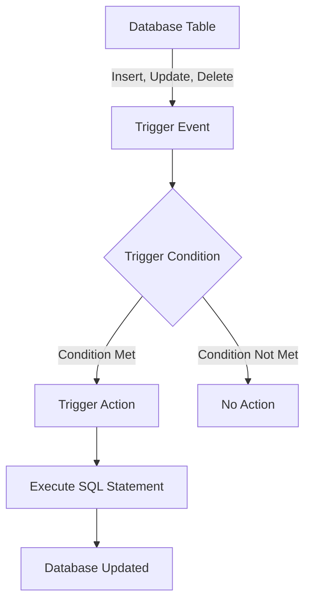
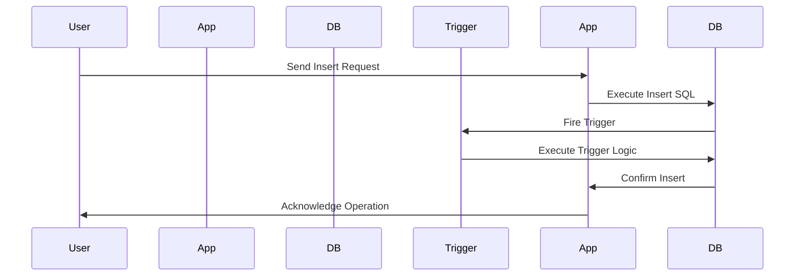

# MySQL Learning Material: Triggers, Stored Procedures, and Events

## Table of Contents
1. [Introduction](#introduction)
2. [Database Triggers](#database-triggers)
    - [What is a Trigger?](#what-is-a-trigger)
    - [Creating a Trigger](#creating-a-trigger)
    - [Example](#example-trigger)
3. [Stored Procedures](#stored-procedures)
    - [What is a Stored Procedure?](#what-is-a-stored-procedure)
    - [Creating a Stored Procedure](#creating-a-stored-procedure)
    - [Example](#example-stored-procedure)
4. [Events](#events)
    - [What is an Event?](#what-is-an-event)
    - [Creating an Event](#creating-an-event)
    - [Example](#example-event)
5. [Conclusion](#conclusion)

## Introduction
This guide covers the basics of database triggers, stored procedures, and events in MySQL. These concepts are essential for managing automated tasks and ensuring data integrity in your databases.

## Database Triggers
Triggers are special types of stored programs that are automatically executed or fired when certain events occur in the database. They can be used to enforce data integrity, maintain audit trails, and automate system tasks.



### What is a Trigger? From the user view
A trigger is a database object that is automatically executed or fired when certain events occur. Triggers can be defined to execute before or after an `INSERT`, `UPDATE`, or `DELETE` operation on a table.



### Creating a Trigger
To create a trigger in MySQL, you can use the `CREATE TRIGGER` statement. The syntax is:

```sql
CREATE TRIGGER trigger_name
{ BEFORE | AFTER } { INSERT | UPDATE | DELETE }
ON table_name FOR EACH ROW
trigger_body;
```
```sql
--starts the creation of a new trigger and assigns it as name, Trigger_Nameof 
CREATE TRIGGER Trigger_Name

--this line specifies when the TRIGGER will be executed about the EVENTS, for example BEFORE an insertion OR UPDATE OR AFTER the insertion...
(BEFORE | AFTER)

--this line defines the TYPE OF operation that TRIGGERS the execution of the TRIGGER, meaning that TRIGGER will be executed when an INSERT, UPDATE, or DELETE happens
[INSERT | UPDATE | DELETE]

--The TABLE IN which the TRIGGER will be defined
ON[TABLE_NAME]

--this line defines whether the TRIGGER should be executed FOR EACH ROW affected BY triggering EVENT  OR FOR EACH column
[for EACH ROW | FOR EACH COLUMN]

-- the following contains one or more SQL statements enclosed with BEGIN---END
[Trigger_body]

```


Example Trigger
Let's create a trigger that automatically updates the last_updated column to the current timestamp whenever a record is updated in the employees table.
```sql
CREATE TRIGGER before_employee_update
BEFORE UPDATE ON employees
FOR EACH ROW
SET NEW.last_updated = NOW();
```
Stored Procedures
What is a Stored Procedure?
A stored procedure is a set of SQL statements that can be stored in the database and executed repeatedly. Stored procedures allow for more complex operations than a single SQL statement and can include control structures such as loops and conditionals.

Creating a Stored Procedure
To create a stored procedure in MySQL, use the CREATE PROCEDURE statement. The syntax is:

```sql
CREATE PROCEDURE procedure_name (parameters)
BEGIN
    -- procedure body
END;

```

Example Stored Procedure
Let's create a stored procedure that inserts a new employee into the employees table.
```sql
CREATE PROCEDURE AddEmployee(
    IN first_name VARCHAR(50),
    IN last_name VARCHAR(50),
    IN hire_date DATE
)
BEGIN
    INSERT INTO employees (first_name, last_name, hire_date)
    VALUES (first_name, last_name, hire_date);
END;


```


Events
What is an Event?
An event in MySQL is a scheduled task that runs automatically at specified intervals. Events are useful for tasks such as cleaning up old data, sending notifications, or generating reports.

Creating an Event
To create an event in MySQL, use the CREATE EVENT statement. The syntax is:

```sql
CREATE EVENT event_name
ON SCHEDULE schedule
DO
event_body;


```
Example Event
Let's create an event that deletes records older than one year from the logs table every day at midnight.

```sql
CREATE EVENT cleanup_old_logs
ON SCHEDULE EVERY 1 DAY
STARTS '2024-01-01 00:00:00'
DO
DELETE FROM logs WHERE log_date < NOW() - INTERVAL 1 YEAR;

````
### Advantages of Triggers:

#### Automated Enforcement of Business Rules:
- Triggers automatically enforce business rules, such as maintaining data consistency and integrity across related tables without requiring manual intervention.

#### Simplifies Code Maintenance:
- Since triggers are defined within the database, they help centralize logic like auditing, updating records, or enforcing complex rules, reducing the need for repetitive code in multiple application layers.

#### Ensures Data Integrity:
- Triggers can enforce referential integrity, update related tables, or prevent invalid data operations automatically (e.g., preventing deletion of a record if it's still referenced elsewhere).

#### Event-Driven:
- Triggers are event-driven and execute automatically in response to `INSERT`, `UPDATE`, or `DELETE` actions. This ensures real-time updates and eliminates the need for periodic checks or manual execution.

#### Auditing and Logging:
- Triggers are commonly used for auditing changes in data. For example, logging all changes to certain tables (like tracking who made updates and when) is easier and more reliable with triggers.

#### Minimizes Redundancy:
- You don't have to duplicate code in different parts of your application (e.g., in stored procedures, scripts, or application logic). Triggers execute consistently for all users and applications interacting with the database.

---

### Disadvantages of Triggers:

#### Complex Debugging and Maintenance:
- Debugging triggers can be difficult because they execute automatically in the background. Understanding the behavior of the system can become tricky, especially when there are multiple triggers on the same table or complex trigger logic.

#### Performance Overhead:
- Triggers introduce additional overhead because they are executed on every data-modifying operation (`INSERT`, `UPDATE`, `DELETE`). This can lead to slower performance, especially in high-transaction environments.

#### Hidden Business Logic:
- Since triggers reside in the database, business logic may become “hidden” and harder to find or modify compared to having it clearly defined in the application layer.

#### Unintended Consequences:
- If not carefully designed, triggers may cause unintended side effects. For example, a trigger could unintentionally create infinite loops if a `BEFORE` trigger makes an update to the same table that caused the trigger to fire.

#### Limited Functionality:
- Triggers are limited to the database scope and SQL operations. More complex business logic or workflows may be better handled in the application code rather than within the database itself.

#### Portability Issues:
- Triggers are database-specific, meaning that if you switch database systems or want to share your database structure, you might face challenges porting or reusing triggers. Not all database systems support triggers in the same way.

#### Order of Execution Confusion:
- When multiple triggers are defined on a table, managing the order of execution becomes complicated. Some databases don't guarantee the order in which triggers are executed, leading to inconsistent results.
--------------------------------------------------------------------------------------------------------------------------

# Stored Procedures
## What is a Stored Procedure?
- A stored procedure is a set of SQL statements that can be stored in the database and executed repeatedly. Stored procedures allow for more complex operations than a single SQL statement and can include control structures such as loops and conditionals.

## Creating a Stored Procedure
To create a stored procedure in MySQL, use the CREATE PROCEDURE statement. The syntax is:

```sql
CREATE PROCEDURE procedure_name (parameters)
BEGIN
    -- procedure body
END;
```
## Example Stored Procedure
Let's create a stored procedure that inserts a new employee into the employees table.

```sql
CREATE PROCEDURE AddEmployee(
    IN first_name VARCHAR(50),
    IN last_name VARCHAR(50),
    IN hire_date DATE
)
BEGIN
    INSERT INTO employees (first_name, last_name, hire_date)
    VALUES (first_name, last_name, hire_date);
END;

```
# Events
## What is an Event?
- An event in MySQL is a scheduled task that runs automatically at specified intervals. Events are useful for tasks such as cleaning up old data, sending notifications, or generating reports.

## Creating an Event
To create an event in MySQL, use the CREATE EVENT statement. The syntax is:
```sql

CREATE EVENT event_name
ON SCHEDULE schedule
DO
event_body;


```
Example Event
Let's create an event that deletes records older than one year from the logs table every day at midnight.

```sql
CREATE EVENT cleanup_old_logs
ON SCHEDULE EVERY 1 DAY
STARTS '2024-01-01 00:00:00'
DO
DELETE FROM logs WHERE log_date < NOW() - INTERVAL 1 YEAR;

```
----------------------------------

# MySQL Learning Material: User Accounts, Security, and Backups

## Table of Contents
1. [Introduction](#introduction)
2. [User Accounts](#user-accounts)
    - [Creating a User Account](#creating-a-user-account)
    - [Granting Privileges](#granting-privileges)
    - [Removing Privileges and Dropping Users](#removing-privileges-and-dropping-users)
3. [Security](#security)
    - [Password Management](#password-management)
    - [Configuring Secure Connections](#configuring-secure-connections)
    - [SQL Injection Prevention](#sql-injection-prevention)
4. [Backups](#backups)
    - [Backup Methods](#backup-methods)
    - [Creating a Backup](#creating-a-backup)
    - [Restoring a Backup](#restoring-a-backup)
5. [Conclusion](#conclusion)

## Introduction
This guide covers the basics of user accounts, security, and backups in MySQL. These concepts are crucial for maintaining the integrity, security, and recoverability of your databases.

## User Accounts

### Creating a User Account
To create a new user account in MySQL, use the `CREATE USER` statement. The syntax is:

```sql
CREATE USER 'username'@'host' IDENTIFIED BY 'password';
```
Example
Create a user new_user that can connect from localhost with the password password123:

```sql
CREATE USER 'new_user'@'localhost' IDENTIFIED BY 'password123';
```
Granting Privileges
To grant privileges to a user, use the GRANT statement. The syntax is:

```sql
GRANT privileges ON database.table TO 'username'@'host';
```
Example
Grant all privileges on the employees database to new_user:

```sql
GRANT ALL PRIVILEGES ON employees.* TO 'new_user'@'localhost';
```

FLUSH PRIVILEGES;
Removing Privileges and Dropping Users
To remove privileges, use the REVOKE statement. To drop a user, use the DROP USER statement.

Example
Revoke all privileges from new_user and drop the user:

```sql
REVOKE ALL PRIVILEGES, GRANT OPTION FROM 'new_user'@'localhost';
DROP USER 'new_user'@'localhost';
```
Security
Password Management
Ensure strong passwords for all MySQL user accounts. You can enforce password policies using MySQL's validate_password plugin.

Example
Set the minimum password length to 8 characters:

```sql
SET GLOBAL validate_password.length = 8;
``
Configuring Secure Connections
Configure MySQL to use SSL/TLS for secure connections. This involves creating SSL certificates and configuring the MySQL server to use them.

Example
Add the following lines to your my.cnf or my.ini file:

```ini
[mysqld]
ssl-ca=/path/to/ca-cert.pem
ssl-cert=/path/to/server-cert.pem
ssl-key=/path/to/server-key.pem
```

SQL Injection Prevention
Prevent SQL injection by using prepared statements and parameterized queries in your application code.


Example (using PHP and MySQLi)
```php
$stmt = $mysqli->prepare("SELECT * FROM users WHERE username = ?");
$stmt->bind_param("s", $username);
$stmt->execute();
$result = $stmt->get_result();
```
Backups
Backup Methods
MySQL provides several methods for backing up data, including logical backups with mysqldump and physical backups with mysqlhotcopy.

Creating a Backup
Use mysqldump to create a logical backup of a database. The syntax is:

```bash
mysqldump -u username -p database_name > backup_file.sql
```
Example
Backup the employees database:

```bash
mysqldump -u root -p employees > employees_backup.sql
```

Restoring a Backup
Use the mysql command to restore a backup from a SQL file. The syntax is:

```bash
mysql -u username -p database_name < backup_file.sql
```
Example
Restore the employees database:

```bash
mysql -u root -p employees < employees_backup.sql
```
Conclusion
Managing user accounts, securing your MySQL server, and creating regular backups are fundamental practices for database administration. These practices help ensure that your database remains secure, accessible, and recoverable in case of failure.
