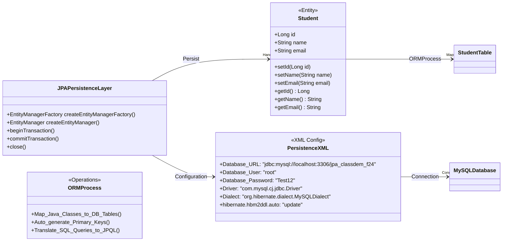

# Introduction to JPA with IntelliJ: A Beginner's Guide (Class Demo)

This guide will walk you through creating a simple Java application using Java Persistence API (JPA) in IntelliJ IDEA. We'll use Hibernate as the JPA implementation and connect to HeidiDB database to demonstrate the basic concepts of Object-Relational Mapping (ORM) and JPA.
- The following figure illustrate the class and the

