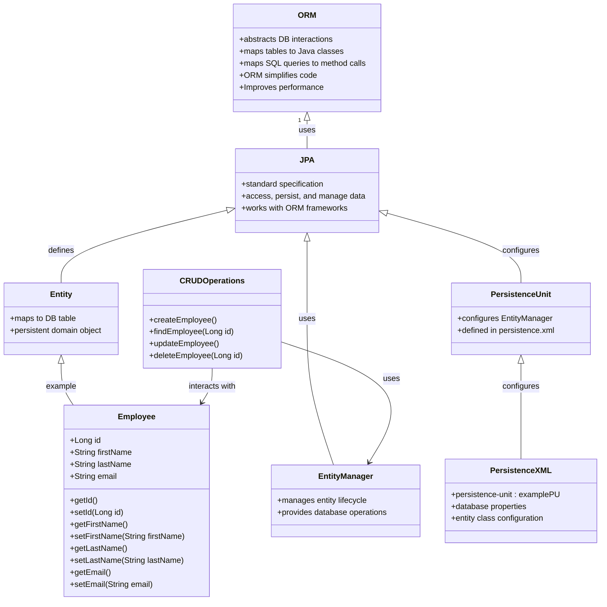
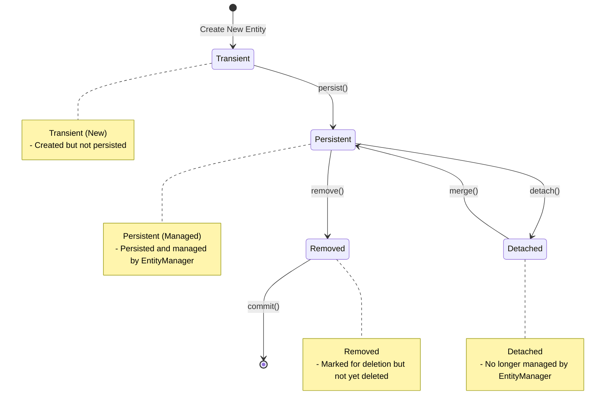
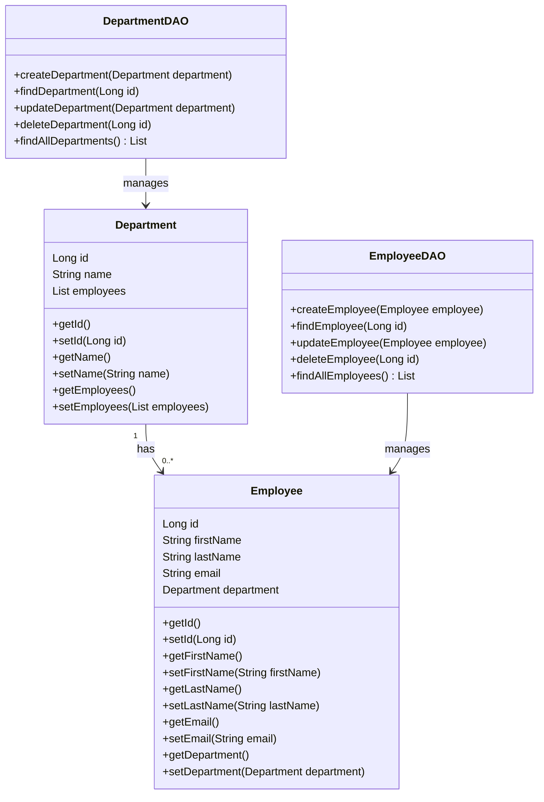

# Learning Material: ORM and JPA
### lectture demo
- 

## Table of Contents
1. [Introduction](#introduction)
2. [Object-Relational Mapping (ORM)](#object-relational-mapping-orm)
    - [What is ORM?](#what-is-orm)
    - [Benefits of ORM](#benefits-of-orm)
    - [Popular ORM Frameworks](#popular-orm-frameworks)
3. [Java Persistence API (JPA)](#java-persistence-api-jpa)
    - [What is JPA?](#what-is-jpa)
    - [Core Concepts of JPA](#core-concepts-of-jpa)
    - [Setting Up JPA](#setting-up-jpa)
4. [Examples](#examples)
    - [Entity Class](#entity-class)
    - [Persistence Configuration](#persistence-configuration)
    - [CRUD Operations](#crud-operations)
5. [Conclusion](#conclusion)

## Introduction
This guide covers the basics of Object-Relational Mapping (ORM) and Java Persistence API (JPA). These concepts are essential for managing relational data in Java applications using object-oriented principles. ORM abstracts the database interactions by mapping database tables to Java classes, while JPA is a specification that standardizes ORM in Java.

## Object-Relational Mapping (ORM)

### What is ORM?
ORM is a programming technique that allows developers to interact with a relational database using an object-oriented paradigm. ORM frameworks map database tables to Java classes, and SQL queries to method calls, abstracting the database interactions.

### Benefits of ORM
- **Productivity:** Reduces boilerplate code and simplifies database interactions.
- **Maintainability:** Easier to maintain and understand due to its object-oriented nature.
- **Portability:** Abstracts the database layer, making the application database-independent.
- **Performance:** Offers caching mechanisms to improve performance.

### Popular ORM Frameworks
- **Hibernate:** The most popular ORM framework for Java.
- **EclipseLink:** The reference implementation of JPA.
- **Apache OpenJPA:** An open-source implementation of JPA.

## Java Persistence API (JPA)


1. ORM & JPA: The ORM class represents Object-Relational Mapping (general concept), and JPA (Java Persistence API) is a specification that works with ORM frameworks.

2. Core JPA Components:

- Entity: Represents a table in the database.
- EntityManager: Manages the entity's lifecycle and interacts with the database.
- PersistenceUnit: Defined in persistence.xml, configures the entity manager.

3. Entity Example (Employee): This represents the Employee class, which is an example of a JPA entity.

4. Persistence Configuration Example: The PersistenceXML class outlines how JPA is configured, typically done in persistence.xml.

5. CRUD Operations Example: This represents methods like createEmployee, findEmployee, updateEmployee, and deleteEmployee, which use the EntityManager and interact with the Employee entity for database operations.


### What is JPA?
JPA is a specification for accessing, persisting, and managing data between Java objects and relational databases. It provides a standard approach to ORM in Java.

### Core Concepts of JPA
- **Entity:** A lightweight, persistent domain object. Typically, each entity corresponds to a table in the database.
- **Entity Manager:** Manages the lifecycle of entities and provides operations to interact with the database.
- **Persistence Unit:** Defines the configuration for an entity manager.

### Setting Up JPA
To use JPA, you'll need to include the necessary dependencies and configure a `persistence.xml` file.

### Example `pom.xml` for Maven
```xml
<dependencies>
    <dependency>
        <groupId>javax.persistence</groupId>
        <artifactId>javax.persistence-api</artifactId>
        <version>2.2</version>
    </dependency>
    <dependency>
        <groupId>org.hibernate</groupId>
        <artifactId>hibernate-core</artifactId>
        <version>5.4.30.Final</version>
    </dependency>
    <dependency>
        <groupId>org.hibernate</groupId>
        <artifactId>hibernate-entitymanager</artifactId>
        <version>5.4.30.Final</version>
    </dependency>
    <dependency>
        <groupId>org.slf4j</groupId>
        <artifactId>slf4j-api</artifactId>
        <version>1.7.30</version>
    </dependency>
    <dependency>
        <groupId>ch.qos.logback</groupId>
        <artifactId>logback-classic</artifactId>
        <version>1.2.3</version>
    </dependency>
</dependencies>
```
# Examples
## Entity Class
An entity class represents a table in the database. Here is an example:
```java
import jakarta.persistence.Entity;
import jakarta.persistence.GeneratedValue;
import jakarta.persistence.GenerationType;
import jakarta.persistence.Id;

@Entity
public class Employee {

    @Id
    @GeneratedValue(strategy = GenerationType.IDENTITY)
    private Long id;

    private String firstName;
    private String lastName;
    private String email;

    // Default constructor
    public Employee() {
    }

    // Parameterized constructor
    public Employee(String firstName, String lastName, String email) {
        this.firstName = firstName;
        this.lastName = lastName;
        this.email = email;
    }

    // Getter and Setter for id
    public Long getId() {
        return id;
    }

    public void setId(Long id) {
        this.id = id;
    }

    // Getter and Setter for firstName
    public String getFirstName() {
        return firstName;
    }

    public void setFirstName(String firstName) {
        this.firstName = firstName;
    }

    // Getter and Setter for lastName
    public String getLastName() {
        return lastName;
    }

    public void setLastName(String lastName) {
        this.lastName = lastName;
    }

    // Getter and Setter for email
    public String getEmail() {
        return email;
    }

    public void setEmail(String email) {
        this.email = email;
    }

    @Override
    public String toString() {
        return "Employee{" +
                "id=" + id +
                ", firstName='" + firstName + '\'' +
                ", lastName='" + lastName + '\'' +
                ", email='" + email + '\'' +
                '}';
    }
}

}

```
## Persistence Configuration
The persistence.xml file configures the persistence unit and specifies database connection properties.

```xml
<?xml version="1.0" encoding="UTF-8"?>
<persistence xmlns="http://xmlns.jcp.org/xml/ns/persistence" version="2.2">
    <persistence-unit name="examplePU">
        <provider>org.hibernate.jpa.HibernatePersistenceProvider</provider>
        <class>com.example.Employee</class>
        <properties>
            <property name="javax.persistence.jdbc.url" value="jdbc:mysql://localhost:3306/mydb"/>
            <property name="javax.persistence.jdbc.user" value="root"/>
            <property name="javax.persistence.jdbc.password" value="password"/>
            <property name="javax.persistence.jdbc.driver" value="com.mysql.cj.jdbc.Driver"/>
            <property name="hibernate.dialect" value="org.hibernate.dialect.MySQL8Dialect"/>
            <property name="hibernate.hbm2ddl.auto" value="update"/>
        </properties>
    </persistence-unit>
</persistence>

```
## CRUD Operations
Performing CRUD operations using the EntityManager.

```java
import javax.persistence.EntityManager;
import javax.persistence.EntityManagerFactory;
import javax.persistence.Persistence;

public class EmployeeDAO {
    private EntityManagerFactory emf = Persistence.createEntityManagerFactory("examplePU");

    public void createEmployee(Employee employee) {
        EntityManager em = emf.createEntityManager();
        em.getTransaction().begin();
        em.persist(employee);
        em.getTransaction().commit();
        em.close();
    }

    public Employee findEmployee(Long id) {
        EntityManager em = emf.createEntityManager();
        Employee employee = em.find(Employee.class, id);
        em.close();
        return employee;
    }

    public void updateEmployee(Employee employee) {
        EntityManager em = emf.createEntityManager();
        em.getTransaction().begin();
        em.merge(employee);
        em.getTransaction().commit();
        em.close();
    }

    public void deleteEmployee(Long id) {
        EntityManager em = emf.createEntityManager();
        em.getTransaction().begin();
        Employee employee = em.find(Employee.class, id);
        if (employee != null) {
            em.remove(employee);
        }
        em.getTransaction().commit();
        em.close();
    }
}

```

## Object State 


# Conclusion
Understanding ORM and JPA is crucial for managing relational data in Java applications. 
ORM simplifies database interactions by abstracting them into an object-oriented paradigm, while JPA provides a standard approach to ORM, 
making it easier to develop, maintain, and port applications. With ORM and JPA, you can perform complex database 
operations with ease and focus on developing the business logic of your application.

---------------------------------------------------------


# Learning Material: 1:M Associations in ORM and JPA

## Table of Contents
1. [Introduction](#introduction)
2. [Object-Relational Mapping (ORM)](#object-relational-mapping-orm)
    - [What is ORM?](#what-is-orm)
    - [1:M Associations](#1m-associations)
3. [Java Persistence API (JPA)](#java-persistence-api-jpa)
    - [Setting Up JPA](#setting-up-jpa)
4. [Examples](#examples)
    - [Entity Classes](#entity-classes)
    - [Persistence Configuration](#persistence-configuration)
    - [CRUD Operations](#crud-operations)
5. [Conclusion](#conclusion)

## Introduction
This guide covers the basics of handling One-to-Many (1:M) associations in Object-Relational Mapping (ORM) using Java Persistence API (JPA). These concepts are essential for managing relational data in Java applications using object-oriented principles.


## Object-Relational Mapping (ORM)

### What is ORM?
ORM is a programming technique that allows developers to interact with a relational database using an object-oriented paradigm. ORM frameworks map database tables to Java classes, and SQL queries to method calls, abstracting the database interactions.

### 1:M Associations
In a 1:M association, one entity (parent) is associated with multiple instances of another entity (child). This is a common relationship in databases where, for example, one department has many employees.

## Java Persistence API (JPA)

### Setting Up JPA
To use JPA, you'll need to include the necessary dependencies and configure a `persistence.xml` file. 
This setup is similar to any JPA project but focuses on defining relationships between entities.


# EXAMPLE

## Overview
In this example, we have two entity classes, Department and Employee, which demonstrate a one-to-many relationship using Java Persistence API (JPA). JPA is a specification for managing relational data in Java applications. It allows developers to map Java objects to database tables and vice versa, making database interactions more intuitive and less error-prone.
- The following dependencies are need to utlize ORM in your code

```css

project-root/               
├── pom.xml                 
├── src/                   
│   ├── main/             
│   │   ├── java/           
│   │   │   └── com/
│   │   │       └── example/
│   │   │           └── jpa/         
│   │   │               ├── Main.java        
│   │   │               ├── DepartmentDAO.java 
│   │   │               ├── EmployeeDAO.java   
│   │   │               └── entity/           
│   │   │                   ├── Department.java 
│   │   │                   └── Employee.java  
│   │   └── resources/       
│   │       └── META-INF/   
│   │           └── persistence.xml 
└── target/                  

```

### Example `pom.xml` for Maven
```xml

    <properties>
        <maven.compiler.source>21</maven.compiler.source>
        <maven.compiler.target>21</maven.compiler.target>
        <project.build.sourceEncoding>UTF-8</project.build.sourceEncoding>
    </properties>
    <dependencies>
        <dependency>
            <groupId>javax.persistence</groupId>
            <artifactId>javax.persistence-api</artifactId>
            <version>2.2</version>
        </dependency>
        <dependency>
            <groupId>org.hibernate</groupId>
            <artifactId>hibernate-core</artifactId>
            <version>5.6.15.Final</version>
        </dependency>
        <dependency>
            <groupId>org.hibernate</groupId>
            <artifactId>hibernate-entitymanager</artifactId>
            <version>5.6.15.Final</version>
        </dependency>
        <dependency>
            <groupId>org.slf4j</groupId>
            <artifactId>slf4j-api</artifactId>
            <version>1.8.0-beta4</version>
        </dependency>
        <dependency>
            <groupId>ch.qos.logback</groupId>
            <artifactId>logback-classic</artifactId>
            <version>1.5.6</version>
        </dependency>
    </dependencies>

```

## Entity Classes
Define the entities and their relationships.

### Department Class
```java
package com.example.jpa.entity;

import javax.persistence.*;
import java.util.List;

@Entity
public class Department {

    @Id
    @GeneratedValue(strategy = GenerationType.IDENTITY)
    private Long id;
    private String name;

    @OneToMany(mappedBy = "department", cascade = CascadeType.ALL, orphanRemoval = true)
    private List<Employee> employees;

    // Getters and Setters
    public Long getId() {
        return id;
    }

    public void setId(Long id) {
        this.id = id;
    }

    public String getName() {
        return name;
    }

    public void setName(String name) {
        this.name = name;
    }

    public List<Employee> getEmployees() {
        return employees;
    }

    public void setEmployees(List<Employee> employees) {
        this.employees = employees;
    }
}


```
### Employee Class

```java
package com.example.jpa.entity;

import javax.persistence.*;

@Entity
public class Employee {

    @Id
    @GeneratedValue(strategy = GenerationType.IDENTITY)
    private Long id;
    private String firstName;
    private String lastName;
    private String email;

    @ManyToOne
    @JoinColumn(name = "department_id")
    private Department department;

    // Getters and Setters
    public Long getId() {
        return id;
    }

    public void setId(Long id) {
        this.id = id;
    }

    public String getFirstName() {
        return firstName;
    }

    public void setFirstName(String firstName) {
        this.firstName = firstName;
    }

    public String getLastName() {
        return lastName;
    }

    public void setLastName(String lastName) {
        this.lastName = lastName;
    }

    public String getEmail() {
        return email;
    }

    public void setEmail(String email) {
        this.email = email;
    }

    public Department getDepartment() {
        return department;
    }

    public void setDepartment(Department department) {
        this.department = department;
    }
}

```
## Annotations Explained
- @Entity: Marks the class as a JPA entity, meaning it will be mapped to a database table.
- @Id: Specifies the primary key of the entity.
- @GeneratedValue: Indicates that the primary key value will be automatically generated.
- @OneToMany(mappedBy = “department”, cascade = CascadeType.ALL, orphanRemoval = true): Defines a one-to-many relationship. The mappedBy attribute indicates that the department field in the Employee class owns the relationship. cascade = CascadeType.ALL means that any operation (persist, merge, remove, etc.) on the Department entity will be cascaded to the Employee entities. orphanRemoval = true ensures that if an Employee is removed from the Department’s list, it will also be removed from the database.
- @ManyToOne: Defines a many-to-one relationship. Each Employee is associated with one Department.
- @JoinColumn(name = “department_id”): Specifies the foreign key column in the Employee table that references the Department table

### Persistence Configuration

## Setting Up the Database
Before running the Main class, you need to create the database in HeidiSQL (or any other database management tool). Ensure that the database name matches the one specified in your persistence.xml file.
The persistence.xml file configures the persistence unit and specifies database connection properties.
```xml
<?xml version="1.0" encoding="UTF-8"?>
<persistence xmlns="http://xmlns.jcp.org/xml/ns/persistence" version="2.2">
    <persistence-unit name="examplePU">
        <provider>org.hibernate.jpa.HibernatePersistenceProvider</provider>
        <class>com.example.jpa.entity.Department</class>
        <class>com.example.jpa.entity.Employee</class>
        <properties>
            <property name="javax.persistence.jdbc.url" value="jdbc:mysql://localhost:3306/manytoone"/>
            <property name="javax.persistence.jdbc.user" value="root"/>
            <property name="javax.persistence.jdbc.password" value="Test12"/>
            <property name="javax.persistence.jdbc.driver" value="com.mysql.cj.jdbc.Driver"/>
            <property name="hibernate.dialect" value="org.hibernate.dialect.MySQL8Dialect"/>
            <property name="hibernate.hbm2ddl.auto" value="update"/>
        </properties>
    </persistence-unit>
</persistence>

```

## Adding the JDBC Driver
If necessary, add the JDBC driver to your project:

1. Go to File -> Project Structure.
2. Select Modules -> Dependencies.
3. Click the + button and choose JARs or directories.
4. Locate the JDBC driver on your local machine and add it to your project.

## CRUD Operations
Performing CRUD operations using the EntityManager.

### DepartmentDAO Class
```java

/**
 * This package contains the Data Access Object (DAO) classes for managing 
 * entities in the JPA (Java Persistence API) context. It includes classes 
 * for performing CRUD (Create, Read, Update, Delete) operations on 
 * Employee and Department entities.
 * 
 * The DAOs use an EntityManagerFactory to create EntityManager instances 
 * for interacting with the persistence context. Each DAO class provides 
 * methods to persist, find, update, and delete entities, as well as to 
 * retrieve lists of all entities of a given type.
 */

package com.example.jpa;
import com.example.jpa.entity.Department;

import javax.persistence.EntityManager;
import javax.persistence.EntityManagerFactory;
import javax.persistence.Persistence;
import java.util.List;

public class DepartmentDAO {
    private EntityManagerFactory emf = Persistence.createEntityManagerFactory("examplePU");

    public void createDepartment(Department department) {
        EntityManager em = emf.createEntityManager();
        em.getTransaction().begin();
        em.persist(department);
        em.getTransaction().commit();
        em.close();
    }

    public Department findDepartment(Long id) {
        EntityManager em = emf.createEntityManager();
        Department department = em.find(Department.class, id);
        em.close();
        return department;
    }

    public void updateDepartment(Department department) {
        EntityManager em = emf.createEntityManager();
        em.getTransaction().begin();
        em.merge(department);
        em.getTransaction().commit();
        em.close();
    }

    public void deleteDepartment(Long id) {
        EntityManager em = emf.createEntityManager();
        em.getTransaction().begin();
        Department department = em.find(Department.class, id);
        if (department != null) {
            em.remove(department);
        }
        em.getTransaction().commit();
        em.close();
    }

    public List<Department> findAllDepartments() {
        EntityManager em = emf.createEntityManager();
        List<Department> departments = em.createQuery("SELECT d FROM Department d", Department.class).getResultList();
        em.close();
        return departments;
    }
}


```
### EmployeeDAO Class
```java
package com.example.jpa;

import com.example.jpa.entity.Employee;

import javax.persistence.EntityManager;
import javax.persistence.EntityManagerFactory;
import javax.persistence.Persistence;
import java.util.List;

public class EmployeeDAO {
    private EntityManagerFactory emf = Persistence.createEntityManagerFactory("examplePU");

    public void createEmployee(Employee employee) {
        EntityManager em = emf.createEntityManager();
        em.getTransaction().begin();
        em.persist(employee);
        em.getTransaction().commit();
        em.close();
    }

    public Employee findEmployee(Long id) {
        EntityManager em = emf.createEntityManager();
        Employee employee = em.find(Employee.class, id);
        em.close();
        return employee;
    }

    public void updateEmployee(Employee employee) {
        EntityManager em = emf.createEntityManager();
        em.getTransaction().begin();
        em.merge(employee);
        em.getTransaction().commit();
        em.close();
    }

    public void deleteEmployee(Long id) {
        EntityManager em = emf.createEntityManager();
        em.getTransaction().begin();
        Employee employee = em.find(Employee.class, id);
        if (employee != null) {
            em.remove(employee);
        }
        em.getTransaction().commit();
        em.close();
    }

    public List<Employee> findAllEmployees() {
        EntityManager em = emf.createEntityManager();
        List<Employee> employees = em.createQuery("SELECT e FROM Employee e", Employee.class).getResultList();
        em.close();
        return employees;
    }
}
```
## Main class to test the CRUD
The Main class is used to test the functionality of the Department and Employee entities along with their DAOs. Make sure it is placed in the appropriate package and run it to see the results.
```java
package com.example.jpa;

import com.example.jpa.entity.Department;
import com.example.jpa.entity.Employee;


import javax.persistence.EntityManagerFactory;
import javax.persistence.Persistence;
import java.util.List;

public class Main {
    public static void main(String[] args) {
        EntityManagerFactory emf = Persistence.createEntityManagerFactory("examplePU");

        DepartmentDAO departmentDAO = new DepartmentDAO();
        EmployeeDAO employeeDAO = new EmployeeDAO();

        // Create a new department
        Department department = new Department();
        department.setName("Engineering");

        // Create new employees
        Employee employee1 = new Employee();
        employee1.setFirstName("John");
        employee1.setLastName("Doe");
        employee1.setEmail("john.doe@example.com");
        employee1.setDepartment(department);

        Employee employee2 = new Employee();
        employee2.setFirstName("Jane");
        employee2.setLastName("Smith");
        employee2.setEmail("jane.smith@example.com");
        employee2.setDepartment(department);

        // Add employees to the department
        department.setEmployees(List.of(employee1, employee2));

        // Persist the department (which will also persist the employees)
        departmentDAO.createDepartment(department);

        // Retrieve and print all departments
        List<Department> departments = departmentDAO.findAllDepartments();
        for (Department dept : departments) {
            System.out.println("Department: " + dept.getName());
            for (Employee emp : dept.getEmployees()) {
                System.out.println(" - Employee: " + emp.getFirstName() + " " + emp.getLastName());
            }
        }

        // Clean up
        emf.close();
    }
}


```

# Conclusion
## Understanding 1
associations in ORM and JPA is crucial for managing relational data in Java applications. 
By defining these relationships, you can model real-world scenarios more accurately and perform complex database operations with ease. 
This guide provides a comprehensive overview and practical examples to help you get started with 1
associations in ORM and JPA.
----------------------------------------------------------------------------------------------


