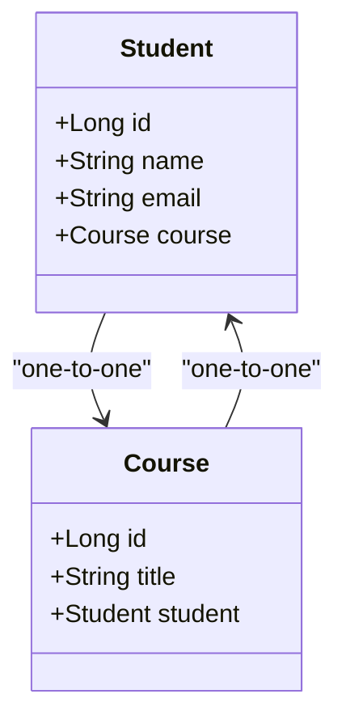
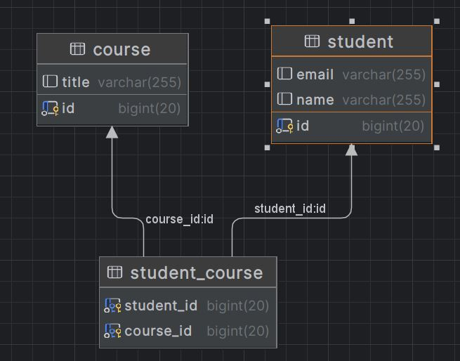
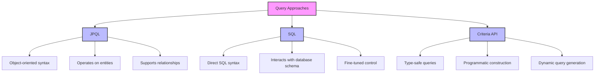
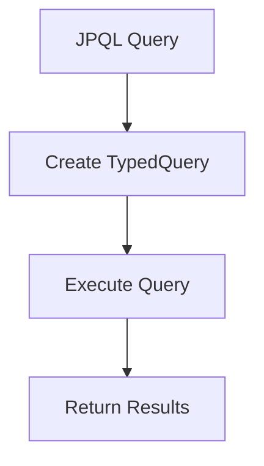
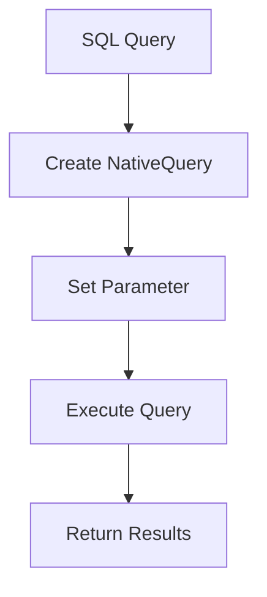
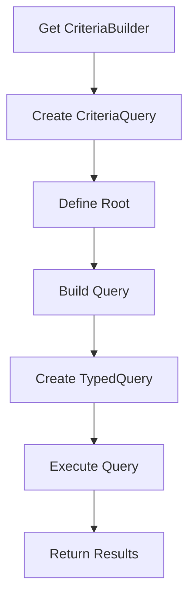
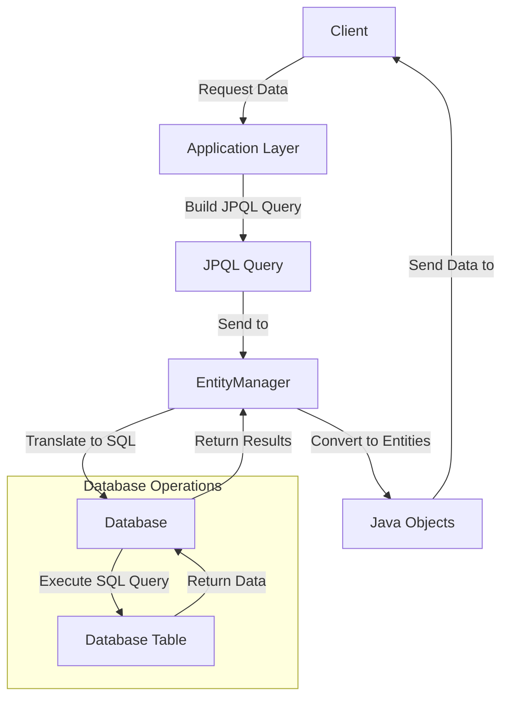
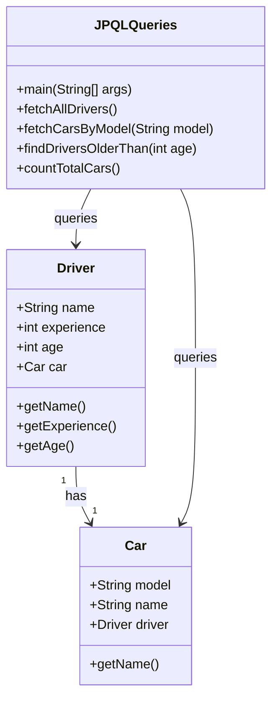
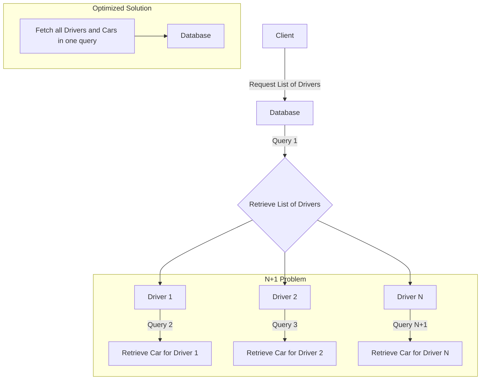

# Learning Material: ORM with JPA - M:N and 1:1 Associations, Inheritance

## Table of Contents
1. [Introduction](#introduction)
2. [Object-Relational Mapping (ORM)](#object-relational-mapping-orm)
    - [What is ORM?](#what-is-orm)
    - [Associations in ORM](#associations-in-orm)
        - [M:N Associations](#mn-associations)
        - [1:1 Associations](#11-associations)
        - [Inheritance](#inheritance)
3. [Java Persistence API (JPA)](#java-persistence-api-jpa)
    - [Setting Up JPA](#setting-up-jpa)
4. [Examples](#examples)
    - [Entity Classes](#entity-classes)
        - [M:N Associations](#mn-associations-example)
        - [1:1 Associations](#11-associations-example)
        - [Inheritance](#inheritance-example)
    - [Persistence Configuration](#persistence-configuration)
    - [CRUD Operations](#crud-operations)
5. [Conclusion](#conclusion)

## Introduction
This guide covers the basics of handling Many-to-Many (M:N) and One-to-One (1:1) associations, and inheritance in Object-Relational Mapping (ORM) using Java Persistence API (JPA). These concepts are essential for managing relational data in Java applications using object-oriented principles.

## Object-Relational Mapping (ORM)

### What is ORM?
ORM is a programming technique that allows developers to interact with a relational database using an object-oriented paradigm. ORM frameworks map database tables to Java classes, and SQL queries to method calls, abstracting the database interactions.

### Associations in ORM
ORM supports various types of associations to model real-world relationships between entities.

#### M:N Associations
In an M:N association, multiple instances of one entity are associated with multiple instances of another entity. This typically involves a join table in the database.

#### 1:1 Associations
In a 1:1 association, one instance of an entity is associated with one instance of another entity. This can be modeled using shared primary keys or foreign keys.

#### Inheritance
Inheritance allows entities to inherit properties and relationships from a base entity, enabling polymorphic queries and shared behavior.

## Java Persistence API (JPA)

### Setting Up JPA
To use JPA, you'll need to include the necessary dependencies and configure a `persistence.xml` file. This setup is similar to any JPA project but focuses on defining relationships between entities.

### Example `pom.xml` for Maven
```xml
<dependencies>
    <dependency>
        <groupId>javax.persistence</groupId>
        <artifactId>javax.persistence-api</artifactId>
        <version>2.2</version>
    </dependency>
    <dependency>
        <groupId>org.hibernate</groupId>
        <artifactId>hibernate-core</artifactId>
        <version>5.4.30.Final</version>
    </dependency>
    <dependency>
        <groupId>org.hibernate</groupId>
        <artifactId>hibernate-entitymanager</artifactId>
        <version>5.4.30.Final</version>
    </dependency>
    <dependency>
        <groupId>org.slf4j</groupId>
        <artifactId>slf4j-api</artifactId>
        <version>1.7.30</version>
    </dependency>
    <dependency>
        <groupId>ch.qos.logback</groupId>
        <artifactId>logback-classic</artifactId>
        <version>1.2.3</version>
    </dependency>
</dependencies>
```
# Examples
## Entity Classes
M
Associations Example
### Project Class

```java
import javax.persistence.*;
import java.util.List;

@Entity
public class Project {

    @Id
    @GeneratedValue(strategy = GenerationType.IDENTITY)
    private Long id;
    private String name;

    @ManyToMany
    @JoinTable(
        name = "project_employee",
        joinColumns = @JoinColumn(name = "project_id"),
        inverseJoinColumns = @JoinColumn(name = "employee_id")
    )
    private List<Employee> employees;

    // Getters and Setters
}

```


### Employee Class (Updated)

```java
import javax.persistence.*;
import java.util.List;

@Entity
public class Employee {

    @Id
    @GeneratedValue(strategy = GenerationType.IDENTITY)
    private Long id;
    private String firstName;
    private String lastName;
    private String email;

    @ManyToMany(mappedBy = "employees")
    private List<Project> projects;

    @ManyToOne
    @JoinColumn(name = "department_id")
    private Department department;

    // Getters and Setters
}

```
## 1:1 Associations Example
### EmployeeDetails Class
```java
import javax.persistence.*;

@Entity
public class EmployeeDetails {

    @Id
    @GeneratedValue(strategy = GenerationType.IDENTITY)
    private Long id;
    private String address;
    private String phoneNumber;

    @OneToOne
    @JoinColumn(name = "employee_id")
    private Employee employee;

    // Getters and Setters
}

```
### Employee Class (Updated)

```java
import javax.persistence.*;
import java.util.List;

@Entity
public class Employee {

    @Id
    @GeneratedValue(strategy = GenerationType.IDENTITY)
    private Long id;
    private String firstName;
    private String lastName;
    private String email;

    @ManyToMany(mappedBy = "employees")
    private List<Project> projects;

    @ManyToOne
    @JoinColumn(name = "department_id")
    private Department department;

    @OneToOne(mappedBy = "employee", cascade = CascadeType.ALL, orphanRemoval = true)
    private EmployeeDetails employeeDetails;

    // Getters and Setters
}


```
## Inheritance Example
### Person Class

```java
import javax.persistence.*;

@Entity
@Inheritance(strategy = InheritanceType.JOINED)
public class Person {

    @Id
    @GeneratedValue(strategy = GenerationType.IDENTITY)
    private Long id;
    private String name;

    // Getters and Setters
}

```
### Customer Class

```java
import javax.persistence.Entity;

@Entity
public class Customer extends Person {
    private String customerType;

    // Getters and Setters
}

```
### Supplier Class
```java
import javax.persistence.Entity;

@Entity
public class Supplier extends Person {
    private String supplierType;

    // Getters and Setters
}

```

## Persistence Configuration
The persistence.xml file configures the persistence unit and specifies database connection properties.

```xml
<?xml version="1.0" encoding="UTF-8"?>
<persistence xmlns="http://xmlns.jcp.org/xml/ns/persistence" version="2.2">
    <persistence-unit name="examplePU">
        <provider>org.hibernate.jpa.HibernatePersistenceProvider</provider>
        <class>com.example.Project</class>
        <class>com.example.Employee</class>
        <class>com.example.Department</class>
        <class>com.example.EmployeeDetails</class>
        <class>com.example.Person</class>
        <class>com.example.Customer</class>
        <class>com.example.Supplier</class>
        <properties>
            <property name="javax.persistence.jdbc.url" value="jdbc:mysql://localhost:3306/mydb"/>
            <property name="javax.persistence.jdbc.user" value="root"/>
            <property name="javax.persistence.jdbc.password" value="password"/>
            <property name="javax.persistence.jdbc.driver" value="com.mysql.cj.jdbc.Driver"/>
            <property name="hibernate.dialect" value="org.hibernate.dialect.MySQL8Dialect"/>
            <property name="hibernate.hbm2ddl.auto" value="update"/>
        </properties>
    </persistence-unit>
</persistence>

```

## CRUD Operations
Performing CRUD operations using the EntityManager.

### ProjectDAO Class
```java
import javax.persistence.EntityManager;
import javax.persistence.EntityManagerFactory;
import javax.persistence.Persistence;
import java.util.List;

public class ProjectDAO {
    private EntityManagerFactory emf = Persistence.createEntityManagerFactory("examplePU");

    public void createProject(Project project) {
        EntityManager em = emf.createEntityManager();
        em.getTransaction().begin();
        em.persist(project);
        em.getTransaction().commit();
        em.close();
    }

    public Project findProject(Long id) {
        EntityManager em = emf.createEntityManager();
        Project project = em.find(Project.class, id);
        em.close();
        return project;
    }

    public void updateProject(Project project) {
        EntityManager em = emf.createEntityManager();
        em.getTransaction().begin();
        em.merge(project);
        em.getTransaction().commit();
        em.close();
    }

    public void deleteProject(Long id) {
        EntityManager em = emf.createEntityManager();
        em.getTransaction().begin();
        Project project = em.find(Project.class, id);
        if (project != null) {
            em.remove(project);
        }
        em.getTransaction().commit();
        em.close();
    }

    public List<Project> findAllProjects() {
        EntityManager em = emf.createEntityManager();
        List<Project> projects = em.createQuery("SELECT p FROM Project p", Project.class).getResultList();
        em.close();
        return projects;
    }
}


```

### EmployeeDAO Class

```java
import javax.persistence.EntityManager;
import javax.persistence.EntityManagerFactory;
import javax.persistence.Persistence;
import java.util.List;

public class EmployeeDAO {
    private EntityManagerFactory emf = Persistence.createEntityManagerFactory("examplePU");

    public void createEmployee(Employee employee) {
        EntityManager em = emf.createEntityManager();
        em.getTransaction().begin();
        em.persist(employee);
        em.getTransaction().commit();
        em.close();
    }

    public Employee findEmployee(Long id) {
        EntityManager em = emf.createEntityManager();
        Employee employee = em.find(Employee.class, id);
        em.close();
        return employee;
    }

    public void updateEmployee(Employee employee) {
        EntityManager em = emf.createEntityManager();
        em.getTransaction().begin();
        em.merge(employee);
        em.getTransaction().commit();
        em.close();
    }

    public void deleteEmployee(Long id) {
        EntityManager em = emf.createEntityManager();
        em.getTransaction().begin();
        Employee employee = em.find(Employee.class, id);
        if (employee != null) {
            em.remove(employee);
        }
        em.getTransaction().commit();
        em.close();
    }

    public List<Employee> findAllEmployees() {
        EntityManager em = emf.createEntityManager();
        List<Employee> employees = em.createQuery("SELECT e FROM Employee e", Employee.class).getResultList();
        em.close();
        return employees;
    }
}


```
## Running the Application
To run the application, create a main class that uses the DAO classes to perform CRUD operations.

### Main Class
```java
public class Main {
    public static void main(String[] args) {
        EmployeeDAO employeeDAO = new EmployeeDAO();
        ProjectDAO projectDAO = new ProjectDAO();

        // Create new employee
        Employee employee = new Employee();
        employee.setFirstName("John");
        employee.setLastName("Doe");
        employee.setEmail("john.doe@example.com");

        EmployeeDetails details = new EmployeeDetails();
        details.setAddress("123 Main St");
        details.setPhoneNumber("555-1234");
        details.setEmployee(employee);
        employee.setEmployeeDetails(details);

        employeeDAO.createEmployee(employee);

        // Create new project
        Project project = new Project();
        project.setName("New Project");

        // Associate employee with project
        project.setEmployees(List.of(employee));
        employee.setProjects(List.of(project));

        projectDAO.createProject(project);

        // Update employee
        employee.setFirstName("Jane");
        employeeDAO.updateEmployee(employee);

        // Find and display project
        Project foundProject = projectDAO.findProject(project.getId());
        System.out.println("Project: " + foundProject.getName());

        // Delete employee
        employeeDAO.deleteEmployee(employee.getId());

        // Find all projects
        List<Project> projects = projectDAO.findAllProjects();
        projects.forEach(p -> System.out.println("Project: " + p.getName()));
    }
}


```
# Conclusion
This guide provided an overview of handling Many-to-Many (M) and One-to-One (1:1) associations, and inheritance in JPA. 
By leveraging these relationships, you can model complex data structures in a relational database using an object-oriented approach, facilitating better data management and retrieval in Java applications.

------------------------------------------------------------------------

# Step-by-Step Guide to Creating a One-to-One Relationship in JPA
This guide will walk you through the process of setting up a one-to-one relationship between two entities using Java Persistence API (JPA). In this example, we'll create a Student entity and a Course entity, where each student is associated with one course, and each course is associated with one student.

- In this example, we will define a one-to-one relationship between a Student and a Course. Each student will be enrolled in exactly one course, and each course will be associated with exactly one student.

**Step-by-Step Explanation**
1. Entities and Relationship Identification
- We have two entities:

    - Student: Represents the student entity (table).
    - Course: Represents the course entity (table).
      

Each  `student` is enrolled in exactly one `course`, and each `course` is associated with one `student`. This is a classic one-to-one relationship.

There are two types of one-to-one association:
1. *bidirectional* which means both entities aware of each other, follow the example below
```mermaid
classDiagram
    class Student {
        +String name
        +Course course
        +getCourse()
        +setCourse(Course course)
    }

    class Course {
        +String title
        +Student student
        +getStudent()
        +setStudent(Student student)
    }

    Student "1" --> "1" Course : has
    Course "1" --> "1" Student : belongs to

   ```
2. *non-bidirectional* which only the owner entities aware of the other entity for example Student only aware of the course.

```mermaid
classDiagram
    class Student {
        +String name
        +Course course
        +getCourse()
        +setCourse(Course course)
    }

    class Course {
        +String title
    }

    Student "1" --> "1" Course : has


```
   - Sample class structure:
```java
@Entity
public class Student {
    @Id
    @GeneratedValue(strategy = GenerationType.IDENTITY)
    private Long id;

    private String name;

    // CascadeType.ALL ensures that any operation on Student will cascade to its courses
    @OneToMany(cascade = CascadeType.ALL)
    @JoinColumn(name = "student_id")  // Foreign key in Course table
    private List<Course> courses;

    // Getters and Setters
}

@Entity
public class Course {
    @Id
    @GeneratedValue(strategy = GenerationType.IDENTITY)
    private Long id;

    private String title;

    // Getters and Setters
}

```


## Establish the *bidirectional* One-to-One Relationship
We define the one-to-one relationship between Student and Course using the `@OneToOne` annotation.

- **Owning Side:** The entity that **holds** the `foreign key`.
- **Mapped (Inverse) Side:** The entity that refers back to the owning side.


In the Course entity, you will use the `@OneToOne` annotation and the `@JoinColumn` annotation to specify the **foreign key column** ´ `(student_id)`.

```
@Entity
public class Course {

    @OneToOne
   @JoinColumn(name = "student_id")
    private Student student;
    
    // Other fields, getters, and setters
}


```
- `@JoinColumn(name = "student_id"):` This tells JPA that the Course table will have a foreign key column named `student_id`, referencing the Student table. The Course entity is the **owning side** of the relationship.


## Annotations on the Inverse Side (Student Entity)
- In the Student entity, use the `@OneToOne` annotation with the `mappedBy` attribute to indicate that the relationship is managed by the Course entity.

```java
@Entity
public class Student {

    @OneToOne(mappedBy = "student")
    private Course course;
    
    // Other fields, getters, and setters
}

```
- mappedBy = "student": This tells JPA that the Course entity owns the relationship, and the foreign key resides in the Course table. The Student entity is the inverse side of the relationship.

## Cascade and Fetch Types (Optional)
You can configure cascade operations and fetching strategies:

- **Cascade:** If you want operations like persist, merge, and remove to propagate from Student to Course, use CascadeType.ALL.
```java
@OneToOne(cascade = CascadeType.ALL)
@JoinColumn(name = "student_id")
private Student student;

```

- **Fetch Type:** By default, @OneToOne relationships are fetched eagerly (FetchType.EAGER). If you want lazy loading, specify FetchType.LAZY.
```java

@OneToOne(fetch = FetchType.LAZY)
@JoinColumn(name = "student_id")
private Student student;


```
## Why Use These Annotations?
- @Entity: Marks the class as a JPA entity.
- @OneToOne: Defines a one-to-one relationship between two entities.
- @JoinColumn: Specifies the foreign key column in the owning entity (in this case, Course).
- mappedBy: Indicates that this is the inverse side of the relationship, and it's managed by the owning entity.
- CascadeType: Controls cascading behavior (e.g., saving/removing related entities automatically).
- FetchType: Determines whether the related entity should be fetched eagerly or lazily.


## 1. Set Up Your Project Structure
1. Create a new Java project in your IDE (e.g., IntelliJ IDEA, Eclipse).
2. Set up Maven or Gradle for dependency management.

Your directory structure should look something like this:

```css
Exampleone-one-db
├── pom.xml
├── src
│   ├── main
│   │   ├── java
│   │   │   └── com
│   │   │       └── example
│   │   │           └── jpa
│   │   │               ├── Main.java
│   │   │               ├── entity
│   │   │               │   ├── Student.java
│   │   │               │   └── Course.java
│   │   └── resources
│   │       └── META-INF
│   │           └── persistence.xml
└── target
    └── classes
        └── META-INF
            └── persistence.xml


```
## 2. Add JPA Dependencies
Add the necessary dependencies for JPA (using Hibernate as the JPA provider) and MySQL (or your preferred database) to your pom.xml (if using Maven):
```xml
<?xml version="1.0" encoding="UTF-8"?>
<project xmlns="http://maven.apache.org/POM/4.0.0"
         xmlns:xsi="http://www.w3.org/2001/XMLSchema-instance"
         xsi:schemaLocation="http://maven.apache.org/POM/4.0.0 http://maven.apache.org/xsd/maven-4.0.0.xsd">
    <modelVersion>4.0.0</modelVersion>

    <groupId>org.example</groupId>
    <artifactId>onetoone</artifactId>
    <version>1.0-SNAPSHOT</version>

    <properties>
        <maven.compiler.source>21</maven.compiler.source>
        <maven.compiler.target>21</maven.compiler.target>
        <project.build.sourceEncoding>UTF-8</project.build.sourceEncoding>
    </properties>
    <dependencies>
        <!-- Hibernate and JPA API -->
        <dependency>
            <groupId>org.hibernate.orm</groupId>
            <artifactId>hibernate-core</artifactId>
            <version>6.2.5.Final</version>
        </dependency>
        <dependency>
            <groupId>jakarta.persistence</groupId>
            <artifactId>jakarta.persistence-api</artifactId>
            <version>3.1.0</version>
        </dependency>

        <!-- H2 Database -->
        <dependency>
            <groupId>com.h2database</groupId>
            <artifactId>h2</artifactId>
            <version>2.2.220</version>
            <scope>runtime</scope>
        </dependency>

        <!-- Logging dependencies (optional) -->
        <dependency>
            <groupId>org.slf4j</groupId>
            <artifactId>slf4j-api</artifactId>
            <version>2.0.9</version>
        </dependency>

        <dependency>
            <groupId>org.slf4j</groupId>
            <artifactId>slf4j-simple</artifactId>
            <version>2.0.9</version>
        </dependency>

        <dependency>
            <groupId>mysql</groupId>
            <artifactId>mysql-connector-java</artifactId>
            <version>8.0.30</version> <!-- Use the latest version available -->
        </dependency>

    </dependencies>
</project>
```
## 3. Configure Persistence Settings
Create a persistence.xml file in the src/main/resources/META-INF directory:

```xml
<?xml version="1.0" encoding="UTF-8"?>
<persistence xmlns="https://jakarta.ee/xml/ns/persistence" version="3.0">
    <persistence-unit name="JPAExamplePU" transaction-type="RESOURCE_LOCAL">
        <provider>org.hibernate.jpa.HibernatePersistenceProvider</provider>
        <class>com.example.jpa.Student</class>
        <properties>
            <!-- JDBC connection properties -->
            <property name="jakarta.persistence.jdbc.url" value="jdbc:mysql://localhost:3306/StudentCourseonetoone"/>
            <property name="jakarta.persistence.jdbc.user" value="root"/>
            <property name="jakarta.persistence.jdbc.driver" value="com.mysql.cj.jdbc.Driver"/>
            <property name="jakarta.persistence.jdbc.password" value="Test12"/>

            <!-- Hibernate settings -->
            <property name="hibernate.dialect" value="org.hibernate.dialect.MySQLDialect"/>
            <property name="hibernate.hbm2ddl.auto" value="update"/>
            <!-- <property name="hibernate.hbm2ddl.auto" value="create-drop"/>-->


            <property name="hibernate.show_sql" value="true"/>
            <property name="hibernate.format_sql" value="true"/>
        </properties>
    </persistence-unit>
</persistence>
```
Replace your_database_name, your_db_username, and your_db_password with your actual database details.

## 4. Create the Entity Classes
Student.java
```java
package com.example.jpa.entity;

import jakarta.persistence.*;

@Entity
public class Student {

    @Id
    @GeneratedValue(strategy = GenerationType.IDENTITY)
    private Long id;

    private String name;
    private String email;

    @OneToOne(mappedBy = "student", cascade = CascadeType.ALL)
    private Course course;

    // Constructors, getters, and setters

    public Student() {}

    public Student(String name, String email) {
        this.name = name;
        this.email = email;
    }

    public Long getId() {
        return id;
    }

    public void setId(Long id) {
        this.id = id;
    }

    public String getName() {
        return name;
    }

    public void setName(String name) {
        this.name = name;
    }

    public String getEmail() {
        return email;
    }

    public void setEmail(String email) {
        this.email = email;
    }

    public Course getCourse() {
        return course;
    }

    public void setCourse(Course course) {
        this.course = course;
    }

    @Override
    public String toString() {
        return "Student{id=" + id + ", name='" + name + '\'' + ", email='" + email + '\'' + ", course=" + course + '}';
    }
}

```
- A one-to-one relationship is used when an entity logically has a single counterpart. In our example, a `Student` can enroll in exactly one `Course`, and each Course can have exactly one Student.

- This type of relationship is common when two related entities have a unique, tightly coupled association in a domain model.




Course.java

```java
package com.example.jpa.entity;

import jakarta.persistence.*;

@Entity
public class Course {

    @Id
    @GeneratedValue(strategy = GenerationType.IDENTITY)
    private Long id;

    private String title;

    @OneToOne
    @JoinColumn(name = "student_id", referencedColumnName = "id")
    private Student student;

    // Constructors, getters, and setters

    public Course() {}

    public Course(String title) {
        this.title = title;
    }

    public Long getId() {
        return id;
    }

    public void setId(Long id) {
        this.id = id;
    }

    public String getTitle() {
        return title;
    }

    public void setTitle(String title) {
        this.title = title;
    }

    public Student getStudent() {
        return student;
    }

    public void setStudent(Student student) {
        this.student = student;
    }

    @Override
    public String toString() {
        return "Course{id=" + id + ", title='" + title + '\'' + ", student=" + student + '}';
    }
}

```

## 5. Create the Main Class
```java

package com.example.jpa;

import com.example.jpa.entity.Course;
import com.example.jpa.entity.Student;
import jakarta.persistence.EntityManager;
import jakarta.persistence.EntityManagerFactory;
import jakarta.persistence.Persistence;

public class Main {
    public static void main(String[] args) {
        EntityManagerFactory emf = Persistence.createEntityManagerFactory("JPAExamplePU");
        EntityManager em = emf.createEntityManager();

        em.getTransaction().begin();

        // Create Students and Courses
        Student student1 = new Student("John Doe", "john.doe@example.com");
        Course course1 = new Course("Mathematics");

        // Set the one-to-one relationship
        student1.setCourse(course1);
        course1.setStudent(student1);

        // Persist the entities
        em.persist(student1);
        em.persist(course1);

        em.getTransaction().commit();

        // Retrieve and display
        Student foundStudent = em.find(Student.class, student1.getId());
        System.out.println(foundStudent);

        em.close();
        emf.close();
    }
}

```
## 6. Run the Project
  1. Compile and run your project.
  2. Check your database to see if the Student and Course tables have been created, and the records have been inserted.
This setup demonstrates how to create a simple one-to-one relationship between two entities in JPA.
-----------------------------------------------------

# Many-to-Many Association in JPA: Example with Student and Course

In a many-to-many relationship, each instance of one entity can be associated with multiple instances of another entity and vice versa. In this example, we'll define a many-to-many relationship between Student and Course:
- A student can enroll in multiple courses.
- A course can have multiple students.

## Entities and Relationship Identification
We have two entities:

- Student: Represents students who can enroll in courses.
- Course: Represents courses that students can enroll in.

- A many-to-many relationship exists because:
    - A single student can enroll in multiple courses.
    - A single course can be taken by multiple students.

Both Student and Course classes are annotated with @Entity, marking them as database tables.
```java
@Entity
public class Student {
    // Fields, getters, and setters
}

@Entity
public class Course {
    // Fields, getters, and setters
}


```
In a many-to-many relationship, you use the @ManyToMany annotation on both sides.

**Owning Side of the Relationship**
One side of the relationship must be the **owning side**, while the other is the **inverse side**. The owning side controls how the relationship is persisted.


## Annotations on the Owning Side (Student Entity)
In the Student entity, use the @ManyToMany annotation and the @JoinTable annotation to define the join table and foreign keys.

```java
@Entity
public class Student {

    @ManyToMany
    @JoinTable(
        name = "student_course",
        joinColumns = @JoinColumn(name = "student_id"),
        inverseJoinColumns = @JoinColumn(name = "course_id")
    )
    private Set<Course> courses = new HashSet<>();
    
    // Other fields, getters, and setters
}


```
- @ManyToMany: Establishes the many-to-many relationship between Student and Course.
- @JoinTable: Specifies the join table (student_course) and its foreign key columns:
    - joinColumns: Points to the owning side (Student).
    - inverseJoinColumns: Points to the inverse side (Course).


## Annotations on the Inverse Side (Course Entity)
In the Course entity, use @ManyToMany with the mappedBy attribute to indicate that the relationship is managed by the Student entity.

``` java
@Entity
public class Course {

    @ManyToMany(mappedBy = "courses")
    private Set<Student> students = new HashSet<>();
    
    // Other fields, getters, and setters
}


```
- mappedBy = "courses": This tells JPA that the Student entity is responsible for managing the relationship.

## Cascade and Fetch Types (Optional)
You can configure cascade and fetch types:

- Cascade: Determines how operations on Student will cascade to related Course entities. For example, using CascadeType.ALL will cascade all operations (persist, remove, etc.).

```java
@ManyToMany(cascade = CascadeType.ALL)
@JoinTable(
    name = "student_course",
    joinColumns = @JoinColumn(name = "student_id"),
    inverseJoinColumns = @JoinColumn(name = "course_id")
)
private Set<Course> courses = new HashSet<>();

```
- Fetch Type: By default, @ManyToMany uses **FetchType.LAZY**, meaning related entities are only loaded when accessed.

```java
@ManyToMany(fetch = FetchType.LAZY)
@JoinTable(
    name = "student_course",
    joinColumns = @JoinColumn(name = "student_id"),
    inverseJoinColumns = @JoinColumn(name = "course_id")
)
private Set<Course> courses = new HashSet<>();

```
The annotations result in the following database structure:

- A join table named student_course is created.
- The student_course table has two foreign keys: student_id (references Student) and course_id (references Course).

 ## Why Use These Annotations?
- @Entity: Marks the class as a JPA entity.
- @ManyToMany: Defines a many-to-many relationship between two entities.
- @JoinTable: Specifies the join table that stores the association between students and courses.
- mappedBy: Indicates that the other side (Student) manages the relationship.
- CascadeType: Controls cascading behavior (e.g., saving/removing related entities).
- FetchType: Determines whether related entities are loaded eagerly or lazily.


# JPA Many-to-Many Association Example
This guide provides step-by-step instructions on how to create a Many-to-Many relationship between two entities, Student and Course, using Java Persistence API (JPA) with Hibernate as the ORM provider.


## Project Overview
In this project, the Student and Course entities have a Many-to-Many relationship. This means that a student can enroll in multiple courses, and a course can have multiple students enrolled. The relationship is bidirectional, meaning that both entities are aware of the relationship.
- In this example Each `Student` can enroll in multiple `Course` entities, and each `Course` can have multiple student. 




Your directory structure should look something like this:

```css
Exampleone-one-db
├── pom.xml
├── src
│   ├── main
│   │   ├── java
│   │   │   └── com
│   │   │       └── example
│   │   │           └── jpa
│   │   │               ├── Main.java
│   │   │               ├── entity
│   │   │               │   ├── Student.java
│   │   │               │   └── Course.java
│   │   └── resources
│   │       └── META-INF
│   │           └── persistence.xml
└── target
    └── classes
        └── META-INF
            └── persistence.xml


```

## Step 1: Create the Student Entity

````mermaid

  classDiagram
    class Course {
        +Long id
        +String title
        +Set~Student~ students
    }

    class Student {
        +Long id
        +String name
        +String email
        +Set~Course~ courses
    }

    Course --* Student : "Many-to-Many (Inverse)"
    Student --> Course : "Many-to-Many (Owning)"


````
Create a class Student to represent the student entity.

```jave
package com.example.jpa.entity;

import jakarta.persistence.*;
import java.util.HashSet;
import java.util.Set;

@Entity //The Student entity is the owning side of the relationship because it defines the @ManyToMany annotation with a @JoinTable. 
public class Student {

    @Id
    @GeneratedValue(strategy = GenerationType.IDENTITY)
    private Long id;

    private String name;
    private String email;

    @ManyToMany 
    @JoinTable(
            name = "student_course",
            joinColumns = @JoinColumn(name = "student_id"),
            inverseJoinColumns = @JoinColumn(name = "course_id")
    )
    private Set<Course> courses = new HashSet<>();

    // Constructors, Getters, Setters

    public Student() {}

    public Student(String name, String email) {
        this.name = name;
        this.email = email;
    }

    public Long getId() {
        return id;
    }

    public void setId(Long id) {
        this.id = id;
    }

    public String getName() {
        return name;
    }

    public void setName(String name) {
        this.name = name;
    }

    public String getEmail() {
        return email;
    }

    public void setEmail(String email) {
        this.email = email;
    }

    public Set<Course> getCourses() {
        return courses;
    }

    public void setCourses(Set<Course> courses) {
        this.courses = courses;
    }
}

```
## Step 2: Create the Course Entity
Create a class Course to represent the course entity.

```jave
package com.example.jpa.entity;

import jakarta.persistence.*;
import java.util.HashSet;
import java.util.Set;

@Entity //The Course entity has a bidirectional relationship with Student.
public class Course {

    @Id
    @GeneratedValue(strategy = GenerationType.IDENTITY)
    private Long id;

    private String title;

    @ManyToMany(mappedBy = "courses") //The @ManyToMany(mappedBy = "courses") on the Course side indicates that Course is the inverse side of the     
    // relationship, and Student is the owner.
    private Set<Student> students = new HashSet<>();

    // Constructors, Getters, Setters

    public Course() {}

    public Course(String title) {
        this.title = title;
    }

    public Long getId() {
        return id;
    }

    public void setId(Long id) {
        this.id = id;
    }

    public String getTitle() {
        return title;
    }

    public void setTitle(String title) {
        this.title = title;
    }

    public Set<Student> getStudents() {
        return students;
    }

    public void setStudents(Set<Student> students) {
        this.students = students;
    }
}

```
## Step 3: Define the Relationship

In a bidirectional many-to-many relationship using JPA, both entities (in this case, `Course` and `Student`) reference each other, allowing navigation from either entity to the other. One entity is considered the **owning side**, and the other is the **inverse side** (non-owning).
- The **owning side** is responsible for managing the relationship and determining how it is persisted in the database. In this example, the Student entity is the owning side because it directly defines the @ManyToMany relationship along with the @JoinTable annotation.
- The **inverse side** (or non-owning side) refers to the entity that simply reflects the relationship, but does not directly manage the persistence of the relationship data. The Course entity is the inverse side, as indicated by the @ManyToMany(mappedBy = "courses") annotation. This tells JPA that the Course entity’s relationship with Student is controlled by the Student entity, and thus JPA will look at the Student side to determine how to persist the relationship.

- Annotation Overview:

  - @ManyToMany: Indicates a many-to-many relationship between the Student and Course entities.
  - @JoinTable: Specifies the join table that holds the foreign keys from both tables to represent the many-to-many relationship.
  - @JoinColumn: Specifies the foreign key columns in the join table.

- Bidirectional Relationship:

  - In Student, the @ManyToMany annotation is used to define the relationship and the @JoinTable annotation specifies the join table (student_course).
  - In Course, the @ManyToMany(mappedBy = "courses") annotation indicates that the relationship is mapped by the courses field in the Student class.
## Step 4: Create the Main Class
Create a Main class to set up and test the relationship.

```jave
package com.example.jpa;

import com.example.jpa.entity.Course;
import com.example.jpa.entity.Student;
import jakarta.persistence.EntityManager;
import jakarta.persistence.EntityManagerFactory;
import jakarta.persistence.Persistence;

public class Main {

    public static void main(String[] args) {
        EntityManagerFactory emf = Persistence.createEntityManagerFactory("JPAExamplePU");
        EntityManager em = emf.createEntityManager();

        try {
            em.getTransaction().begin();

            // Create Students
            Student student1 = new Student("John Doe", "john.doe@example.com");
            Student student2 = new Student("Jane Smith", "jane.smith@example.com");

            // Create Courses
            Course course1 = new Course("Mathematics");
            Course course2 = new Course("Computer Science");

            // Add courses to students
            student1.getCourses().add(course1);
            student1.getCourses().add(course2);
            student2.getCourses().add(course1);

            // Persist students and courses
            em.persist(student1);
            em.persist(student2);
            em.persist(course1);
            em.persist(course2);

            // Commit the transaction
            em.getTransaction().commit();

        } catch (Exception e) {
            if (em.getTransaction().isActive()) {
                em.getTransaction().rollback();
            }
            e.printStackTrace();
        } finally {
            em.close();
            emf.close();
        }
    }
}

```
## Step 5: Create the persistence.xml File
Ensure you have a persistence.xml configuration file in the META-INF directory.

```xml
<?xml version="1.0" encoding="UTF-8"?>
<persistence xmlns="https://jakarta.ee/xml/ns/persistence" version="3.0">
    <persistence-unit name="JPAExamplePU" transaction-type="RESOURCE_LOCAL">
        <provider>org.hibernate.jpa.HibernatePersistenceProvider</provider>
        <class>com.example.jpa.entity.Student</class>
        <class>com.example.jpa.entity.Course</class>
        <properties>
            <!-- JDBC connection properties -->
            <property name="jakarta.persistence.jdbc.url" value="jdbc:mysql://localhost:3306/StudentCourseMN"/>
            <property name="jakarta.persistence.jdbc.user" value="root"/>
            <property name="jakarta.persistence.jdbc.driver" value="com.mysql.cj.jdbc.Driver"/>
            <property name="jakarta.persistence.jdbc.password" value="Test12"/>

            <!-- Hibernate settings -->
            <property name="hibernate.dialect" value="org.hibernate.dialect.MySQLDialect"/>
            <property name="hibernate.hbm2ddl.auto" value="update"/>
            <!-- <property name="hibernate.hbm2ddl.auto" value="create-drop"/>-->


            <property name="hibernate.show_sql" value="true"/>
            <property name="hibernate.format_sql" value="true"/>
        </properties>
    </persistence-unit>
</persistence>
```
## Step 6. POM.XML
No additional change to POM.XML
```xml
<?xml version="1.0" encoding="UTF-8"?>
<project xmlns="http://maven.apache.org/POM/4.0.0"
         xmlns:xsi="http://www.w3.org/2001/XMLSchema-instance"
         xsi:schemaLocation="http://maven.apache.org/POM/4.0.0 http://maven.apache.org/xsd/maven-4.0.0.xsd">
    <modelVersion>4.0.0</modelVersion>

    <groupId>org.example</groupId>
    <artifactId>manytomany</artifactId>
    <version>1.0-SNAPSHOT</version>

    <properties>
        <maven.compiler.source>21</maven.compiler.source>
        <maven.compiler.target>21</maven.compiler.target>
        <project.build.sourceEncoding>UTF-8</project.build.sourceEncoding>
    </properties>


    <dependencies>
        <!-- Hibernate and JPA API -->
        <dependency>
            <groupId>org.hibernate.orm</groupId>
            <artifactId>hibernate-core</artifactId>
            <version>6.2.5.Final</version>
        </dependency>
        <dependency>
            <groupId>jakarta.persistence</groupId>
            <artifactId>jakarta.persistence-api</artifactId>
            <version>3.1.0</version>
        </dependency>

        <!-- H2 Database -->
        <dependency>
            <groupId>com.h2database</groupId>
            <artifactId>h2</artifactId>
            <version>2.2.220</version>
            <scope>runtime</scope>
        </dependency>

        <!-- Logging dependencies (optional) -->
        <dependency>
            <groupId>org.slf4j</groupId>
            <artifactId>slf4j-api</artifactId>
            <version>2.0.9</version>
        </dependency>

        <dependency>
            <groupId>org.slf4j</groupId>
            <artifactId>slf4j-simple</artifactId>
            <version>2.0.9</version>
        </dependency>

        <dependency>
            <groupId>mysql</groupId>
            <artifactId>mysql-connector-java</artifactId>
            <version>8.0.30</version> <!-- Use the latest version available -->
        </dependency>

    </dependencies>

</project>
```
## Step 7: Run the Application
1. Compile and run the Main class.
2. The application will create a many-to-many relationship between Student and Course.
3. The relationship data will be stored in a join table (student_course).
4. The program will print out the students and the courses they are enrolled in.
---------------------------------------------------------

1. [Introduction to Query in Java](#Introduction)
2. [JPQ by Example](#JPQL)
3. [SQL by Example](#SQL)
4. [Criteria APPI](#Criteria)
5. [Eager vs. Lazy](#Eager)
6. [N+1 Problem](#N+1)

[Link Text](#section-title)


# Introduction to Querying in Java
In Java applications, especially those that interact with relational databases, developers have multiple options for constructing and executing SQL queries. Understanding these options is crucial for efficient data retrieval and manipulation, as well as for leveraging the full power of the underlying database systems.




## Overview of Querying Options
1. JPQL (Java Persistence Query Language): As part of the Java Persistence API (JPA), JPQL allows developers to write queries that are closely aligned with their object-oriented model. Instead of dealing directly with tables and columns, JPQL operates on entities, making it easier to work with complex data structures and relationships.
    - Description: JPQL is an object-oriented query language that is part of the Java Persistence API (JPA). It operates on the entity objects rather than directly on the database tables.
    - Usage: Developers can write queries that resemble SQL but are based on the entity model. For example, it supports inheritance, polymorphism, and navigation through relationships.
-**EXAMPLE**

```java
String jpql = "SELECT d FROM Driver d WHERE d.name LIKE :namePattern";
TypedQuery<Driver> query = entityManager.createQuery(jpql, Driver.class);


```


- **TypedQuery<Driver>**
    - This defines a strongly-typed query that will return Driver entities as results. By using TypedQuery, the query ensures that the returned result is of the specified type (Driver in this case), which provides type safety at compile time.

- entityManager.createQuery(jpql, Driver.class)
    - This creates a query using the EntityManager object.

- entityManager: This is the JPA EntityManager that handles the persistence operations, including executing JPQL queries.
    - .createQuery(jpql, Driver.class): This method creates a new TypedQuery object for the provided JPQL string and the type of entity expected as the result (Driver.class).
    - The first argument is the JPQL query string, and the second argument is the type of the result (in this case, Driver).
__________________________________________________________________________

2. SQL (Structured Query Language): SQL is the traditional language used for managing and manipulating relational databases. It provides a powerful way to write queries that directly interact with the database schema. While it allows for fine-tuned control and optimization, it requires a good understanding of SQL syntax and the specific database being used.

    - Description: SQL is the standard language for interacting directly with relational databases. It allows developers to write queries that execute against the database schema directly.
    - Usage: It is used for complex queries, data manipulation, and schema management. Developers have full control over the SQL syntax and can leverage database-specific features


**EXAMPLE**
```
String sql = "SELECT * FROM Driver WHERE name LIKE ?";
Query query = entityManager.createNativeQuery(sql, Driver.class);
query.setParameter(1, "%T%");

```
- The query parameter ? is set using query.setParameter(). The value "1" specifies the position of the parameter, and "%T%" is the pattern that matches any name containing the letter "T".
_________________________________________________________
3. Criteria API: This programmatic approach to creating queries provides a type-safe way to construct queries using Java objects. The Criteria API is particularly useful for dynamic queries where conditions may vary at runtime, enabling developers to avoid the pitfalls of string manipulation and providing compile-time checks.

    - Description: The Criteria API is a programmatic way to create queries in a type-safe manner. It allows developers to build queries using Java objects rather than string-based queries.
    - Usage: It is useful for dynamic query generation, where conditions may change based on runtime criteria. It avoids issues with string concatenation and provides compile-time checking.
  


**EXAMPLE**
```java
CriteriaBuilder cb = entityManager.getCriteriaBuilder();
CriteriaQuery<Driver> cq = cb.createQuery(Driver.class);
Root<Driver> driver = cq.from(Driver.class);
cq.select(driver).where(cb.like(driver.get("name"), "%T%"));
TypedQuery<Driver> query = entityManager.createQuery(cq);

```
- Get CriteriaBuilder: The CriteriaBuilder is obtained from the entityManager.
-- ````java CriteriaBuilder cb = entityManager.getCriteriaBuilder();````
- Create CriteriaQuery: A new CriteriaQuery object is created for the Driver class.
- ````java CriteriaQuery<Driver> cq = cb.createQuery(Driver.class);````
  
- Define Root: The root of the query is defined, specifying the entity (Driver) that is being queried.
- ````java Root<Driver> driver = cq.from(Driver.class);````
-
- Build Query: The SELECT and WHERE clauses are defined using the CriteriaBuilder, with a LIKE condition filtering names containing "T".
- ````java cq.select(driver).where(cb.like(driver.get("name"), "%T%"));````

-  Create TypedQuery: The query is finalized and turned into a TypedQuery.
- ````java TypedQuery<Driver> query = entityManager.createQuery(cq);````
- 
- Execute Query: The query is executed.
- Return Results: The results are returned from the query execution.

# JPQL

The main concept behind JPA (Java Persistence API) is to shield the software developer from directly interacting with the relational database. Instead, JPA provides a more intuitive approach where persistence and retrieval of objects are typically handled through methods like `persist()` and `find()` within the `EntityManager`.

However, some operations may not be efficiently executed using these methods alone. For instance, tasks such as retrieving all employees earning €2000/month or more, or granting a 5% pay rise to all employees, present challenges. Attempting to perform these tasks by individually retrieving and persisting relevant objects would be highly inefficient. This approach would result in a substantial number of SQL statements being generated, despite the fact that a single SQL statement could accomplish each task more effectively. Therefore, JPA aims to optimize these operations by providing more efficient mechanisms for handling such tasks, ultimately simplifying database interactions for developers.




### Examples of JPQL Queries
#### Find All Employees
```java
EntityManager em = emf.createEntityManager();
List<Employee> employees = em.createQuery("SELECT e FROM Employee e", Employee.class).getResultList();
em.close();
```
#### Find Employees by Department
```java
EntityManager em = emf.createEntityManager();
List<Employee> employees = em.createQuery("SELECT e FROM Employee e WHERE e.department.name = :deptName", Employee.class)
                             .setParameter("deptName", "Sales")
                             .getResultList();
em.close();


```
#### Find Employees with Projects

```java
EntityManager em = emf.createEntityManager();
List<Employee> employees = em.createQuery("SELECT e FROM Employee e JOIN e.projects p WHERE p.name = :projectName", Employee.class)
                             .setParameter("projectName", "New Project")
                             .getResultList();
em.close();

```

## JPQL Example

````css
Exampleone-one-db
├── pom.xml
├── src
│   ├── main
│   │   ├── java
│   │   │   └── com
│   │   │       └── example
│   │   │           └── jpa
│   │   │               ├── Main.java
│   │   │               ├── entity
│   │   │               │   ├── Student.java
│   │   │               │   └── Course.java
│   │   └── resources
│   │       └── META-INF
│   │           └── persistence.xml
└── target
    └── classes
        └── META-INF
            └── persistence.xml

````


```java
import com.example.jpa.entity.Car;
import com.example.jpa.entity.Driver;
import jakarta.persistence.EntityManager;
import jakarta.persistence.EntityManagerFactory;
import jakarta.persistence.Persistence;
import jakarta.persistence.TypedQuery;

import java.util.List;

public class Main {
    public static void main(String[] args) {
        EntityManagerFactory emf = Persistence.createEntityManagerFactory("yourPersistenceUnitName");
        EntityManager em = emf.createEntityManager();

        try {
            em.getTransaction().begin();

            // Create new Driver entities
            Driver driver1 = new Driver("Matti", 10);
            Driver driver2 = new Driver("Mikhail", 11);
            Driver driver3 = new Driver("Timo", 1);
            em.persist(driver1);
            em.persist(driver2);
            em.persist(driver3);

            // Create new Car entities and associate them with drivers
            Car car1 = new Car("Honda");
            car1.setDriver(driver1); // Set driver for Honda
            em.persist(car1);

            Car car2 = new Car("BMW");
            car2.setDriver(driver2); // Set driver for BMW
            em.persist(car2);

            // Flush changes to the database
            em.flush();

            em.getTransaction().commit();

            // Example JPQL query to find drivers with names containing 'T'
            String jpql = "SELECT d.name FROM Driver d WHERE d.name LIKE :namePattern";
            TypedQuery<String> query = em.createQuery(jpql, String.class);
            query.setParameter("namePattern", "%T%");

            List<String> driversWithNameContainingT = query.getResultList();

            for (String driverName : driversWithNameContainingT) {
                System.out.println("Driver Name: " + driverName);
            }
        } catch (Exception e) {
            em.getTransaction().rollback();
            e.printStackTrace();
        } finally {
            em.close();
            emf.close();
        }
    }
}

```
**1. Driver class**
- **Purpose:** Represents a driver entity with attributes such as name, experience, and age. It may also have a relationship with a Car entity.
- **Functionality:** Contains getter methods for accessing its properties and can be used to persist driver data in the database.

```java
package com.example.jpa.entity;

import jakarta.persistence.*;

@Entity
public class Driver {

    @Id
    @GeneratedValue(strategy = GenerationType.IDENTITY)
    private Long id;

    private String name;
    private int experience;

    @OneToOne(mappedBy = "driver", cascade = CascadeType.ALL)
    private Car car;

    public Driver() {}

    public Driver(String name, int experience) {
        this.name = name;
        this.experience = experience;
    }

    // Getters and Setters
    public Long getId() {
        return id;
    }

    public void setId(Long id) {
        this.id = id;
    }

    public String getName() {
        return name;
    }

    public void setName(String name) {
        this.name = name;
    }

    public int getExperience() {
        return experience;
    }

    public void setExperience(int experience) {
        this.experience = experience;
    }

    public Car getCar() {
        return car;
    }

    public void setCar(Car car) {
        this.car = car;
        if (car != null && car.getDriver() != this) {
            car.setDriver(this); // Maintain the bidirectional relationship
        }
    }
}


```
**2. Car Entity**
- **Purpose:** Represents a car entity with attributes like model and name, and it has a relationship with a Driver.
- **Functionality:** Contains a getter method for its properties and is used to persist car data associated with drivers.

```java
package com.example.jpa.entity;

import jakarta.persistence.*;

@Entity
public class Car {

    @Id
    @GeneratedValue(strategy = GenerationType.IDENTITY)
    private Long id;

    private String name;

    @OneToOne
    @JoinColumn(name = "driver_id")
    private Driver driver;

    public Car() {}

    public Car(String name) {
        this.name = name;
    }

    // Getters and Setters
    public Long getId() {
        return id;
    }

    public void setId(Long id) {
        this.id = id;
    }

    public String getName() {
        return name;
    }

    public void setName(String name) {
        this.name = name;
    }

    public Driver getDriver() {
        return driver;
    }

    public void setDriver(Driver driver) {
        this.driver = driver;
        if (driver != null && driver.getCar() != this) {
            driver.setCar(this); // Maintain the bidirectional relationship
        }
    }
}


```
3. persistance.xml
```xml

<persistence xmlns="http://xmlns.jcp.org/xml/ns/persistence"
             xmlns:xsi="http://www.w3.org/2001/XMLSchema-instance"
             xsi:schemaLocation="http://xmlns.jcp.org/xml/ns/persistence
             http://xmlns.jcp.org/xml/ns/persistence/persistence_2_2.xsd"
             version="2.2">
    <persistence-unit name="yourPersistenceUnitName">
        <class>com.example.jpa.entity.Driver</class>
        <class>com.example.jpa.entity.Car</class>
        <properties>
            <property name="jakarta.persistence.jdbc.driver" value="com.mysql.cj.jdbc.Driver"/>
            <property name="jakarta.persistence.jdbc.url" value="jdbc:mysql://localhost:3306/jpql_car_drive"/>
            <property name="jakarta.persistence.jdbc.user" value="root"/>
            <property name="jakarta.persistence.jdbc.password" value="Test12"/>
            <property name="hibernate.hbm2ddl.auto" value="update"/>
            <property name="hibernate.show_sql" value="true"/>
            <property name="hibernate.dialect" value="org.hibernate.dialect.MySQLDialect"/>
            <property name="hibernate.format_sql" value="true"/>
            <property name="hibernate.use_sql_comments" value="true"/>
        </properties>
    </persistence-unit>
</persistence>

```
----------------------------------------------------------------------------------------------

### POM.xml
```xml
<?xml version="1.0" encoding="UTF-8"?>
<project xmlns="http://maven.apache.org/POM/4.0.0"
         xmlns:xsi="http://www.w3.org/2001/XMLSchema-instance"
         xsi:schemaLocation="http://maven.apache.org/POM/4.0.0 http://maven.apache.org/xsd/maven-4.0.0.xsd">
    <modelVersion>4.0.0</modelVersion>

    <groupId>org.example</groupId>
    <artifactId>jpql_final</artifactId>
    <version>1.0-SNAPSHOT</version>

    <properties>
        <maven.compiler.source>21</maven.compiler.source>
        <maven.compiler.target>21</maven.compiler.target>
        <project.build.sourceEncoding>UTF-8</project.build.sourceEncoding>
    </properties>
    <dependencies>
        <!-- JPA and Hibernate -->
        <dependency>
            <groupId>org.hibernate.orm</groupId>
            <artifactId>hibernate-core</artifactId>
            <version>6.2.5.Final</version>
        </dependency>

        <!-- MySQL Connector -->
        <dependency>
            <groupId>mysql</groupId>
            <artifactId>mysql-connector-java</artifactId>
            <version>8.0.32</version>
        </dependency>

        <!-- JPA API -->
        <dependency>
            <groupId>jakarta.persistence</groupId>
            <artifactId>jakarta.persistence-api</artifactId>
            <version>3.1.0</version>
        </dependency>

        <!-- Logging (optional but useful) -->
        <dependency>
            <groupId>org.slf4j</groupId>
            <artifactId>slf4j-api</artifactId>
            <version>2.0.13</version>
        </dependency>
        <dependency>
            <groupId>org.slf4j</groupId>
            <artifactId>slf4j-simple</artifactId>
            <version>2.0.9</version>
        </dependency>

        <!-- JUnit 5 for testing -->
        <dependency>
            <groupId>org.junit.jupiter</groupId>
            <artifactId>junit-jupiter-api</artifactId>
            <version>5.11.0</version>
            <scope>test</scope>
        </dependency>
        <dependency>
            <groupId>org.junit.jupiter</groupId>
            <artifactId>junit-jupiter-engine</artifactId>
            <version>5.11.0</version>
            <scope>test</scope>
        </dependency>
    </dependencies>

    <build>
        <plugins>
            <!-- Maven compiler plugin to use Java 17 -->
            <plugin>
                <groupId>org.apache.maven.plugins</groupId>
                <artifactId>maven-compiler-plugin</artifactId>
                <version>3.8.1</version>
                <configuration>
                    <source>17</source>
                    <target>17</target>
                </configuration>
            </plugin>

            <!-- Maven Surefire plugin for running JUnit tests -->
            <plugin>
                <groupId>org.apache.maven.plugins</groupId>
                <artifactId>maven-surefire-plugin</artifactId>
                <version>2.22.2</version>
            </plugin>
        </plugins>
    </build>
</project>


```

**Extend to test**

-  Lets test the JPQL 
````css
my-hibernate-jpql-project/
├── pom.xml
├── src/
│   ├── main/
│   │   ├── java/
│   │   │   └── com/
│   │   │       └── example/
│   │   │           └── entity/
│   │   │               ├── Car.java
│   │   │               ├── Driver.java
│   │   │               ├── HibernateUtil.java
│   │   │               ├── Main.java
│   │   │               └── JPQLQueries.java
│   │   └── resources/
│   │       ├── hibernate.cfg.xml
│   │       └── META-INF/
│   │           └── persistence.xml (if using JPA)
│   └── test/
│       └── java/
│           └── com/
│               └── example/
│                   └── entity/
│                       └── (Optional test files)
├── target/ (generated after building the project)

````

```java
// Example JPQL query to find drivers with names containing 'T'
String jpql = "SELECT d.name FROM Driver d WHERE d.name LIKE :namePattern";
TypedQuery<String> query = session.createQuery(jpql, String.class);
query.setParameter("namePattern", "%T%"); // Set the value of the parameter

List<String> driversWithNameContainingT = query.getResultList();

for (String driverName : driversWithNameContainingT) {
    System.out.println("Driver Name: " + driverName);
}


```
### Sample of JPQL class


**4. JPQLQueries**
- **Purpose:** Contains methods for executing JPQL queries to interact with the Driver and Car entities.
- **Functionality:** Includes methods to fetch all drivers, find cars by model, find drivers older than a certain age, and count total cars. It encapsulates query logic in a single class for better organization.
```java
package com.example.entity;

import jakarta.persistence.TypedQuery;
import org.hibernate.Session;

import java.util.List;

public class JPQLQueries {
    public static void main(String[] args) {
        // Open the Hibernate session
        Session session = HibernateUtil.getSessionFactory().openSession();

        // Example 1: Fetch all drivers
        TypedQuery<Driver> driverQuery = session.createQuery("SELECT d FROM Driver d", Driver.class);
        List<Driver> drivers = driverQuery.getResultList();

        System.out.println("List of Drivers:");
        for (Driver driver : drivers) {
            System.out.println(driver.getName() + ", experience: " + driver.getExperience() + " years");
        }

        // Example 2: Fetch all cars with a specific model (e.g., Tesla Model S)
        TypedQuery<Car> carQuery = session.createQuery("SELECT c FROM Car c WHERE c.name = :name", Car.class);
        carQuery.setParameter("name", "Tesla Model S");
        List<Car> cars = carQuery.getResultList();

        System.out.println("\nCars of model Tesla Model S:");
        for (Car car : cars) {
            System.out.println(car.getName());
        }

        // Example 3: Find all drivers older than a certain age (e.g., age > 10)
        TypedQuery<Driver> ageQuery = session.createQuery("SELECT d FROM Driver d WHERE d.experience > :age", Driver.class);
        ageQuery.setParameter("age", 10);
        List<Driver> experiencedDrivers = ageQuery.getResultList();

        System.out.println("\nDrivers older than 10 years:");
        for (Driver experiencedDriver : experiencedDrivers) {
            System.out.println(experiencedDriver.getName() + ", age: " + experiencedDriver.getExperience());
        }

        // Example 4: Count the total number of cars
        TypedQuery<Long> countQuery = session.createQuery("SELECT COUNT(c) FROM Car c", Long.class);
        Long carCount = countQuery.getSingleResult();

        System.out.println("\nTotal number of cars: " + carCount);

        // Close the Hibernate session
        session.close();
    }
}


```


### Update the driver experience by one year
```java
private static void incrementDriverExperience(Session session) {
    // Create update query to increment experience by one year
    Query query = session.createQuery("UPDATE Driver SET experience = experience + 1");

    // Execute update query
    int rowCount = query.executeUpdate();


```
### Parameterized query ()
To add a parameterized query in JPQL, you can use the setParameter method provided by the Query interface

```java
// Parameterized JPQL update query
Query updateQuery = session.createQuery("UPDATE Driver SET experience = experience + 1 WHERE name = :driverName");
updateQuery.setParameter("driverName", "Amir");
int rowsUpdated = updateQuery.executeUpdate();
System.out.println(rowsUpdated + " rows updated.");


```
-----------

# SQL

In certain scenarios, developers might opt for SQL over JPQL due to various reasons:

For relaying SQL operations, use the `EntityManager`’s `createNativeQuery()` method.

- `createNativeQuery()` is a method provided by the `EntityManager` interface in JPA (Java Persistence API) to execute native SQL queries directly against the underlying database.

When executing native SQL queries with JPA's `createNativeQuery()` method, additional work may be required to map the result set from the database into Java objects. Here's an elaboration on the three options:

1. **Process the Resulting Object[] List Manually**:
   - When you execute a native SQL query without specifying the result type, the query result is typically returned as a list of `Object[]` arrays. Each array represents a row from the result set, with each element corresponding to a column value.
   - You can manually iterate over this list and extract the values from each `Object[]` array to populate your domain objects.

2. **Specify a Class in the `createNativeQuery()` Method Call**:
   - You can specify the class of the result in the `createNativeQuery()` method call. When you do this, JPA attempts to map the result set columns to the fields or properties of the specified class.
   - The class must have a constructor that matches the result set columns' types and order. JPA will use reflection to instantiate objects of this class and populate them with the query results.
   - This approach automates the mapping process to some extent, reducing manual coding effort.

3. **Use `@SqlResultSetMapping` Annotations**:
   - `@SqlResultSetMapping` annotations provide a way to define custom result set mappings in your entity mappings or configuration files.
   - With `@SqlResultSetMapping`, you can specify how columns from the result set should be mapped to entity fields or constructor parameters.
   - This approach offers the most flexibility and control over the mapping process. You can define complex mappings, handle entity inheritance, and map results to DTOs (Data Transfer Objects) or non-entity classes.

-----------------------------------------------------------------------------------------------------------------------------------------

# Criteria API

The Criteria API is a feature of JPA (Java Persistence API) that allows developers to build dynamic queries programmatically, without relying on string-based JPQL (Java Persistence Query Language) queries. It provides a type-safe and object-oriented way to construct queries at runtime.

Here's how the Criteria API works:

1. **CriteriaBuilder**: This interface is the entry point for creating criteria queries. You obtain an instance of `CriteriaBuilder` from the `EntityManager`.
2. **CriteriaQuery**: This interface represents a query object that defines the structure of the query. It includes information about the root entity, selection criteria, ordering, grouping, etc.
3. **Root**: This interface represents the root entity in the query. You use the `Root` interface to specify the entity type you want to query.
4. **Predicate**: This interface represents a condition or restriction applied to the query. Predicates are used to filter query results based on certain criteria.
5. **Join**: This interface represents a join operation between two entities in a query. Joins are used to fetch related entities and navigate relationships.

> **Note**: Hibernate’s native Criteria API (`org.hibernate.Criteria`) is deprecated and should not be used. Use JPA implementation (`jakarta.persistence.criteria`) instead.


## Examples of Criteria API Queries
Find All Employees
``` java
EntityManager em = emf.createEntityManager();
CriteriaBuilder cb = em.getCriteriaBuilder();
CriteriaQuery<Employee> cq = cb.createQuery(Employee.class);
Root<Employee> employee = cq.from(Employee.class);
cq.select(employee);
List<Employee> employees = em.createQuery(cq).getResultList();
em.close();
```

### Find Employees with Projects

```java
EntityManager em = emf.createEntityManager();
CriteriaBuilder cb = em.getCriteriaBuilder();
CriteriaQuery<Employee> cq = cb.createQuery(Employee.class);
Root<Employee> employee = cq.from(Employee.class);
Join<Employee, Project> project = employee.join("projects");
cq.select(employee).where(cb.equal(project.get("name"), "New Project"));
List<Employee> employees = em.createQuery(cq).getResultList();
em.close();

```

## Entity Classes
The following entity classes will be used in the examples above.

### Employee Class

```java
import javax.persistence.*;
import java.util.List;

@Entity
public class Employee {

    @Id
    @GeneratedValue(strategy = GenerationType.IDENTITY)
    private Long id;
    private String firstName;
    private String lastName;
    private String email;

    @ManyToMany(mappedBy = "employees")
    private List<Project> projects;

    @ManyToOne
    @JoinColumn(name = "department_id")
    private Department department;

    @OneToOne(mappedBy = "employee", cascade = CascadeType.ALL, orphanRemoval = true)
    private EmployeeDetails employeeDetails;

    // Getters and Setters
}


### Project Class
```java
import javax.persistence.*;
import java.util.List;

@Entity
public class Project {

    @Id
    @GeneratedValue(strategy = GenerationType.IDENTITY)
    private Long id;
    private String name;

    @ManyToMany
    @JoinTable(
        name = "project_employee",
        joinColumns = @JoinColumn(name = "project_id"),
        inverseJoinColumns = @JoinColumn(name = "employee_id")
    )
    private List<Employee> employees;

    // Getters and Setters
}


```

### Department Class

```java
import javax.persistence.*;
import java.util.List;

@Entity
public class Department {

    @Id
    @GeneratedValue(strategy = GenerationType.IDENTITY)
    private Long id;
    private String name;

    @OneToMany(mappedBy = "department")
    private List<Employee> employees;

    // Getters and Setters
}


```

### EmployeeDetails Class

```java
import javax.persistence.*;

@Entity
public class EmployeeDetails {

    @Id
    @GeneratedValue(strategy = GenerationType.IDENTITY)
    private Long id;
    private String address;
    private String phoneNumber;

    @OneToOne
    @JoinColumn(name = "employee_id")
    private Employee employee;

    // Getters and Setters
}

```
### Persistence Configuration
The persistence.xml file configures the persistence unit and specifies database connection properties.

```xml
<?xml version="1.0" encoding="UTF-8"?>
<persistence xmlns="http://xmlns.jcp.org/xml/ns/persistence" version="2.2">
    <persistence-unit name="examplePU">
        <provider>org.hibernate.jpa.HibernatePersistenceProvider</provider>
        <class>com.example.Project</class>
        <class>com.example.Employee</class>
        <class>com.example.Department</class>
        <class>com.example.EmployeeDetails</class>
        <properties>
            <property name="javax.persistence.jdbc.url" value="jdbc:mysql://localhost:3306/mydb"/>
            <property name="javax.persistence.jdbc.user" value="root"/>
            <property name="javax.persistence.jdbc.password" value="password"/>
            <property name="javax.persistence.jdbc.driver" value="com.mysql.cj.jdbc.Driver"/>
            <property name="hibernate.dialect" value="org.hibernate.dialect.MySQL8Dialect"/>
            <property name="hibernate.hbm2ddl.auto" value="update"/>
        </properties>
    </persistence-unit>
</persistence>
```


__________________________________________________


# Eager vs. Lazy Loading in JPA

In Java Persistence API (JPA), eager and lazy loading are two strategies used to fetch related entities from the database. Understanding these strategies is crucial for optimizing performance and managing resources effectively. Here are the key differences between them:

## 1. Fetching Strategy

### Eager Loading:
- When an entity is loaded, its related entities are also fetched immediately.
- This is done regardless of whether the related entities are actually needed.
- Typically implemented using the `FetchType.EAGER` annotation.

### Lazy Loading:
- Related entities are not fetched until they are specifically accessed.
- This can improve performance by reducing the amount of data retrieved initially.
- Typically implemented using the `FetchType.LAZY` annotation.

## 2. Performance

### Eager Loading:
- Can lead to performance issues, especially if there are many related entities or if the relationships are deep (e.g., one-to-many, many-to-many).
- The initial query can become complex and resource-intensive, as it retrieves more data than might be needed.

### Lazy Loading:
- Generally more efficient in terms of initial load time, as only the primary entity is fetched initially.
- However, accessing related entities later may trigger additional queries, which can lead to performance overhead if not managed properly.

## 3. Use Cases

### Eager Loading:
- Suitable when you are certain that related entities will be needed immediately.
- Common in scenarios where relationships are critical for the application logic.

### Lazy Loading:
- Preferred in scenarios where related entities may not always be needed.
- Useful for improving performance when working with large datasets or complex object graphs.


------------------------------------------------------------------------------------------------------------------------------------------

# N+1 Problem

The N+1 problem is a performance issue that commonly occurs in object-relational mapping (ORM) frameworks like Hibernate, including when using Java Persistence API (JPA). It arises due to the way ORM frameworks handle the lazy loading of entity associations.




- **Getting the Initial Data**: Let's say we ask the database for a list of N things, like a list of books.
- **Fetching More Info**: Now, for each of these N things, we need additional details, like the author's name.
- **Extra Queries**: So, we end up making N extra queries to the database to get this extra info.
- **Total Queries**: In total, we make N+1 queries: 1 for the initial data and N for each additional detail we need.

In the first query, all will be fetched and printed, while in the second query, it goes through the whole database and assesses one by one element. This leads to performance and resource consumption issues, especially in large databases. In a small database, that won’t be a problem, but when we have lots of entities, then it is important to be mindful of the queries.  

In the following example, Hibernate will execute an additional query for each driver to fetch their associated cars.

### Cause

Lazy loading is often the culprit. Lazy loading means the app only gets the extra info when it's asked for. So, when we loop through our list of things, each time we ask for the extra info, it triggers another database query.

### Impact

This can slow down our app, especially with lots of data. More queries mean more time waiting for responses, which can make our app feel sluggish. It can even put a strain on the database server, making things slow for everyone.

### How to Fix It

- **Eager Loading**: Instead of lazy loading, fetch all the info you need upfront. For example:

- **Batch Fetching**: Get multiple sets of extra info in one go, reducing the number of queries.

- **Fetch Joins**: Use special queries to fetch everything you need in a single query.

- **DTO Projections**: Only fetch the data you need, instead of loading everything.

---


