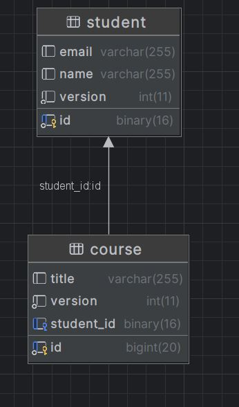

# Setting Up a One-to-One Relationship in Hibernate: Student and Course Example
## Overview
This guide will demonstrate how to create a Hibernate application with a one-to-one relationship between Student and Course entities. Additionally, 
we will **programmatically** create the database schema if it doesn't already exist.


 
### Step 1: Create a New Maven Project
1. Open your IDE and create a new Maven project.


- The structure of the project must be implemented as shown below


```css
Exampleone-one-db
├── pom.xml
├── src
│   ├── main
│   │   ├── java
│   │   │   └── com
│   │   │       └── example
│   │   │           └── jpa
│   │   │               ├── Main.java
│   │   │               ├── DatabaseInitializer.java
│   │   │               └── entity
│   │   │                   ├── Student.java
│   │   │                   └── Course.java
│   │   └── resources
│   │       └── META-INF
│   │           └── persistence.xml
└── target
    └── classes
        └── META-INF
            └── persistence.xml


```


 
3. Add the following dependencies to your pom.xml:

 ```xml
<?xml version="1.0" encoding="UTF-8"?>
<project xmlns="http://maven.apache.org/POM/4.0.0"
         xmlns:xsi="http://www.w3.org/2001/XMLSchema-instance"
         xsi:schemaLocation="http://maven.apache.org/POM/4.0.0 http://maven.apache.org/xsd/maven-4.0.0.xsd">
    <modelVersion>4.0.0</modelVersion>

    <groupId>org.example</groupId>
    <artifactId>Exampleone-one-db</artifactId>
    <version>1.0-SNAPSHOT</version>

    <properties>
        <maven.compiler.source>21</maven.compiler.source>
        <maven.compiler.target>21</maven.compiler.target>
        <project.build.sourceEncoding>UTF-8</project.build.sourceEncoding>
    </properties>
    <dependencies>
        <!-- Hibernate Core -->
        <dependency>
            <groupId>org.hibernate</groupId>
            <artifactId>hibernate-core</artifactId>
            <version>6.2.5.Final</version>
        </dependency>

        <!-- Jakarta Persistence -->
        <dependency>
            <groupId>jakarta.persistence</groupId>
            <artifactId>jakarta.persistence-api</artifactId>
            <version>3.1.0</version>
        </dependency>

        <!-- MySQL Connector/J -->
        <dependency>
            <groupId>com.mysql</groupId>
            <artifactId>mysql-connector-j</artifactId>
            <version>8.0.32</version>
        </dependency>

        <!-- SLF4J Logging -->
        <dependency>
            <groupId>org.slf4j</groupId>
            <artifactId>slf4j-api</artifactId>
            <version>2.0.9</version>
        </dependency>
    </dependencies>

</project>
```
## Step 2: Create Database Schema Programmatically
Create a Java class to programmatically create the database schema if it doesn’t exist.

  1. Create a file named DatabaseInitializer.java in your src/main/java directory.
   
```java
import java.sql.Connection;
import java.sql.DriverManager;
import java.sql.Statement;

public class DatabaseInitializer {

    public static void main(String[] args) {
        String jdbcUrl = "jdbc:mysql://localhost:3306/";
        String jdbcUser = "root";
        String jdbcPassword = "Test12";
        String dbName = "university";

        try (Connection connection = DriverManager.getConnection(jdbcUrl, jdbcUser, jdbcPassword)) {
            Statement stmt = connection.createStatement();
            String createDatabaseSQL = "CREATE DATABASE IF NOT EXISTS " + dbName;
            stmt.executeUpdate(createDatabaseSQL);
            System.out.println("Database created or already exists.");
        } catch (Exception e) {
            e.printStackTrace();
        }
    }
}

```
  2. Run the DatabaseInitializer class to create the database before starting your Hibernate application.


## Step 3: Define Entities with One-to-One Relationship
  1. Create the Student Entity

Create a file named Student.java:
```java

package com.example.jpa.entity;
import jakarta.persistence.*;

@Entity
@Table(name = "students")
public class Student {

    @Id
    @GeneratedValue(strategy = GenerationType.IDENTITY)
    private Long id;

    private String name;

    @OneToOne(mappedBy = "student", cascade = CascadeType.ALL, orphanRemoval = true)
    private Course course;

    // Getters and setters
    public Long getId() { return id; }
    public void setId(Long id) { this.id = id; }
    public String getName() { return name; }
    public void setName(String name) { this.name = name; }
    public Course getCourse() { return course; }
    public void setCourse(Course course) { this.course = course; }
}

```
  2.Create the Course Entity

Create a file named Course.java:

```java
package com.example.jpa.entity;
import jakarta.persistence.*;

@Entity
@Table(name = "courses")
public class Course {

    @Id
    @GeneratedValue(strategy = GenerationType.IDENTITY)
    private Long id;

    private String title;

    @OneToOne
    @JoinColumn(name = "student_id")
    private Student student;

    // Getters and setters
    public Long getId() { return id; }
    public void setId(Long id) { this.id = id; }
    public String getTitle() { return title; }
    public void setTitle(String title) { this.title = title; }
    public Student getStudent() { return student; }
    public void setStudent(Student student) { this.student = student; }
}

```
## Step 4: Configure Hibernate with persistence.xml
  1.Create the persistence.xml file in src/main/resources/META-INF:

```xml
<persistence xmlns="https://jakarta.ee/xml/ns/persistence" version="3.0">
    <persistence-unit name="JPAExamplePU">
        <properties>
            <property name="jakarta.persistence.jdbc.url" value="jdbc:mysql://localhost:3306/university"/>
            <property name="jakarta.persistence.jdbc.user" value="root"/>
            <property name="jakarta.persistence.jdbc.password" value="Test12"/>
            <property name="jakarta.persistence.jdbc.driver" value="com.mysql.cj.jdbc.Driver"/>
            <property name="hibernate.dialect" value="org.hibernate.dialect.MySQL8Dialect"/>
            <property name="hibernate.hbm2ddl.auto" value="update"/> <!-- Options: create, update, create-drop -->
            <property name="hibernate.show_sql" value="true"/>
        </properties>
    </persistence-unit>
</persistence>
```

## Step 5: Create and Run Main Class
  1.Create a Main class to bootstrap the application and create entities.

Create a file named Main.java:
```java
package com.example.jpa;


import com.example.jpa.entity.Course;
import com.example.jpa.entity.Student;
import jakarta.persistence.EntityManager;
import jakarta.persistence.EntityManagerFactory;
import jakarta.persistence.Persistence;

public class Main {

    public static void main(String[] args) {
        EntityManagerFactory emf = Persistence.createEntityManagerFactory("JPAExamplePU");
        EntityManager em = emf.createEntityManager();

        em.getTransaction().begin();

        Student student = new Student();
        student.setName("Alice");

        Course course = new Course();
        course.setTitle("Introduction to Programming");
        course.setStudent(student);

        student.setCourse(course);

        em.persist(student);

        em.getTransaction().commit();

        em.close();
        emf.close();
    }
}

```
  2. Run the Main class to create the tables and insert data.

# Conclusion
By following these steps, you have set up a Hibernate application with a one-to-one relationship between Student and Course entities. Additionally, the database schema is created programmatically if it does not already exist. Hibernate will manage the schema and data according to your configuration.

Feel free to modify and extend these instructions based on your project’s requirements. For further customization or advanced configurations, refer to the Hibernate documentation or your database's specific settings.
   
