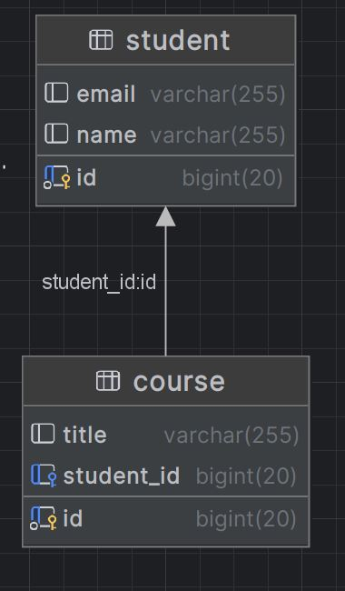

# Step-by-Step Guide: JPA 1 to many Association
-----------------------------------------------------------
# Project Overview
This project is a simple example demonstrating the use of Java Persistence API (JPA) to model a One-to-Many relationship between two entities: Student and Course. The main objective is to showcase how to establish and manage relationships in a JPA context using Hibernate as the ORM (Object-Relational Mapping) provider.



## Classes and Their Relationships
### 1. Student Class
- Purpose: Represents a student in the system.
- Attributes:
   - id: A unique identifier for each student (primary key).
   - name: The name of the student.
   - email: The email address of the student.
   - courses: A list of courses associated with the student.
- Relationship:
   - One-to-Many: A student can enroll in multiple courses. This is represented using the @OneToMany annotation with Course as the target entity.
   - Cascade Operations: Cascade type ALL is used to propagate all operations (e.g., persist, remove) from the Student entity to its associated Course entities.
   - Orphan Removal: When a course is removed from a student’s list, it is also removed from the database.
### 2. Course Class
- Purpose: Represents a course in which students can enroll.
- Attributes:
   - id: A unique identifier for each course (primary key).
   - title: The title of the course.
   - student: A reference to the student who is associated with the course.
## Relationship:
- Many-to-One: Many courses can belong to one student. This is represented using the @ManyToOne annotation, with Student as the owning entity.
- Lazy Fetching: By default, the student associated with the course is fetched lazily, meaning it is loaded on demand.
## Relationship Explanation
- One-to-Many Relationship:
    - This relationship is bidirectional. The Student class has a List<Course> representing the courses a student is enrolled in, and each Course has a reference back to the Student it belongs to.
    - In the database, this is typically represented by a foreign key in the Course table pointing to the primary key of the Student table.
## Project Functionality
- Data Persistence: When the application runs, a new Student and several Course objects are created and persisted in the database. The relationships are maintained through JPA annotations.
- Retrieval: The application retrieves and prints the student and their associated courses, demonstrating the working of the One-to-Many relationship.
This project serves as a foundational example of how to set up and use JPA for managing relational data in a Java application.

_______________________________________________________________________________---------------------------------------------------


## Step 1: Set Up Your Project
### 1.1 Create a Maven Project in IntelliJ IDEA
1. Open IntelliJ IDEA.
2. Go to File -> New -> Project.
3. Select Maven and click Next.
4. Enter the Group ID (e.g., com.example) and Artifact ID (e.g., jpa-onetomany-example).
5. Click Finish.
### 1.2 Add Dependencies in pom.xml
- Open the pom.xml file and add the following dependencies for JPA, Hibernate, and MySQL connector:
```xml
<?xml version="1.0" encoding="UTF-8"?>
<project xmlns="http://maven.apache.org/POM/4.0.0"
         xmlns:xsi="http://www.w3.org/2001/XMLSchema-instance"
         xsi:schemaLocation="http://maven.apache.org/POM/4.0.0 http://maven.apache.org/xsd/maven-4.0.0.xsd">
    <modelVersion>4.0.0</modelVersion>

    <groupId>org.example</groupId>
    <artifactId>JPAExample_OnetoMany</artifactId>
    <version>1.0-SNAPSHOT</version>

    <properties>
        <maven.compiler.source>21</maven.compiler.source>
        <maven.compiler.target>21</maven.compiler.target>
        <project.build.sourceEncoding>UTF-8</project.build.sourceEncoding>
    </properties>
    <dependencies>
        <!-- Hibernate and JPA API -->
        <dependency>
            <groupId>org.hibernate.orm</groupId>
            <artifactId>hibernate-core</artifactId>
            <version>6.2.5.Final</version>
        </dependency>
        <dependency>
            <groupId>jakarta.persistence</groupId>
            <artifactId>jakarta.persistence-api</artifactId>
            <version>3.1.0</version>
        </dependency>

        <!-- H2 Database -->
        <dependency>
            <groupId>com.h2database</groupId>
            <artifactId>h2</artifactId>
            <version>2.2.220</version>
            <scope>runtime</scope>
        </dependency>

        <!-- Logging dependencies (optional) -->
        <dependency>
            <groupId>org.slf4j</groupId>
            <artifactId>slf4j-api</artifactId>
            <version>2.0.9</version>
        </dependency>

        <dependency>
            <groupId>org.slf4j</groupId>
            <artifactId>slf4j-simple</artifactId>
            <version>2.0.9</version>
        </dependency>

        <dependency>
            <groupId>mysql</groupId>
            <artifactId>mysql-connector-java</artifactId>
            <version>8.0.30</version> <!-- Use the latest version available -->
        </dependency>

    </dependencies>

</project>
```

## /Step 2: Create the Entity Classes
### 2.1 Create the Student Entity
1. Create a package named com.example.jpa.entity.
2. Inside this package, create a Student class:

```java
package com.example.jpa.entity;

import jakarta.persistence.*;
import java.util.HashSet;
import java.util.Set;

@Entity
public class Student {

    @Id
    @GeneratedValue(strategy = GenerationType.IDENTITY)
    private Long id;

    private String name;
    private String email;

    @OneToMany(mappedBy = "student", cascade = CascadeType.ALL, orphanRemoval = true)
    private Set<Course> courses = new HashSet<>();

    // Getters and Setters
    public Long getId() {
        return id;
    }

    public void setId(Long id) {
        this.id = id;
    }

    public String getName() {
        return name;
    }

    public void setName(String name) {
        this.name = name;
    }

    public String getEmail() {
        return email;
    }

    public void setEmail(String email) {
        this.email = email;
    }

    public Set<Course> getCourses() {
        return courses;
    }

    public void setCourses(Set<Course> courses) {
        this.courses = courses;
    }

    @Override
    public String toString() {
        return "Student{id=" + id + ", name='" + name + "', email='" + email + "'}";
    }
}

```
### 2.2 Create the Course Entity
1. In the same package com.example.jpa.entity, create a Course class:

```java
package com.example.jpa.entity;

import jakarta.persistence.*;

@Entity
public class Course {

    @Id
    @GeneratedValue(strategy = GenerationType.IDENTITY)
    private Long id;

    private String title;

    @ManyToOne
    @JoinColumn(name = "student_id")
    private Student student;

    // Getters and Setters
    public Long getId() {
        return id;
    }

    public void setId(Long id) {
        this.id = id;
    }

    public String getTitle() {
        return title;
    }

    public void setTitle(String title) {
        this.title = title;
    }

    public Student getStudent() {
        return student;
    }

    public void setStudent(Student student) {
        this.student = student;
    }

    @Override
    public String toString() {
        return "Course{id=" + id + ", title='" + title + "'}";
    }
}

```
## Step 3: Configure persistence.xml
### 3.1 Create META-INF/persistence.xml
1. In the src/main/resources directory, create a folder named META-INF.
2. Inside META-INF, create a persistence.xml file with the following content:

```xml
<?xml version="1.0" encoding="UTF-8"?>
<persistence xmlns="https://jakarta.ee/xml/ns/persistence" version="3.0">
    <persistence-unit name="JPAExamplePU" transaction-type="RESOURCE_LOCAL">
        <provider>org.hibernate.jpa.HibernatePersistenceProvider</provider>
        <class>com.example.jpa.Student</class>
        <properties>
            <!-- JDBC connection properties -->
            <property name="jakarta.persistence.jdbc.url" value="jdbc:mysql://localhost:3306/StudentCourse"/>
            <property name="jakarta.persistence.jdbc.user" value="root"/>
            <property name="jakarta.persistence.jdbc.driver" value="com.mysql.cj.jdbc.Driver"/>
            <property name="jakarta.persistence.jdbc.password" value="Test12"/>

            <!-- Hibernate settings -->
            <property name="hibernate.dialect" value="org.hibernate.dialect.MySQLDialect"/>
            <property name="hibernate.hbm2ddl.auto" value="update"/>
            <!-- <property name="hibernate.hbm2ddl.auto" value="create-drop"/>-->


             <property name="hibernate.show_sql" value="true"/>
             <property name="hibernate.format_sql" value="true"/>
         </properties>
     </persistence-unit>
 </persistence>
```
- Replace yourpassword with your MySQL root password.
## Step 4: Create the Main Application
### 4.1 Create the Main Class
1. In the com.example.jpa package, create a Main class:
```java
package com.example.jpa;

import com.example.jpa.entity.Student; // Correct import statement
import com.example.jpa.entity.Course; // Correct import statement
import jakarta.persistence.EntityManager;
import jakarta.persistence.EntityManagerFactory;
import jakarta.persistence.EntityTransaction;
import jakarta.persistence.Persistence;

public class Main {
    public static void main(String[] args) {
        EntityManagerFactory emf = Persistence.createEntityManagerFactory("JPAExamplePU");
        EntityManager em = emf.createEntityManager();
        EntityTransaction tx = em.getTransaction();

        try {
            tx.begin();

            Student student = new Student();
            student.setName("John Doe");
            student.setEmail("john.doe@example.com");

            Course course1 = new Course();
            course1.setTitle("Mathematics");
            course1.setStudent(student);

            Course course2 = new Course();
            course2.setTitle("Science");
            course2.setStudent(student);

            student.getCourses().add(course1);
            student.getCourses().add(course2);

            em.persist(student);
            tx.commit();
        } catch (Exception e) {
            if (tx.isActive()) tx.rollback();
            e.printStackTrace();
        } finally {
            em.close();
            emf.close();
        }
    }
}

```
## Step 5: Run the Application
### 5.1 Run the Main Class
- Run the Main class from your IDE. If everything is set up correctly, the application will create a student, associate it with two courses, and print out the student and their associated courses.
### 5.2 Check the Database
- Open your MySQL database and verify that the Student and Course tables have been created and populated with data.
## Step 6: Explore and Expand
### 6.1 Expand the Application
- You can add more entities, define additional relationships, or implement more JPA features like @ManyToMany, @OneToOne, etc.
## 6.2 Experiment with Queries
- Try using JPQL (Java Persistence Query Language) or the Criteria API to query and manipulate your data.
