# IntelliJ Assignment: Demonstrating One-to-Many Relationship using JPA and MySQL

## Assignment Title: One-to-Many Relationship: Students and Exam Grades

### Objective
In this assignment, you will implement a simple **One-to-Many relationship** using **JPA (Java Persistence API)** and **Hibernate** in a Java project without Spring. You will model the relationship between a `Student` entity and an `Exam` entity with a grade scale from 1-5, where each student can have multiple exam grades.


You will use **IntelliJ IDEA** and **MySQL** (through HeidiSQL or another MySQL client) as your database for this assignment. The submission will include the project files and a screenshot of the list of students and their exam grades after querying the database.

---

### Part 1: Project Setup in IntelliJ

1. **Create a new Maven Project**:
   - Open IntelliJ IDEA and create a new **Maven** project named `StudentExamSystem`.
   - Configure the `pom.xml` with the necessary dependencies for **JPA**, **Hibernate**, and **MySQL**.

```xml
<dependencies>
    <!-- JPA and Hibernate -->
    <dependency>
        <groupId>org.hibernate.orm</groupId>
        <artifactId>hibernate-core</artifactId>
        <version>6.1.5.Final</version>
    </dependency>

    <!-- MySQL Connector for Java -->
    <dependency>
        <groupId>mysql</groupId>
        <artifactId>mysql-connector-java</artifactId>
        <version>8.0.33</version>
    </dependency>

    <!-- JUnit for testing -->
    <dependency>
        <groupId>junit</groupId>
        <artifactId>junit</artifactId>
        <version>4.13.2</version>
        <scope>test</scope>
    </dependency>
</dependencies>


```
## Part 2: Database Setup

1. Create the Database:

- Create a database called student_exam_system in MySQL using HeidiSQL or from the MySQL CLI.
```sql
CREATE DATABASE student_exam_system;
```

2. Configure persistence.xml:

- In the src/main/resources/META-INF folder, create a persistence.xml file to configure JPA for MySQL.

```xml
<?xml version="1.0" encoding="UTF-8"?>
<persistence xmlns="http://xmlns.jcp.org/xml/ns/persistence"
             xmlns:xsi="http://www.w3.org/2001/XMLSchema-instance"
             xsi:schemaLocation="http://xmlns.jcp.org/xml/ns/persistence
    http://xmlns.jcp.org/xml/ns/persistence/persistence_2_1.xsd"
             version="2.1">

    <persistence-unit name="student_exam_system">
        <class>com.example.jpa.entity.Student</class>
        <class>com.example.jpa.entity.Exam</class>

        <!-- Database settings -->
        <properties>
            <!-- MySQL Database Connection Settings -->
            <property name="javax.persistence.jdbc.driver" value="com.mysql.cj.jdbc.Driver"/>
            <property name="javax.persistence.jdbc.url" value="jdbc:mysql://localhost:3306/student_exam_system"/>
            <property name="javax.persistence.jdbc.user" value="root"/>
            <property name="javax.persistence.jdbc.password" value="Test12"/>

            <!-- Hibernate settings -->
            <property name="hibernate.dialect" value="org.hibernate.dialect.MySQL8Dialect"/>
            <property name="hibernate.hbm2ddl.auto" value="update"/>
            <property name="hibernate.show_sql" value="true"/>
            <property name="hibernate.format_sql" value="true"/>
        </properties>
    </persistence-unit>
</persistence>

```
- Make sure to replace your-username and your-password with your MySQL credentials.

## Part 3: Entity Creation
1. Create the Student Entity:
- Inside the src/main/java/com/example folder, create a Java class Student.
- Annotate it with @Entity and define fields such as id, name, and a One-to-Many relationship with the Exam entity.

```java
package com.example;

import jakarta.persistence.*;
import java.util.List;

@Entity
@Table(name = "students")
public class Student {

    @Id
    @GeneratedValue(strategy = GenerationType.IDENTITY)
    private Long id;

    @Column(name = "name", nullable = false)
    private String name;

    @OneToMany(mappedBy = "student", cascade = CascadeType.ALL, orphanRemoval = true)
    private List<Exam> exams;

    public Student() {}

    public Student(String name) {
        this.name = name;
    }

    // Getters and Setters
}


```
2. Create the Exam Entity:
- Create a Java class Exam to represent the Exam entity.
- Annotate it with @Entity and define fields such as id, grade, and a Many-to-One relationship to the Student entity.
```java

package com.example;

import jakarta.persistence.*;

@Entity
@Table(name = "exams")
public class Exam {

    @Id
    @GeneratedValue(strategy = GenerationType.IDENTITY)
    private Long id;

    @ManyToOne
    @JoinColumn(name = "student_id")
    private Student student;

    @Column(name = "grade", nullable = false)
    private int grade; // Grades will be on a scale of 1-5

    public Exam() {}

    public Exam(Student student, int grade) {
        this.student = student;
        this.grade = grade;
    }

    // Getters and Setters
}

```
## Part 4: DAO Layer (Data Access Object)
1. Create DAO Classes for Student and Exam:
- Create DAO classes to manage database operations for Student and Exam entities using Hibernate.

```java
package com.example;

import jakarta.persistence.EntityManager;
import jakarta.persistence.EntityManagerFactory;
import jakarta.persistence.Persistence;

import java.util.List;

public class StudentDAO {
    private static final EntityManagerFactory ENTITY_MANAGER_FACTORY = Persistence.createEntityManagerFactory("student_exam_system");

    public void saveStudent(Student student) {
        EntityManager entityManager = ENTITY_MANAGER_FACTORY.createEntityManager();
        entityManager.getTransaction().begin();
        entityManager.persist(student);
        entityManager.getTransaction().commit();
        entityManager.close();
    }

    public List<Student> getAllStudents() {
        EntityManager entityManager = ENTITY_MANAGER_FACTORY.createEntityManager();
        List<Student> students = entityManager.createQuery("from Student", Student.class).getResultList();
        entityManager.close();
        return students;
    }
}

```


```java
package com.example;

import jakarta.persistence.EntityManager;
import jakarta.persistence.EntityManagerFactory;
import jakarta.persistence.Persistence;

public class ExamDAO {
    private static final EntityManagerFactory ENTITY_MANAGER_FACTORY = Persistence.createEntityManagerFactory("student_exam_system");

    public void saveExam(Exam exam) {
        EntityManager entityManager = ENTITY_MANAGER_FACTORY.createEntityManager();
        entityManager.getTransaction().begin();
        entityManager.persist(exam);
        entityManager.getTransaction().commit();
        entityManager.close();
    }
}


```
## Part 5: Main Class (Application Runner)
1. Create Application Logic to Test:
- Create a Main class to add sample data and test the relationship.
```java
package com.example;

import java.util.List;

public class Main {

    public static void main(String[] args) {
        StudentDAO studentDAO = new StudentDAO();
        ExamDAO examDAO = new ExamDAO();

        // Add sample students
        Student john = new Student("John Doe");
        Student jane = new Student("Jane Smith");

        studentDAO.saveStudent(john);
        studentDAO.saveStudent(jane);

        // Add exams for students
        examDAO.saveExam(new Exam(john, 4));
        examDAO.saveExam(new Exam(john, 5));
        examDAO.saveExam(new Exam(jane, 3));

        // Retrieve and display all students and their exam grades
        List<Student> students = studentDAO.getAllStudents();
        for (Student student : students) {
            System.out.println("Student: " + student.getName());
            student.getExams().forEach(exam -> System.out.println(" - Exam Grade: " + exam.getGrade()));
        }
    }
}


```

## Sequence Diagram (The role of each classes)

```mermaid
sequenceDiagram
    participant Main
    participant StudentDAO
    participant ExamDAO
    participant Student
    participant Exam

    Main->>StudentDAO: saveStudent(john)
    StudentDAO->>Student: new Student("John Doe")
    StudentDAO-->>Main: student saved

    Main->>StudentDAO: saveStudent(jane)
    StudentDAO->>Student: new Student("Jane Smith")
    StudentDAO-->>Main: student saved

    Main->>ExamDAO: saveExam(new Exam(john, 4))
    ExamDAO->>Exam: new Exam(john, 4)
    ExamDAO-->>Main: exam saved

    Main->>ExamDAO: saveExam(new Exam(john, 5))
    ExamDAO->>Exam: new Exam(john, 5)
    ExamDAO-->>Main: exam saved

    Main->>ExamDAO: saveExam(new Exam(jane, 3))
    ExamDAO->>Exam: new Exam(jane, 3)
    ExamDAO-->>Main: exam saved

    Main->>StudentDAO: getAllStudents()
    StudentDAO-->>Main: List of Students

    Main->>Student: getExams()
    Student-->>Main: List of Exams for each student


```

## Additional tasks:
Extend the code above with additional filds
- Add grade saving date
- Add also the temporality feature in Exam

## Part 6: Generate Output and Submit
1. Run the Project:

- Run the project to verify that the One-to-Many relationship works as expected. You should see students along with their exam grades printed in the console.

2. Take a Screenshot:

After running the program, take a screenshot of the console output showing the list of students and their exam grades.

3. Submit the Following:

- Upload the Java project files to GitHub.
- Include a screenshot of the console output displaying the list of students and their exam grades.
- Submit the GitHub repository link and screenshot through OMA

# Submission Deadline
The assignment must be submitted by [insert deadline].


## Evaluation Criteria
- Correct implementation of the One-to-Many relationship between Student and Exam.
- Ability to query students and their associated exam grades.
- Clean and readable code following best practices.
- A functional application with correct output in the console.
