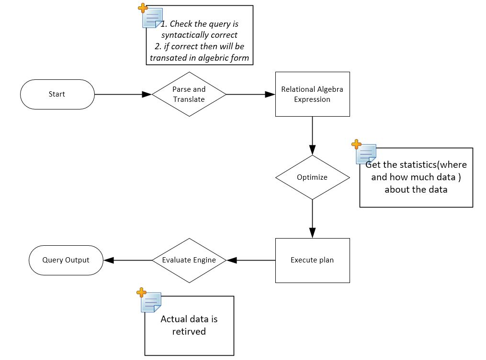

# MariaDB Learning Material



## Table of Contents
1. [Query Optimization](#query-optimization)
2. [Transactions](#transactions)
3. [Concurrency Management](#concurrency-management)

## Query Optimization

Query optimization in MariaDB involves improving the performance of SQL queries to ensure they run as efficiently as possible. Here are some techniques and examples:

## Query Optimization: An Overview

Query optimization is a critical process in database management systems (DBMS) that aims to determine the most efficient way to execute a query. The goal is to minimize resource usage, such as CPU time, memory, and disk I/O, to retrieve the desired data as quickly and efficiently as possible. The optimizer considers multiple query execution plans and chooses the one with the lowest estimated cost.

## Example Scenario: Optimizing a Query

Let's take a simple scenario where we want to retrieve specific data from a university database with three tables: `Students`, `Courses`, and `Enrollments`.

### Tables

1. **Students**:
   
    ````sql
    | StudentID | StudentName    | DateOfBirth | Major    |
    |-----------|---------|-----|----------|
    | 1         | Alice   | 20  | Biology  |
    | 2         | Amir   | 22  | Math     |
    | 3         | Carol   | 21  | Physics  |

    ````

3. **Courses**:
    ```sql
    | CourseID | CourseName   |
    |----------|--------------|
    | 101      | Biology      |
    | 102      | Math         |
    | 103      | Physics      |
    ```

4. **Enrollments**:
    ```sql
    | StudentID | CourseID |
    |-----------|----------|
    | 1         | 101      |
    | 1         | 102      |
    | 2         | 102      |
    | 3         | 103      |
    ```

### Query: Retrieve the names of students enrolled in 'Math' who are older than 20.

```sql
SELECT s.StudentName
FROM Students s
JOIN Enrollments e ON s.StudentID = e.StudentID
JOIN Courses c ON e.CourseID = c.CourseID
WHERE c.CourseName = 'Math' AND s.DateOfBirth < '2004-01-01';

````
Result:  Amir

### Step 1: Initial Query Analysis

The initial query involves:

- **Two joins**: Joining `Students` with `Enrollments`, and `Enrollments` with `Courses`.
- **Selection**: Filtering based on course name (`'Math'`) and student age (`> 20`).
- **Projection**: Selecting only the student names.

### Step 2: Understand the Execution Plan

To optimize the query, the DBMS evaluates different execution plans. Let's look at a potential execution plan:

1. **Scan or Index Scan on `Courses`**: The DBMS starts by finding the `CourseID` for `'Math'`.
2. **Join `Enrollments` with `Courses`**: Using the `CourseID` found in step 1, the DBMS identifies which students are enrolled in `'Math'`.
3. **Join `Students` with `Enrollments`**: The DBMS matches the `StudentID` from `Enrollments` to the `Students` table.
4. **Selection on `Age`**: The DBMS filters out students who are not older than 20.
5. **Projection**: Finally, the DBMS returns the names of the students.

### Step 3: Query Optimization

In this final step, the DBMS may apply several optimization strategies, such as:

- **Index Utilization**: Ensuring indexes are used on `CourseName` in `Courses` and `Age` in `Students` to speed up the selection process.
- **Join Order Optimization**: Choosing the most efficient order for performing joins, such as filtering rows early in the process to reduce the number of records to join.
- **Avoiding Full Table Scans**: Leveraging indexes or partitioning to avoid scanning entire tables.
- **Query Rewriting**: Simplifying or restructuring the query to reduce its computational cost.

By applying these optimizations, the DBMS aims to execute the query with minimal resource consumption and maximum speed.

### Example Scenario: Optimizing a Query

Let's take a simple scenario where we want to retrieve specific data from a university database with three tables: `Students`, `Courses`, and `Enrollments`.


Tables:
Students:


### Indexing

Indexes improve query performance by allowing the database to find rows more quickly.

```sql
-- Creating an index on a column
CREATE INDEX idx_customer_name ON customers (name);

-- Using EXPLAIN to analyze query performance
EXPLAIN SELECT * FROM customers WHERE name = 'John Doe';

```
## Query Refactoring
Query refactoring involves modifying a database query to improve its performance, maintainability, readability, or to adapt to changes in the database schema, without changing the query's output or functionality. This process is essential in database optimization and management, especially in complex systems where performance and scalability are critical.

```sql
-- Original query
SELECT * FROM orders WHERE YEAR(order_date) = 2023;
 
-- Optimized query
SELECT * FROM orders WHERE order_date >= '2023-01-01' AND order_date < '2024-01-01';
```
or

```sql
-- Original query using subquery
SELECT name FROM Employees WHERE department_id = 
    (SELECT id FROM Departments WHERE name = 'HR');

-- Refactored query using a join
SELECT e.name FROM Employees e
JOIN Departments d ON e.department_id = d.id
WHERE d.name = 'HR';
```


## Use of Appropriate SQL Functions
Defining an appropriate SQL function involves creating a reusable block of code that performs a specific task or calculation in your database. 
SQL functions can be categorized into scalar functions (which return a single value) and table-valued functions (which return a table). 
Functions are often used for encapsulating logic that you want to reuse across multiple queries.

Choose the right SQL functions for better performance.

```sql
-- Inefficient query
SELECT * FROM orders WHERE SUBSTRING(customer_id, 1, 3) = 'ABC';

-- Optimized query using LIKE
SELECT * FROM orders WHERE customer_id LIKE 'ABC%';

```
## Avoiding SELECT *
Avoiding the SELECT statement in SQL refer to situations where you need to optimize performance, avoid redundant data retrieval, or adhere to certain database constraints. 
Select only the columns you need.

```sql
-- Inefficient query
SELECT * FROM employees;

-- Optimized query
SELECT id, name, department FROM employees;
```

## Introduction to the Relational Model

The **relational model** is a cornerstone of modern database systems. It provides a way to structure and query data using tables (also called relations), which are made up of rows and columns. Each table represents an entity, and the relationships between these entities are expressed through keys (primary and foreign keys). This model is widely used in various applications due to its simplicity, flexibility, and powerful querying capabilities.

### Why is the Relational Model Important?

1. **Data Organization**: The relational model organizes data into tables that are easy to understand and work with. Each table can be thought of as a separate entity, like `Customers`, `Orders`, or `Products`.

2. **Data Integrity**: The model enforces data integrity through constraints like primary keys (which uniquely identify rows) and foreign keys (which maintain relationships between tables).

3. **Ease of Querying**: With Structured Query Language (SQL), users can easily query and manipulate data. SQL provides a standard interface to interact with relational databases, making it possible to perform complex queries, updates, and analyses efficiently.

4. **Scalability**: Relational databases are designed to handle large amounts of data and can scale to accommodate growing datasets, making them suitable for a wide range of applications from small projects to enterprise-level systems.

### How is the Relational Model Used?

The relational model is used to define the structure of a database and to perform operations on the data within that structure. Some of the core operations in the relational model include **projection**, **selection**, **Cartesian product**, and **join**. These operations allow users to retrieve and manipulate data in powerful ways.

Let's explore these operations in detail:

---

### 1. **Projection**
   - **What it is**: Projection is like taking a table and picking out just the columns (fields) you want to see. It’s about narrowing down the information to focus on specific attributes.
   - **Example**: Imagine you have a table of students:

     ```sql
     | StudentID | Name    | Age | Major    |
     |-----------|---------|-----|----------|
     | 1         | Alice   | 20  | Biology  |
     | 2         | Bob     | 22  | Math     |
     | 3         | Carol   | 21  | Physics  |
     ```

     **Projection**: If you only want to see the `Name` and `Major` of each student, you project those columns:

     ```sql
     | Name  | Major   |
     |-------|---------|
     | Alice | Biology |
     | Bob   | Math    |
     | Carol | Physics |
     ```

### 2. **Selection**
   - **What it is**: Selection is like filtering rows from a table based on a condition. It’s about choosing only the rows that meet certain criteria.
   - **Example**: Using the same student table, suppose you want to see only the students who are older than 20.

     **Selection**: You filter the table where `Age > 20`:

     ```sql
     | StudentID | Name  | Age | Major   |
     |-----------|-------|-----|---------|
     | 2         | Bob   | 22  | Math    |
     | 3         | Carol | 21  | Physics |
     ```

### 3. **Cartesian Product**
   - **What it is**: The Cartesian product is a way to combine two tables by pairing every row of the first table with every row of the second table. The result is a new table with all possible combinations of the rows.
   - **Example**: Suppose you have two tables:

     **Students**:

     ```sql
     | StudentID | Name  |
     |-----------|-------|
     | 1         | Alice |
     | 2         | Bob   |
     ```

     **Courses**:

     ```sql
     | CourseID | CourseName   |
     |----------|--------------|
     | 101      | Biology      |
     | 102      | Math         |
     ```

     **Cartesian Product**: Every student is paired with every course:

     ```sql
     | StudentID | Name  | CourseID | CourseName |
     |-----------|-------|----------|------------|
     | 1         | Alice | 101      | Biology    |
     | 1         | Alice | 102      | Math       |
     | 2         | Bob   | 101      | Biology    |
     | 2         | Bob   | 102      | Math       |
     ```

     This can generate a large table, especially if the original tables are big.

### 4. **Join**
   - **What it is**: A join combines rows from two tables based on a related column. It’s like connecting the dots between two tables using a common attribute.
   - **Example**: Let’s use the same `Students` and `Courses` tables, but now imagine you have a third table that records which courses each student is enrolled in:

     **Enrollments**:

     ```sql
     | StudentID | CourseID |
     |-----------|----------|
     | 1         | 101      |
     | 2         | 102      |
     ```

     **Join**: To find out which students are taking which courses, you join the `Students` and `Enrollments` tables on `StudentID`, and then join the result with the `Courses` table on `CourseID`:

     ```sql
     | StudentID | Name  | CourseID | CourseName |
     |-----------|-------|----------|------------|
     | 1         | Alice | 101      | Biology    |
     | 2         | Bob   | 102      | Math       |
     ```

     Here, Alice is enrolled in Biology, and Bob is enrolled in Math.

---

### Combining All Operations in a Many-to-Many Relationship

Let's consider a scenario where we combine **projection**, **selection**, **Cartesian product**, and **join** within a many-to-many relationship.

#### Example Scenario: Students and Courses in a University

In a university database, students can enroll in multiple courses, and each course can have multiple students. This creates a many-to-many relationship between `Students` and `Courses`. We manage this relationship using an intermediary table called `Enrollments` that links students to the courses they are taking.

#### Tables:

1. **Students**:
    ```sql
    | StudentID | Name    | Age |
    |-----------|---------|-----|
    | 1         | Alice   | 20  |
    | 2         | Bob     | 22  |
    | 3         | Carol   | 21  |
    ```

2. **Courses**:
    ```sql
    | CourseID | CourseName   |
    |----------|--------------|
    | 101      | Biology      |
    | 102      | Math         |
    | 103      | Physics      |
    ```

3. **Enrollments**:
    ```sql
    | StudentID | CourseID |
    |-----------|----------|
    | 1         | 101      |
    | 1         | 102      |
    | 2         | 102      |
    | 3         | 103      |
    ```

### Step 1: **Join**

First, we want to know which students are enrolled in which courses. We need to join the `Students` table with the `Enrollments` table on `StudentID`, and then join the result with the `Courses` table on `CourseID`.

```sql
SELECT Students.Name, Courses.CourseName
FROM Students
JOIN Enrollments ON Students.StudentID = Enrollments.StudentID
JOIN Courses ON Enrollments.CourseID = Courses.CourseID;
```
Result:

| Name  | CourseName |
|-------|------------|
| Alice | Biology    |
| Alice | Math       |
| Bob   | Math       |
| Carol | Physics    |

Step 2: Selection
Now, let’s say we are only interested in the students who are older than 20. We can add a selection condition to filter the rows based on this criterion.
```sql
SELECT Students.Name, Courses.CourseName
FROM Students
JOIN Enrollments ON Students.StudentID = Enrollments.StudentID
JOIN Courses ON Enrollments.CourseID = Courses.CourseID
WHERE Students.Age > 20;
````
Result:
| Name  | CourseName |
|-------|------------|
| Bob   | Math       |
| Carol | Physics    |


Step 3: Projection
Suppose we are only interested in the course names without the student names. We can project only the CourseName column.

```sql
SELECT Courses.CourseName
FROM Students
JOIN Enrollments ON Students.StudentID = Enrollments.StudentID
JOIN Courses ON Enrollments.CourseID = Courses.CourseID
WHERE Students.Age > 20;
````
Result:
| CourseName |
|------------|
| Math       |
| Physics    |

Step 4: Cartesian Product
Let's consider a scenario where we want to explore all possible combinations of students and courses, regardless of their actual enrollments. 
This is achieved using the Cartesian product.
````sql
SELECT Students.Name, Courses.CourseName
FROM Students, Courses;
````
Result:

| Name  | CourseName |
|-------|------------|
| Alice | Biology    |
| Alice | Math       |
| Alice | Physics    |
| Bob   | Biology    |
| Bob  


-----------------------------------------------------------------------------
# Transactions
A transaction in a database context is a sequence of one or more SQL operations (such as `INSERT`, `UPDATE`, `DELETE`, or `SELECT` statements) that are executed as a single unit of work. Transactions ensure that a series of operations are completed successfully and consistently, even in the presence of system failures or other concurrent operations. If any part of the transaction fails, the entire transaction can be rolled back to ensure the database remains in a consistent state.

## Key Properties of Transactions: ACID

Transactions are defined by four key properties, commonly referred to as ACID:

### Atomicity
The transaction is indivisible; it is either fully completed or not at all. If any part of the transaction fails, the entire transaction is rolled back, and the database is left unchanged.

**Example:** If a bank transaction involves transferring money from one account to another, atomicity ensures that either both the debit and credit occur, or neither does.

### Consistency
A transaction brings the database from one consistent state to another. Consistency ensures that all database rules (such as integrity constraints) are maintained after the transaction completes.

**Example:** If a transaction violates a database constraint, such as a foreign key constraint, the transaction will be rolled back, preserving the database's consistent state.

### Isolation
Transactions are isolated from each other, meaning that the intermediate results of a transaction are not visible to other transactions until the transaction is completed. This prevents concurrent transactions from interfering with each other.

**Example:** If two users are making changes to the same data concurrently, isolation ensures that one user’s changes do not affect the other’s operations until the first transaction is committed.

### Durability
Once a transaction is committed, its results are permanently recorded in the database, even in the event of a system failure. This means the committed data will survive crashes, power loss, or other issues.

**Example:** After a financial transaction is committed, the changes are permanently saved, and the system can recover this information even after a crash.


## Starting and Committing a Transaction

-- Start a transaction

```sql
BEGIN TRANSACTION;
```
Transaction Execution:
```sql
-- Perform some SQL operations
UPDATE accounts SET balance = balance - 100 WHERE account_id = 1;
UPDATE accounts SET balance = balance + 100 WHERE account_id = 2;

-- Commit the transaction
COMMIT;
```

## Rolling Back a Transaction
If any operation within the transaction fails or if an error is detected, the transaction can be rolled back using the ROLLBACK statement. 
This undoes all changes made during the transaction, ensuring the database remains in a consistent state.

-- Start a transaction
START TRANSACTION;
```sql
-- Perform some SQL operations
UPDATE accounts SET balance = balance - 100 WHERE account_id = 1;
UPDATE accounts SET balance = balance + 100 WHERE account_id = 2;

-- Rollback the transaction if something goes wrong
ROLLBACK;
```

# Example Scenario
Imagine a simple banking system where money is transferred from one account to another:

```sql
BEGIN TRANSACTION;

UPDATE Accounts SET balance = balance - 100 WHERE account_id = 1;
UPDATE Accounts SET balance = balance + 100 WHERE account_id = 2;

IF @@ERROR = 0
   COMMIT;
ELSE
   ROLLBACK;


```
In this example:

- The transaction begins with `BEGIN TRANSACTION`.
- Two `UPDATE` operations transfer money between accounts.
- If both updates succeed (`IF @@ERROR = 0` checks for errors), the transaction is committed, making the changes permanent.
- If an error occurs, the transaction is rolled back, undoing all changes.

# Concurrency Management
Concurrency management in databases refers to the techniques and mechanisms used to control the simultaneous access and modification of data by multiple transactions in a multi-user environment. The goal of concurrency management is to ensure data consistency, integrity, and isolation while maximizing performance and allowing as many concurrent operations as possible.
MariaDB uses locking mechanisms and isolation levels to manage concurrency.
## Challenges in Concurrency Management

Concurrency can lead to several potential issues, often referred to as concurrency problems:

### Dirty Reads
Occurs when a transaction reads data that has been modified by another transaction but not yet committed. If the other transaction is rolled back, the first transaction may have read data that never existed.

### Non-Repeatable Reads
Happens when a transaction reads the same data multiple times and gets different results each time because another transaction modified the data in the meantime.

### Phantom Reads
Occurs when a transaction re-executes a query and finds new rows that weren’t there before, due to another transaction inserting, updating, or deleting rows that affect the query’s result set.

### Lost Updates
Occurs when two transactions read the same data and update it, but the second update overwrites the first one, causing a loss of data.

## Concurrency Control Mechanisms
To manage these concurrency challenges, databases use several control mechanisms:

## Locking Mechanisms
MariaDB provides various types of locks to ensure data integrity.
Locks are the most common concurrency control mechanism. They prevent multiple transactions from accessing the same data in conflicting ways.

**Types of Locks:**

- **Shared Lock (S):** Allows multiple transactions to read (but not modify) the same data simultaneously.
- **Exclusive Lock (X):** Prevents other transactions from reading or modifying the data. Only one transaction can hold an exclusive lock on a piece of data.
- **Intent Locks:** Used in hierarchical locking schemes to indicate an intention to acquire a shared or exclusive lock at a finer granularity.

**Lock Granularity:**

- **Row-level locking:** Locks specific rows, allowing higher concurrency but more complex management.
- **Page-level locking:** Locks a page (a block of rows), balancing concurrency and complexity.
- **Table-level locking:** Locks an entire table, simpler but reduces concurrency.
```sql
-- Explicit locking
LOCK TABLES accounts WRITE;

-- Perform operations
UPDATE accounts SET balance = balance - 100 WHERE account_id = 1;

-- Unlock tables
UNLOCK TABLES;
```

### 2. Timestamp Ordering
Each transaction is given a unique timestamp when it starts. The database ensures that transactions are executed in a way that respects the order of these timestamps, preventing conflicts by making sure that older transactions are completed before newer ones.

### 3. Optimistic Concurrency Control
Assumes that transactions will rarely conflict. Data is read and modified without locking. Before a transaction is committed, the database checks whether another transaction has modified the same data. If there’s a conflict, the transaction is rolled back.

**Steps:**

- **Read Phase:** Transaction reads the data and performs its operations.
- **Validation Phase:** Before committing, it checks if any other transactions have modified the data it worked on.
- **Write Phase:** If validation passes, the transaction is committed.

### 4. Pessimistic Concurrency Control
Assumes that conflicts are likely, so locks are used aggressively. Data is locked when it is read or written, preventing other transactions from accessing it until the lock is released.

### 5. Multiversion Concurrency Control (MVCC)
MVCC allows multiple versions of data to exist simultaneously, enabling transactions to see a consistent snapshot of the database without blocking other transactions. It’s widely used in databases like PostgreSQL and Oracle.

## Isolation Levels
Isolation levels define the degree to which the operations in one transaction are isolated from those in other transactions.
**How It Works:**

- Each transaction sees a snapshot of the data as it was at the start of the transaction.
- New data changes are written as new versions, and older versions are retained for other transactions.
- Conflicts are resolved at commit time, ensuring that transactions do not interfere with each other.

## Isolation Levels

Isolation levels are configurations that determine how strictly a database manages concurrency. They balance the need for data consistency against the need for performance and concurrency. The four primary isolation levels are:

### Read Uncommitted
- Transactions can see uncommitted changes from other transactions, leading to dirty reads.
- Highest concurrency, lowest consistency.

### Read Committed
- Transactions only see committed changes from other transactions, avoiding dirty reads.
- Most commonly used isolation level, balancing consistency and performance.

### Repeatable Read
- Transactions can read the same data multiple times and see the same value, preventing non-repeatable reads.
- Ensures more consistency but with some performance trade-offs.

### Serializable
- The strictest isolation level, where transactions are fully isolated from each other as if they were executed serially.
- Ensures full consistency but at the cost of reduced concurrency.

## Deadlock Management

A deadlock occurs when two or more transactions are waiting indefinitely for each other to release locks, preventing them from proceeding. 
Databases use various strategies to detect and resolve deadlocks:

- **Deadlock Detection:** The database periodically checks for cycles of waiting transactions and resolves deadlocks by aborting one of the transactions (often the one with the lowest cost to rollback).

- **Deadlock Prevention:** The database may prevent deadlocks by ensuring that transactions acquire locks in a predefined order or by imposing timeouts on locks.
```sql
-- Setting the isolation level to REPEATABLE READ
SET SESSION TRANSACTION ISOLATION LEVEL REPEATABLE READ;

-- Start a transaction
START TRANSACTION;

-- Perform operations
SELECT * FROM accounts WHERE account_id = 1;

-- Commit the transaction
COMMIT;
```

# Example of Handling Deadlocks
Deadlocks occur when two or more transactions are waiting for each other to release locks.

```sql
-- Transaction 1
START TRANSACTION;
UPDATE accounts SET balance = balance - 100 WHERE account_id = 1;
-- Waits for Transaction 2 to release the lock

-- Transaction 2
START TRANSACTION;
UPDATE accounts SET balance = balance + 100 WHERE account_id = 2;
-- Waits for Transaction 1 to release the lock

-- MariaDB will detect the deadlock and roll back one of the transactions
```
By understanding and implementing these concepts, you can optimize query performance, manage transactions effectively, and handle concurrency in MariaDB to ensure your database operations are efficient and reliable.

This single Markdown file can be used in a GitHub repository to provide comprehensive learning material on query optimization, transactions, and concurrency management in MariaDB.


