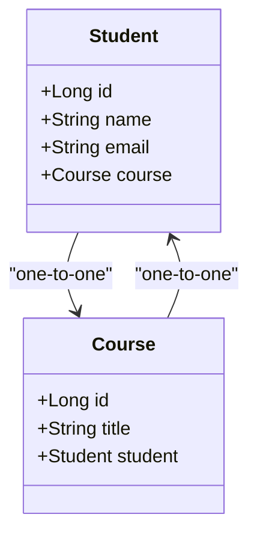

# Step-by-Step Guide to Creating a One-to-One Relationship in JPA
This guide will walk you through the process of setting up a one-to-one relationship between two entities using Java Persistence API (JPA). In this example, we'll create a Student entity and a Course entity, where each student is associated with one course, and each course is associated with one student.

- In this example, we will define a one-to-one relationship between a Student and a Course. Each student will be enrolled in exactly one course, and each course will be associated with exactly one student.

**Step-by-Step Explanation**
1. Entities and Relationship Identification
- We have two entities:

    - Student: Represents the student entity (table).
    - Course: Represents the course entity (table).
      

Each  `student` is enrolled in exactly one `course`, and each `course` is associated with one `student`. This is a classic one-to-one relationship.

There are two types of one-to-one association:
1. *bidirectional* which means both entities aware of each other, follow the example below
2. *non-bidirectional* which only the owner entities aware of the other entity for example Student only aware of the course.
   - Sample class structure:
```java
@Entity
public class Student {
    @Id
    @GeneratedValue(strategy = GenerationType.IDENTITY)
    private Long id;

    private String name;

    // CascadeType.ALL ensures that any operation on Student will cascade to its courses
    @OneToMany(cascade = CascadeType.ALL)
    @JoinColumn(name = "student_id")  // Foreign key in Course table
    private List<Course> courses;

    // Getters and Setters
}

@Entity
public class Course {
    @Id
    @GeneratedValue(strategy = GenerationType.IDENTITY)
    private Long id;

    private String title;

    // Getters and Setters
}

```


## Establish the *bidirectional* One-to-One Relationship
We define the one-to-one relationship between Student and Course using the `@OneToOne` annotation.

- **Owning Side:** The entity that **holds** the `foreign key`.
- **Mapped (Inverse) Side:** The entity that refers back to the owning side.


In the Course entity, you will use the `@OneToOne` annotation and the `@JoinColumn` annotation to specify the **foreign key column** ´ `(student_id)`.

```
@Entity
public class Course {

    @OneToOne
   @JoinColumn(name = "student_id")
    private Student student;
    
    // Other fields, getters, and setters
}


```
- `@JoinColumn(name = "student_id"):` This tells JPA that the Course table will have a foreign key column named `student_id`, referencing the Student table. The Course entity is the **owning side** of the relationship.


## Annotations on the Inverse Side (Student Entity)
- In the Student entity, use the `@OneToOne` annotation with the `mappedBy` attribute to indicate that the relationship is managed by the Course entity.

```java
@Entity
public class Student {

    @OneToOne(mappedBy = "student")
    private Course course;
    
    // Other fields, getters, and setters
}

```
- mappedBy = "student": This tells JPA that the Course entity owns the relationship, and the foreign key resides in the Course table. The Student entity is the inverse side of the relationship.

## Cascade and Fetch Types (Optional)
You can configure cascade operations and fetching strategies:

- **Cascade:** If you want operations like persist, merge, and remove to propagate from Student to Course, use CascadeType.ALL.
```java
@OneToOne(cascade = CascadeType.ALL)
@JoinColumn(name = "student_id")
private Student student;

```

- **Fetch Type:** By default, @OneToOne relationships are fetched eagerly (FetchType.EAGER). If you want lazy loading, specify FetchType.LAZY.
```java

@OneToOne(fetch = FetchType.LAZY)
@JoinColumn(name = "student_id")
private Student student;


```
## Why Use These Annotations?
- @Entity: Marks the class as a JPA entity.
- @OneToOne: Defines a one-to-one relationship between two entities.
- @JoinColumn: Specifies the foreign key column in the owning entity (in this case, Course).
- mappedBy: Indicates that this is the inverse side of the relationship, and it's managed by the owning entity.
- CascadeType: Controls cascading behavior (e.g., saving/removing related entities automatically).
- FetchType: Determines whether the related entity should be fetched eagerly or lazily.


## 1. Set Up Your Project Structure
1. Create a new Java project in your IDE (e.g., IntelliJ IDEA, Eclipse).
2. Set up Maven or Gradle for dependency management.

Your directory structure should look something like this:

```css
Exampleone-one-db
├── pom.xml
├── src
│   ├── main
│   │   ├── java
│   │   │   └── com
│   │   │       └── example
│   │   │           └── jpa
│   │   │               ├── Main.java
│   │   │               ├── entity
│   │   │               │   ├── Student.java
│   │   │               │   └── Course.java
│   │   └── resources
│   │       └── META-INF
│   │           └── persistence.xml
└── target
    └── classes
        └── META-INF
            └── persistence.xml


```
## 2. Add JPA Dependencies
Add the necessary dependencies for JPA (using Hibernate as the JPA provider) and MySQL (or your preferred database) to your pom.xml (if using Maven):
```xml
<?xml version="1.0" encoding="UTF-8"?>
<project xmlns="http://maven.apache.org/POM/4.0.0"
         xmlns:xsi="http://www.w3.org/2001/XMLSchema-instance"
         xsi:schemaLocation="http://maven.apache.org/POM/4.0.0 http://maven.apache.org/xsd/maven-4.0.0.xsd">
    <modelVersion>4.0.0</modelVersion>

    <groupId>org.example</groupId>
    <artifactId>onetoone</artifactId>
    <version>1.0-SNAPSHOT</version>

    <properties>
        <maven.compiler.source>21</maven.compiler.source>
        <maven.compiler.target>21</maven.compiler.target>
        <project.build.sourceEncoding>UTF-8</project.build.sourceEncoding>
    </properties>
    <dependencies>
        <!-- Hibernate and JPA API -->
        <dependency>
            <groupId>org.hibernate.orm</groupId>
            <artifactId>hibernate-core</artifactId>
            <version>6.2.5.Final</version>
        </dependency>
        <dependency>
            <groupId>jakarta.persistence</groupId>
            <artifactId>jakarta.persistence-api</artifactId>
            <version>3.1.0</version>
        </dependency>

        <!-- H2 Database -->
        <dependency>
            <groupId>com.h2database</groupId>
            <artifactId>h2</artifactId>
            <version>2.2.220</version>
            <scope>runtime</scope>
        </dependency>

        <!-- Logging dependencies (optional) -->
        <dependency>
            <groupId>org.slf4j</groupId>
            <artifactId>slf4j-api</artifactId>
            <version>2.0.9</version>
        </dependency>

        <dependency>
            <groupId>org.slf4j</groupId>
            <artifactId>slf4j-simple</artifactId>
            <version>2.0.9</version>
        </dependency>

        <dependency>
            <groupId>mysql</groupId>
            <artifactId>mysql-connector-java</artifactId>
            <version>8.0.30</version> <!-- Use the latest version available -->
        </dependency>

    </dependencies>
</project>
```
## 3. Configure Persistence Settings
Create a persistence.xml file in the src/main/resources/META-INF directory:

```xml
<?xml version="1.0" encoding="UTF-8"?>
<persistence xmlns="https://jakarta.ee/xml/ns/persistence" version="3.0">
    <persistence-unit name="JPAExamplePU" transaction-type="RESOURCE_LOCAL">
        <provider>org.hibernate.jpa.HibernatePersistenceProvider</provider>
        <class>com.example.jpa.Student</class>
        <properties>
            <!-- JDBC connection properties -->
            <property name="jakarta.persistence.jdbc.url" value="jdbc:mysql://localhost:3306/StudentCourseonetoone"/>
            <property name="jakarta.persistence.jdbc.user" value="root"/>
            <property name="jakarta.persistence.jdbc.driver" value="com.mysql.cj.jdbc.Driver"/>
            <property name="jakarta.persistence.jdbc.password" value="Test12"/>

            <!-- Hibernate settings -->
            <property name="hibernate.dialect" value="org.hibernate.dialect.MySQLDialect"/>
            <property name="hibernate.hbm2ddl.auto" value="update"/>
            <!-- <property name="hibernate.hbm2ddl.auto" value="create-drop"/>-->


            <property name="hibernate.show_sql" value="true"/>
            <property name="hibernate.format_sql" value="true"/>
        </properties>
    </persistence-unit>
</persistence>
```
Replace your_database_name, your_db_username, and your_db_password with your actual database details.

## 4. Create the Entity Classes
Student.java
```java
package com.example.jpa.entity;

import jakarta.persistence.*;

@Entity
public class Student {

    @Id
    @GeneratedValue(strategy = GenerationType.IDENTITY)
    private Long id;

    private String name;
    private String email;

    @OneToOne(mappedBy = "student", cascade = CascadeType.ALL)
    private Course course;

    // Constructors, getters, and setters

    public Student() {}

    public Student(String name, String email) {
        this.name = name;
        this.email = email;
    }

    public Long getId() {
        return id;
    }

    public void setId(Long id) {
        this.id = id;
    }

    public String getName() {
        return name;
    }

    public void setName(String name) {
        this.name = name;
    }

    public String getEmail() {
        return email;
    }

    public void setEmail(String email) {
        this.email = email;
    }

    public Course getCourse() {
        return course;
    }

    public void setCourse(Course course) {
        this.course = course;
    }

    @Override
    public String toString() {
        return "Student{id=" + id + ", name='" + name + '\'' + ", email='" + email + '\'' + ", course=" + course + '}';
    }
}

```
- A one-to-one relationship is used when an entity logically has a single counterpart. In our example, a `Student` can enroll in exactly one `Course`, and each Course can have exactly one Student.

- This type of relationship is common when two related entities have a unique, tightly coupled association in a domain model.




Course.java

```java
package com.example.jpa.entity;

import jakarta.persistence.*;

@Entity
public class Course {

    @Id
    @GeneratedValue(strategy = GenerationType.IDENTITY)
    private Long id;

    private String title;

    @OneToOne
    @JoinColumn(name = "student_id", referencedColumnName = "id")
    private Student student;

    // Constructors, getters, and setters

    public Course() {}

    public Course(String title) {
        this.title = title;
    }

    public Long getId() {
        return id;
    }

    public void setId(Long id) {
        this.id = id;
    }

    public String getTitle() {
        return title;
    }

    public void setTitle(String title) {
        this.title = title;
    }

    public Student getStudent() {
        return student;
    }

    public void setStudent(Student student) {
        this.student = student;
    }

    @Override
    public String toString() {
        return "Course{id=" + id + ", title='" + title + '\'' + ", student=" + student + '}';
    }
}

```

## 5. Create the Main Class
```java

package com.example.jpa;

import com.example.jpa.entity.Course;
import com.example.jpa.entity.Student;
import jakarta.persistence.EntityManager;
import jakarta.persistence.EntityManagerFactory;
import jakarta.persistence.Persistence;

public class Main {
    public static void main(String[] args) {
        EntityManagerFactory emf = Persistence.createEntityManagerFactory("JPAExamplePU");
        EntityManager em = emf.createEntityManager();

        em.getTransaction().begin();

        // Create Students and Courses
        Student student1 = new Student("John Doe", "john.doe@example.com");
        Course course1 = new Course("Mathematics");

        // Set the one-to-one relationship
        student1.setCourse(course1);
        course1.setStudent(student1);

        // Persist the entities
        em.persist(student1);
        em.persist(course1);

        em.getTransaction().commit();

        // Retrieve and display
        Student foundStudent = em.find(Student.class, student1.getId());
        System.out.println(foundStudent);

        em.close();
        emf.close();
    }
}

```
## 6. Run the Project
  1. Compile and run your project.
  2. Check your database to see if the Student and Course tables have been created, and the records have been inserted.
This setup demonstrates how to create a simple one-to-one relationship between two entities in JPA.
