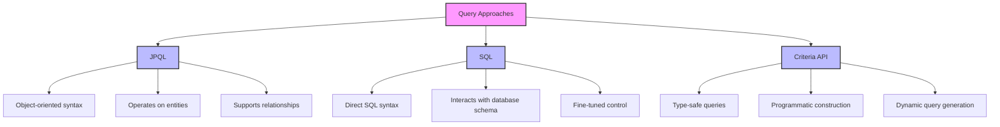
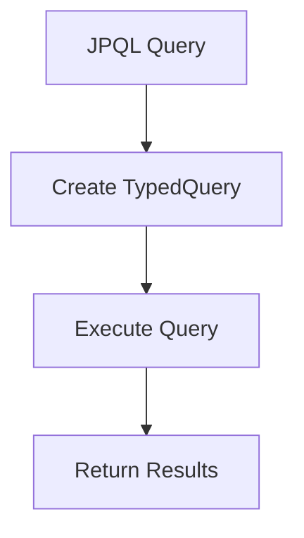

# Introduction to Querying in Java
In Java applications, especially those that interact with relational databases, developers have multiple options for constructing and executing SQL queries. Understanding these options is crucial for efficient data retrieval and manipulation, as well as for leveraging the full power of the underlying database systems.




## Overview of Querying Options
1. JPQL (Java Persistence Query Language): As part of the Java Persistence API (JPA), JPQL allows developers to write queries that are closely aligned with their object-oriented model. Instead of dealing directly with tables and columns, JPQL operates on entities, making it easier to work with complex data structures and relationships.
    - Description: JPQL is an object-oriented query language that is part of the Java Persistence API (JPA). It operates on the entity objects rather than directly on the database tables.
    - Usage: Developers can write queries that resemble SQL but are based on the entity model. For example, it supports inheritance, polymorphism, and navigation through relationships.
-**EXAMPLE**

```java
String jpql = "SELECT d FROM Driver d WHERE d.name LIKE :namePattern";
TypedQuery<Driver> query = entityManager.createQuery(jpql, Driver.class);


```


- **TypedQuery<Driver>**
    - This defines a strongly-typed query that will return Driver entities as results. By using TypedQuery, the query ensures that the returned result is of the specified type (Driver in this case), which provides type safety at compile time.

- entityManager.createQuery(jpql, Driver.class)
    - This creates a query using the EntityManager object.

- entityManager: This is the JPA EntityManager that handles the persistence operations, including executing JPQL queries.
    - .createQuery(jpql, Driver.class): This method creates a new TypedQuery object for the provided JPQL string and the type of entity expected as the result (Driver.class).
    - The first argument is the JPQL query string, and the second argument is the type of the result (in this case, Driver).


2. SQL (Structured Query Language): SQL is the traditional language used for managing and manipulating relational databases. It provides a powerful way to write queries that directly interact with the database schema. While it allows for fine-tuned control and optimization, it requires a good understanding of SQL syntax and the specific database being used.

    - Description: SQL is the standard language for interacting directly with relational databases. It allows developers to write queries that execute against the database schema directly.
    - Usage: It is used for complex queries, data manipulation, and schema management. Developers have full control over the SQL syntax and can leverage database-specific features

**EXAMPLE**
```
String sql = "SELECT * FROM Driver WHERE name LIKE ?";
Query query = entityManager.createNativeQuery(sql, Driver.class);
query.setParameter(1, "%T%");

```
  
3. Criteria API: This programmatic approach to creating queries provides a type-safe way to construct queries using Java objects. The Criteria API is particularly useful for dynamic queries where conditions may vary at runtime, enabling developers to avoid the pitfalls of string manipulation and providing compile-time checks.

    - Description: The Criteria API is a programmatic way to create queries in a type-safe manner. It allows developers to build queries using Java objects rather than string-based queries.
    - Usage: It is useful for dynamic query generation, where conditions may change based on runtime criteria. It avoids issues with string concatenation and provides compile-time checking.

**EXAMPLE**
```java
CriteriaBuilder cb = entityManager.getCriteriaBuilder();
CriteriaQuery<Driver> cq = cb.createQuery(Driver.class);
Root<Driver> driver = cq.from(Driver.class);
cq.select(driver).where(cb.like(driver.get("name"), "%T%"));
TypedQuery<Driver> query = entityManager.createQuery(cq);


```


# JPQL

The main concept behind JPA (Java Persistence API) is to shield the software developer from directly interacting with the relational database. Instead, JPA provides a more intuitive approach where persistence and retrieval of objects are typically handled through methods like `persist()` and `find()` within the `EntityManager`.

However, some operations may not be efficiently executed using these methods alone. For instance, tasks such as retrieving all employees earning €2000/month or more, or granting a 5% pay rise to all employees, present challenges. Attempting to perform these tasks by individually retrieving and persisting relevant objects would be highly inefficient. This approach would result in a substantial number of SQL statements being generated, despite the fact that a single SQL statement could accomplish each task more effectively. Therefore, JPA aims to optimize these operations by providing more efficient mechanisms for handling such tasks, ultimately simplifying database interactions for developers.


## JPQL

### An Update Query

Update the driver experience by one year.

### Parameterized Query

To add a parameterized query in JPQL, you can use the `setParameter` method provided by the `Query` interface.

### Examples of JPQL Queries
#### Find All Employees
```java
EntityManager em = emf.createEntityManager();
List<Employee> employees = em.createQuery("SELECT e FROM Employee e", Employee.class).getResultList();
em.close();
```
### Find Employees by Department
```java
EntityManager em = emf.createEntityManager();
List<Employee> employees = em.createQuery("SELECT e FROM Employee e WHERE e.department.name = :deptName", Employee.class)
                             .setParameter("deptName", "Sales")
                             .getResultList();
em.close();


```
### Find Employees with Projects


```java
EntityManager em = emf.createEntityManager();
List<Employee> employees = em.createQuery("SELECT e FROM Employee e JOIN e.projects p WHERE p.name = :projectName", Employee.class)
                             .setParameter("projectName", "New Project")
                             .getResultList();
em.close();

```

## JPQL Example

````css
Exampleone-one-db
├── pom.xml
├── src
│   ├── main
│   │   ├── java
│   │   │   └── com
│   │   │       └── example
│   │   │           └── jpa
│   │   │               ├── Main.java
│   │   │               ├── entity
│   │   │               │   ├── Student.java
│   │   │               │   └── Course.java
│   │   └── resources
│   │       └── META-INF
│   │           └── persistence.xml
└── target
    └── classes
        └── META-INF
            └── persistence.xml

````


```java
import com.example.jpa.entity.Car;
import com.example.jpa.entity.Driver;
import jakarta.persistence.EntityManager;
import jakarta.persistence.EntityManagerFactory;
import jakarta.persistence.Persistence;
import jakarta.persistence.TypedQuery;

import java.util.List;

public class Main {
    public static void main(String[] args) {
        EntityManagerFactory emf = Persistence.createEntityManagerFactory("yourPersistenceUnitName");
        EntityManager em = emf.createEntityManager();

        try {
            em.getTransaction().begin();

            // Create new Driver entities
            Driver driver1 = new Driver("Matti", 10);
            Driver driver2 = new Driver("Mikhail", 11);
            Driver driver3 = new Driver("Timo", 1);
            em.persist(driver1);
            em.persist(driver2);
            em.persist(driver3);

            // Create new Car entities and associate them with drivers
            Car car1 = new Car("Honda");
            car1.setDriver(driver1); // Set driver for Honda
            em.persist(car1);

            Car car2 = new Car("BMW");
            car2.setDriver(driver2); // Set driver for BMW
            em.persist(car2);

            // Flush changes to the database
            em.flush();

            em.getTransaction().commit();

            // Example JPQL query to find drivers with names containing 'T'
            String jpql = "SELECT d.name FROM Driver d WHERE d.name LIKE :namePattern";
            TypedQuery<String> query = em.createQuery(jpql, String.class);
            query.setParameter("namePattern", "%T%");

            List<String> driversWithNameContainingT = query.getResultList();

            for (String driverName : driversWithNameContainingT) {
                System.out.println("Driver Name: " + driverName);
            }
        } catch (Exception e) {
            em.getTransaction().rollback();
            e.printStackTrace();
        } finally {
            em.close();
            emf.close();
        }
    }
}

```
**1. Driver class**
- **Purpose:** Represents a driver entity with attributes such as name, experience, and age. It may also have a relationship with a Car entity.
- **Functionality:** Contains getter methods for accessing its properties and can be used to persist driver data in the database.

```java
package com.example.jpa.entity;

import jakarta.persistence.*;

@Entity
public class Driver {

    @Id
    @GeneratedValue(strategy = GenerationType.IDENTITY)
    private Long id;

    private String name;
    private int experience;

    @OneToOne(mappedBy = "driver", cascade = CascadeType.ALL)
    private Car car;

    public Driver() {}

    public Driver(String name, int experience) {
        this.name = name;
        this.experience = experience;
    }

    // Getters and Setters
    public Long getId() {
        return id;
    }

    public void setId(Long id) {
        this.id = id;
    }

    public String getName() {
        return name;
    }

    public void setName(String name) {
        this.name = name;
    }

    public int getExperience() {
        return experience;
    }

    public void setExperience(int experience) {
        this.experience = experience;
    }

    public Car getCar() {
        return car;
    }

    public void setCar(Car car) {
        this.car = car;
        if (car != null && car.getDriver() != this) {
            car.setDriver(this); // Maintain the bidirectional relationship
        }
    }
}


```
**2. Car Entity**
- **Purpose:** Represents a car entity with attributes like model and name, and it has a relationship with a Driver.
- **Functionality:** Contains a getter method for its properties and is used to persist car data associated with drivers.

```java
package com.example.jpa.entity;

import jakarta.persistence.*;

@Entity
public class Car {

    @Id
    @GeneratedValue(strategy = GenerationType.IDENTITY)
    private Long id;

    private String name;

    @OneToOne
    @JoinColumn(name = "driver_id")
    private Driver driver;

    public Car() {}

    public Car(String name) {
        this.name = name;
    }

    // Getters and Setters
    public Long getId() {
        return id;
    }

    public void setId(Long id) {
        this.id = id;
    }

    public String getName() {
        return name;
    }

    public void setName(String name) {
        this.name = name;
    }

    public Driver getDriver() {
        return driver;
    }

    public void setDriver(Driver driver) {
        this.driver = driver;
        if (driver != null && driver.getCar() != this) {
            driver.setCar(this); // Maintain the bidirectional relationship
        }
    }
}


```
3. persistance.xml
```xml

<persistence xmlns="http://xmlns.jcp.org/xml/ns/persistence"
             xmlns:xsi="http://www.w3.org/2001/XMLSchema-instance"
             xsi:schemaLocation="http://xmlns.jcp.org/xml/ns/persistence
             http://xmlns.jcp.org/xml/ns/persistence/persistence_2_2.xsd"
             version="2.2">
    <persistence-unit name="yourPersistenceUnitName">
        <class>com.example.jpa.entity.Driver</class>
        <class>com.example.jpa.entity.Car</class>
        <properties>
            <property name="jakarta.persistence.jdbc.driver" value="com.mysql.cj.jdbc.Driver"/>
            <property name="jakarta.persistence.jdbc.url" value="jdbc:mysql://localhost:3306/jpql_car_drive"/>
            <property name="jakarta.persistence.jdbc.user" value="root"/>
            <property name="jakarta.persistence.jdbc.password" value="Test12"/>
            <property name="hibernate.hbm2ddl.auto" value="update"/>
            <property name="hibernate.show_sql" value="true"/>
            <property name="hibernate.dialect" value="org.hibernate.dialect.MySQLDialect"/>
            <property name="hibernate.format_sql" value="true"/>
            <property name="hibernate.use_sql_comments" value="true"/>
        </properties>
    </persistence-unit>
</persistence>

```
----------------------------------------------------------------------------------------------

### POM.xml
```xml
<?xml version="1.0" encoding="UTF-8"?>
<project xmlns="http://maven.apache.org/POM/4.0.0"
         xmlns:xsi="http://www.w3.org/2001/XMLSchema-instance"
         xsi:schemaLocation="http://maven.apache.org/POM/4.0.0 http://maven.apache.org/xsd/maven-4.0.0.xsd">
    <modelVersion>4.0.0</modelVersion>

    <groupId>org.example</groupId>
    <artifactId>jpql_final</artifactId>
    <version>1.0-SNAPSHOT</version>

    <properties>
        <maven.compiler.source>21</maven.compiler.source>
        <maven.compiler.target>21</maven.compiler.target>
        <project.build.sourceEncoding>UTF-8</project.build.sourceEncoding>
    </properties>
    <dependencies>
        <!-- JPA and Hibernate -->
        <dependency>
            <groupId>org.hibernate.orm</groupId>
            <artifactId>hibernate-core</artifactId>
            <version>6.2.5.Final</version>
        </dependency>

        <!-- MySQL Connector -->
        <dependency>
            <groupId>mysql</groupId>
            <artifactId>mysql-connector-java</artifactId>
            <version>8.0.32</version>
        </dependency>

        <!-- JPA API -->
        <dependency>
            <groupId>jakarta.persistence</groupId>
            <artifactId>jakarta.persistence-api</artifactId>
            <version>3.1.0</version>
        </dependency>

        <!-- Logging (optional but useful) -->
        <dependency>
            <groupId>org.slf4j</groupId>
            <artifactId>slf4j-api</artifactId>
            <version>2.0.13</version>
        </dependency>
        <dependency>
            <groupId>org.slf4j</groupId>
            <artifactId>slf4j-simple</artifactId>
            <version>2.0.9</version>
        </dependency>

        <!-- JUnit 5 for testing -->
        <dependency>
            <groupId>org.junit.jupiter</groupId>
            <artifactId>junit-jupiter-api</artifactId>
            <version>5.11.0</version>
            <scope>test</scope>
        </dependency>
        <dependency>
            <groupId>org.junit.jupiter</groupId>
            <artifactId>junit-jupiter-engine</artifactId>
            <version>5.11.0</version>
            <scope>test</scope>
        </dependency>
    </dependencies>

    <build>
        <plugins>
            <!-- Maven compiler plugin to use Java 17 -->
            <plugin>
                <groupId>org.apache.maven.plugins</groupId>
                <artifactId>maven-compiler-plugin</artifactId>
                <version>3.8.1</version>
                <configuration>
                    <source>17</source>
                    <target>17</target>
                </configuration>
            </plugin>

            <!-- Maven Surefire plugin for running JUnit tests -->
            <plugin>
                <groupId>org.apache.maven.plugins</groupId>
                <artifactId>maven-surefire-plugin</artifactId>
                <version>2.22.2</version>
            </plugin>
        </plugins>
    </build>
</project>


```

**Extend to test**

-  Lets test the JPQL 
````css
my-hibernate-jpql-project/
├── pom.xml
├── src/
│   ├── main/
│   │   ├── java/
│   │   │   └── com/
│   │   │       └── example/
│   │   │           └── entity/
│   │   │               ├── Car.java
│   │   │               ├── Driver.java
│   │   │               ├── HibernateUtil.java
│   │   │               ├── Main.java
│   │   │               └── JPQLQueries.java
│   │   └── resources/
│   │       ├── hibernate.cfg.xml
│   │       └── META-INF/
│   │           └── persistence.xml (if using JPA)
│   └── test/
│       └── java/
│           └── com/
│               └── example/
│                   └── entity/
│                       └── (Optional test files)
├── target/ (generated after building the project)

````

```java
// Example JPQL query to find drivers with names containing 'T'
String jpql = "SELECT d.name FROM Driver d WHERE d.name LIKE :namePattern";
TypedQuery<String> query = session.createQuery(jpql, String.class);
query.setParameter("namePattern", "%T%"); // Set the value of the parameter

List<String> driversWithNameContainingT = query.getResultList();

for (String driverName : driversWithNameContainingT) {
    System.out.println("Driver Name: " + driverName);
}


```
### Sample of JPQL class


**4. JPQLQueries**
- **Purpose:** Contains methods for executing JPQL queries to interact with the Driver and Car entities.
- **Functionality:** Includes methods to fetch all drivers, find cars by model, find drivers older than a certain age, and count total cars. It encapsulates query logic in a single class for better organization.
```java
package com.example.entity;

import jakarta.persistence.TypedQuery;
import org.hibernate.Session;

import java.util.List;

public class JPQLQueries {
    public static void main(String[] args) {
        // Open the Hibernate session
        Session session = HibernateUtil.getSessionFactory().openSession();

        // Example 1: Fetch all drivers
        TypedQuery<Driver> driverQuery = session.createQuery("SELECT d FROM Driver d", Driver.class);
        List<Driver> drivers = driverQuery.getResultList();

        System.out.println("List of Drivers:");
        for (Driver driver : drivers) {
            System.out.println(driver.getName() + ", experience: " + driver.getExperience() + " years");
        }

        // Example 2: Fetch all cars with a specific model (e.g., Tesla Model S)
        TypedQuery<Car> carQuery = session.createQuery("SELECT c FROM Car c WHERE c.name = :name", Car.class);
        carQuery.setParameter("name", "Tesla Model S");
        List<Car> cars = carQuery.getResultList();

        System.out.println("\nCars of model Tesla Model S:");
        for (Car car : cars) {
            System.out.println(car.getName());
        }

        // Example 3: Find all drivers older than a certain age (e.g., age > 10)
        TypedQuery<Driver> ageQuery = session.createQuery("SELECT d FROM Driver d WHERE d.experience > :age", Driver.class);
        ageQuery.setParameter("age", 10);
        List<Driver> experiencedDrivers = ageQuery.getResultList();

        System.out.println("\nDrivers older than 10 years:");
        for (Driver experiencedDriver : experiencedDrivers) {
            System.out.println(experiencedDriver.getName() + ", age: " + experiencedDriver.getExperience());
        }

        // Example 4: Count the total number of cars
        TypedQuery<Long> countQuery = session.createQuery("SELECT COUNT(c) FROM Car c", Long.class);
        Long carCount = countQuery.getSingleResult();

        System.out.println("\nTotal number of cars: " + carCount);

        // Close the Hibernate session
        session.close();
    }
}


```


### Update the driver experience by one year
```java
private static void incrementDriverExperience(Session session) {
    // Create update query to increment experience by one year
    Query query = session.createQuery("UPDATE Driver SET experience = experience + 1");

    // Execute update query
    int rowCount = query.executeUpdate();


```
### Parameterized query ()
To add a parameterized query in JPQL, you can use the setParameter method provided by the Query interface

```java
// Parameterized JPQL update query
Query updateQuery = session.createQuery("UPDATE Driver SET experience = experience + 1 WHERE name = :driverName");
updateQuery.setParameter("driverName", "Amir");
int rowsUpdated = updateQuery.executeUpdate();
System.out.println(rowsUpdated + " rows updated.");


```
-----------

# SQL

In certain scenarios, developers might opt for SQL over JPQL due to various reasons:

For relaying SQL operations, use the `EntityManager`’s `createNativeQuery()` method.

- `createNativeQuery()` is a method provided by the `EntityManager` interface in JPA (Java Persistence API) to execute native SQL queries directly against the underlying database.

When executing native SQL queries with JPA's `createNativeQuery()` method, additional work may be required to map the result set from the database into Java objects. Here's an elaboration on the three options:

1. **Process the Resulting Object[] List Manually**:
   - When you execute a native SQL query without specifying the result type, the query result is typically returned as a list of `Object[]` arrays. Each array represents a row from the result set, with each element corresponding to a column value.
   - You can manually iterate over this list and extract the values from each `Object[]` array to populate your domain objects.

2. **Specify a Class in the `createNativeQuery()` Method Call**:
   - You can specify the class of the result in the `createNativeQuery()` method call. When you do this, JPA attempts to map the result set columns to the fields or properties of the specified class.
   - The class must have a constructor that matches the result set columns' types and order. JPA will use reflection to instantiate objects of this class and populate them with the query results.
   - This approach automates the mapping process to some extent, reducing manual coding effort.

3. **Use `@SqlResultSetMapping` Annotations**:
   - `@SqlResultSetMapping` annotations provide a way to define custom result set mappings in your entity mappings or configuration files.
   - With `@SqlResultSetMapping`, you can specify how columns from the result set should be mapped to entity fields or constructor parameters.
   - This approach offers the most flexibility and control over the mapping process. You can define complex mappings, handle entity inheritance, and map results to DTOs (Data Transfer Objects) or non-entity classes.

---

# N+1 Problem

The N+1 problem is a performance issue that commonly occurs in object-relational mapping (ORM) frameworks like Hibernate, including when using Java Persistence API (JPA). It arises due to the way ORM frameworks handle the lazy loading of entity associations.


- **Getting the Initial Data**: Let's say we ask the database for a list of N things, like a list of books.
- **Fetching More Info**: Now, for each of these N things, we need additional details, like the author's name.
- **Extra Queries**: So, we end up making N extra queries to the database to get this extra info.
- **Total Queries**: In total, we make N+1 queries: 1 for the initial data and N for each additional detail we need.

In the first query, all will be fetched and printed, while in the second query, it goes through the whole database and assesses one by one element. This leads to performance and resource consumption issues, especially in large databases. In a small database, that won’t be a problem, but when we have lots of entities, then it is important to be mindful of the queries.  

In the following example, Hibernate will execute an additional query for each driver to fetch their associated cars.

### Cause

Lazy loading is often the culprit. Lazy loading means the app only gets the extra info when it's asked for. So, when we loop through our list of things, each time we ask for the extra info, it triggers another database query.

### Impact

This can slow down our app, especially with lots of data. More queries mean more time waiting for responses, which can make our app feel sluggish. It can even put a strain on the database server, making things slow for everyone.

### How to Fix It

- **Eager Loading**: Instead of lazy loading, fetch all the info you need upfront. For example:

- **Batch Fetching**: Get multiple sets of extra info in one go, reducing the number of queries.

- **Fetch Joins**: Use special queries to fetch everything you need in a single query.

- **DTO Projections**: Only fetch the data you need, instead of loading everything.

---

# Criteria API

The Criteria API is a feature of JPA (Java Persistence API) that allows developers to build dynamic queries programmatically, without relying on string-based JPQL (Java Persistence Query Language) queries. It provides a type-safe and object-oriented way to construct queries at runtime.

Here's how the Criteria API works:

1. **CriteriaBuilder**: This interface is the entry point for creating criteria queries. You obtain an instance of `CriteriaBuilder` from the `EntityManager`.
2. **CriteriaQuery**: This interface represents a query object that defines the structure of the query. It includes information about the root entity, selection criteria, ordering, grouping, etc.
3. **Root**: This interface represents the root entity in the query. You use the `Root` interface to specify the entity type you want to query.
4. **Predicate**: This interface represents a condition or restriction applied to the query. Predicates are used to filter query results based on certain criteria.
5. **Join**: This interface represents a join operation between two entities in a query. Joins are used to fetch related entities and navigate relationships.

> **Note**: Hibernate’s native Criteria API (`org.hibernate.Criteria`) is deprecated and should not be used. Use JPA implementation (`jakarta.persistence.criteria`) instead.


## Examples of Criteria API Queries
Find All Employees
``` java
EntityManager em = emf.createEntityManager();
CriteriaBuilder cb = em.getCriteriaBuilder();
CriteriaQuery<Employee> cq = cb.createQuery(Employee.class);
Root<Employee> employee = cq.from(Employee.class);
cq.select(employee);
List<Employee> employees = em.createQuery(cq).getResultList();
em.close();
```

### Find Employees with Projects

```java
EntityManager em = emf.createEntityManager();
CriteriaBuilder cb = em.getCriteriaBuilder();
CriteriaQuery<Employee> cq = cb.createQuery(Employee.class);
Root<Employee> employee = cq.from(Employee.class);
Join<Employee, Project> project = employee.join("projects");
cq.select(employee).where(cb.equal(project.get("name"), "New Project"));
List<Employee> employees = em.createQuery(cq).getResultList();
em.close();

```

## Entity Classes
The following entity classes will be used in the examples above.

### Employee Class

```java
import javax.persistence.*;
import java.util.List;

@Entity
public class Employee {

    @Id
    @GeneratedValue(strategy = GenerationType.IDENTITY)
    private Long id;
    private String firstName;
    private String lastName;
    private String email;

    @ManyToMany(mappedBy = "employees")
    private List<Project> projects;

    @ManyToOne
    @JoinColumn(name = "department_id")
    private Department department;

    @OneToOne(mappedBy = "employee", cascade = CascadeType.ALL, orphanRemoval = true)
    private EmployeeDetails employeeDetails;

    // Getters and Setters
}


### Project Class
```java
import javax.persistence.*;
import java.util.List;

@Entity
public class Project {

    @Id
    @GeneratedValue(strategy = GenerationType.IDENTITY)
    private Long id;
    private String name;

    @ManyToMany
    @JoinTable(
        name = "project_employee",
        joinColumns = @JoinColumn(name = "project_id"),
        inverseJoinColumns = @JoinColumn(name = "employee_id")
    )
    private List<Employee> employees;

    // Getters and Setters
}


```

### Department Class

```java
import javax.persistence.*;
import java.util.List;

@Entity
public class Department {

    @Id
    @GeneratedValue(strategy = GenerationType.IDENTITY)
    private Long id;
    private String name;

    @OneToMany(mappedBy = "department")
    private List<Employee> employees;

    // Getters and Setters
}


```

### EmployeeDetails Class

```java
import javax.persistence.*;

@Entity
public class EmployeeDetails {

    @Id
    @GeneratedValue(strategy = GenerationType.IDENTITY)
    private Long id;
    private String address;
    private String phoneNumber;

    @OneToOne
    @JoinColumn(name = "employee_id")
    private Employee employee;

    // Getters and Setters
}

```
### Persistence Configuration
The persistence.xml file configures the persistence unit and specifies database connection properties.

```xml
<?xml version="1.0" encoding="UTF-8"?>
<persistence xmlns="http://xmlns.jcp.org/xml/ns/persistence" version="2.2">
    <persistence-unit name="examplePU">
        <provider>org.hibernate.jpa.HibernatePersistenceProvider</provider>
        <class>com.example.Project</class>
        <class>com.example.Employee</class>
        <class>com.example.Department</class>
        <class>com.example.EmployeeDetails</class>
        <properties>
            <property name="javax.persistence.jdbc.url" value="jdbc:mysql://localhost:3306/mydb"/>
            <property name="javax.persistence.jdbc.user" value="root"/>
            <property name="javax.persistence.jdbc.password" value="password"/>
            <property name="javax.persistence.jdbc.driver" value="com.mysql.cj.jdbc.Driver"/>
            <property name="hibernate.dialect" value="org.hibernate.dialect.MySQL8Dialect"/>
            <property name="hibernate.hbm2ddl.auto" value="update"/>
        </properties>
    </persistence-unit>
</persistence>
```
