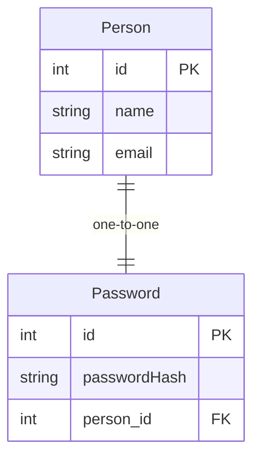

Based on the following diagram implement the one-to-one association

- Person entity has an id (primary key) and attributes such as name and email.
- Password entity has its own id (primary key) and attributes like passwordHash.
- The relationship between Person and Password is one-to-one, indicated by the ||--|| symbol.
  This means that each person has one password, and each password is associated with one person.
- The Password entity holds a foreign key (person_id) that references the Person entity.
