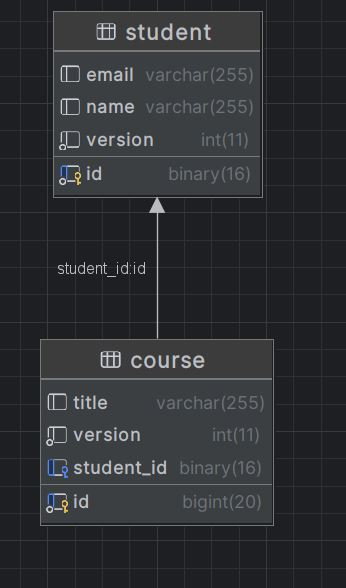

# Object-Level Concurrency in JPA

Object-Level Concurrency refers to the management of simultaneous access to the same data object in a database by multiple transactions. In a multi-user environment, it's common for different users or processes to try to modify the same data simultaneously. 
To prevent data inconsistency and ensure data integrity, JPA provides mechanisms like Optimistic Locking and Pessimistic Locking to handle concurrency.

In this guide, we'll focus on Optimistic Locking, which assumes that multiple transactions can complete without affecting each other. 
It checks for data conflicts only at the time of committing a transaction. If a conflict is detected, the transaction is rolled back, and an OptimisticLockException is thrown.


## Step-by-Step Instructions to Implement Object-Level Concurrency Using Optimistic Locking





### Step 1: Set Up Your JPA Project

  Your directory structure should look something like this:

```css
Exampleone-one-db
├── pom.xml
├── src
│   ├── main
│   │   ├── java
│   │   │   └── com
│   │   │       └── example
│   │   │           └── jpa
│   │   │               ├── Main.java
│   │   │               ├── entity
│   │   │               │   ├── Student.java
│   │   │               │   └── Course.java
│   │   └── resources
│   │       └── META-INF
│   │           └── persistence.xml
└── target
    └── classes
        └── META-INF
            └── persistence.xml


```
  
  
  1. Create a new Java project using your IDE (e.g., IntelliJ IDEA, Eclipse).

  2. Add the necessary JPA and Hibernate dependencies to your pom.xml (if using Maven) or include the required libraries in your classpath.


```xml
<?xml version="1.0" encoding="UTF-8"?>
<project xmlns="http://maven.apache.org/POM/4.0.0"
         xmlns:xsi="http://www.w3.org/2001/XMLSchema-instance"
         xsi:schemaLocation="http://maven.apache.org/POM/4.0.0 http://maven.apache.org/xsd/maven-4.0.0.xsd">
    <modelVersion>4.0.0</modelVersion>

    <groupId>org.example</groupId>
    <artifactId>objectlevelcon</artifactId>
    <version>1.0-SNAPSHOT</version>

    <properties>
        <maven.compiler.source>21</maven.compiler.source>
        <maven.compiler.target>21</maven.compiler.target>
        <project.build.sourceEncoding>UTF-8</project.build.sourceEncoding>
    </properties>

    <dependencies>
        <!-- Hibernate Core -->
        <dependency>
            <groupId>org.hibernate.orm</groupId>
            <artifactId>hibernate-core</artifactId>
            <version>6.2.5.Final</version>
        </dependency>

        <!-- Jakarta Persistence API -->
        <dependency>
            <groupId>jakarta.persistence</groupId>
            <artifactId>jakarta.persistence-api</artifactId>
            <version>3.1.0</version>
        </dependency>

        <!-- H2 Database -->
        <dependency>
            <groupId>com.h2database</groupId>
            <artifactId>h2</artifactId>
            <version>2.2.220</version>
            <scope>runtime</scope>
        </dependency>

        <!-- Logging dependencies -->
        <dependency>
            <groupId>org.slf4j</groupId>
            <artifactId>slf4j-api</artifactId>
            <version>2.0.9</version>
        </dependency>

        <dependency>
            <groupId>org.slf4j</groupId>
            <artifactId>slf4j-simple</artifactId>
            <version>2.0.9</version>
        </dependency>

        <!-- MySQL Connector -->
        <dependency>
            <groupId>mysql</groupId>
            <artifactId>mysql-connector-java</artifactId>
            <version>8.0.32</version>
        </dependency>
    </dependencies>
</project>


```
### Step 2: Create Entity Classes with Optimistic Locking
Create your entity classes and add a @Version field to enable optimistic locking.

Student.java
```java
package com.example.jpa.entity;

import java.util.UUID;
import jakarta.persistence.*;

@Entity
public class Student {

    @Id
    private UUID id;

    private String name;
    private String email;

    @OneToOne(mappedBy = "student", cascade = CascadeType.ALL)
    private Course course;

    @Version
    private int version;

    // Constructors, getters, and setters

    public Student() {
        this.id = UUID.randomUUID(); // Manually generate UUID
    }

    public Student(String name, String email) {
        this.id = UUID.randomUUID(); // Manually generate UUID
        this.name = name;
        this.email = email;
    }

    public UUID getId() {
        return id;
    }

    public void setId(UUID id) {
        this.id = id;
    }

    public String getName() {
        return name;
    }

    public void setName(String name) {
        this.name = name;
    }

    public String getEmail() {
        return email;
    }

    public void setEmail(String email) {
        this.email = email;
    }

    public Course getCourse() {
        return course;
    }

    public void setCourse(Course course) {
        this.course = course;
    }

    public int getVersion() {
        return version;
    }

    public void setVersion(int version) {
        this.version = version;
    }

    @Override
    public String toString() {
        return "Student{id=" + id + ", name='" + name + '\'' + ", email='" + email + '\'' + ", course=" + course + ", version=" + version + '}';
    }
}

```
Course.java
```java
package com.example.jpa.entity;

import jakarta.persistence.*;

@Entity
public class Course {

    @Id
    @GeneratedValue(strategy = GenerationType.IDENTITY)
    private Long id;

    private String title;

    @OneToOne
    @JoinColumn(name = "student_id", referencedColumnName = "id")
    private Student student;

    @Version
    private int version; // Version field for optimistic locking

    // Constructors, getters, and setters

    public Course() {}

    public Course(String title) {
        this.title = title;
    }

    public Long getId() {
        return id;
    }

    public void setId(Long id) {
        this.id = id;
    }

    public String getTitle() {
        return title;
    }

    public void setTitle(String title) {
        this.title = title;
    }

    public Student getStudent() {
        return student;
    }

    public void setStudent(Student student) {
        this.student = student;
    }

    public int getVersion() {
        return version;
    }

    public void setVersion(int version) {
        this.version = version;
    }

    @Override
    public String toString() {
        return "Course{id=" + id + ", title='" + title + '\'' + ", student=" + student + ", version=" + version + '}';
    }
}

```
### Step 3: Set Up the Persistence Configuration
Create a persistence.xml file in the META-INF directory for your JPA configuration.

```xml

<persistence xmlns="https://jakarta.ee/xml/ns/persistence" version="3.0">
    <persistence-unit name="JPAExamplePU">
        <properties>
            <property name="jakarta.persistence.jdbc.url" value="jdbc:mysql://localhost:3306/coursecreator"/>
            <property name="jakarta.persistence.jdbc.user" value="root"/>
            <property name="jakarta.persistence.jdbc.password" value="Test12"/>
            <property name="jakarta.persistence.jdbc.driver" value="com.mysql.cj.jdbc.Driver"/>
            <property name="hibernate.dialect" value="org.hibernate.dialect.MySQL8Dialect"/>
            <property name="hibernate.hbm2ddl.auto" value="update"/>
            <property name="hibernate.show_sql" value="true"/>
        </properties>
    </persistence-unit>
</persistence>


```
### Step 4: Write the Main Class to Simulate Concurrency
Create a main class to simulate concurrent updates and demonstrate optimistic locking.

Main.java

```java
package com.example.jpa;

import com.example.jpa.entity.Student;
import com.example.jpa.entity.Course;
import jakarta.persistence.EntityManager;
import jakarta.persistence.EntityManagerFactory;
import jakarta.persistence.Persistence;

public class Main {
    public static void main(String[] args) {
        EntityManagerFactory emf = Persistence.createEntityManagerFactory("JPAExamplePU");
        EntityManager em = emf.createEntityManager();

        em.getTransaction().begin();

        // Create Students with UUIDs
        Student student1 = new Student("John Doe", "john.doe@example.com");
        Student student2 = new Student("Jane Smith", "jane.smith@example.com");

        // Create Courses
        Course course1 = new Course("Mathematics");
        Course course2 = new Course("Computer Science");

        // Persist entities
        em.persist(student1);
        em.persist(student2);
        em.persist(course1);
        em.persist(course2);

        em.getTransaction().commit();
        em.close();
        emf.close();
    }
}


```
### Step 5: Run the Project
  1.Compile and run your project.
  2.Observe the behavior when two transactions try to update the same Student entity concurrently.
    - The first transaction commits successfully.
    - The second transaction throws an OptimisticLockException due to the version mismatch.

## Explanation of the Example
  - Optimistic Locking: The @Version field is used by JPA to automatically manage the version of an entity. Before committing a transaction, JPA checks the version.
  - If it has changed since the entity was last read, an OptimisticLockException is thrown.

  - Concurrency Simulation: The example simulates two transactions attempting to modify the same entity.
  - The second transaction fails if the entity version has been updated by the first transaction.

This approach helps prevent data inconsistencies and ensures that only one transaction successfully modifies the entity at a time, maintaining data integrity in a concurrent environment.

