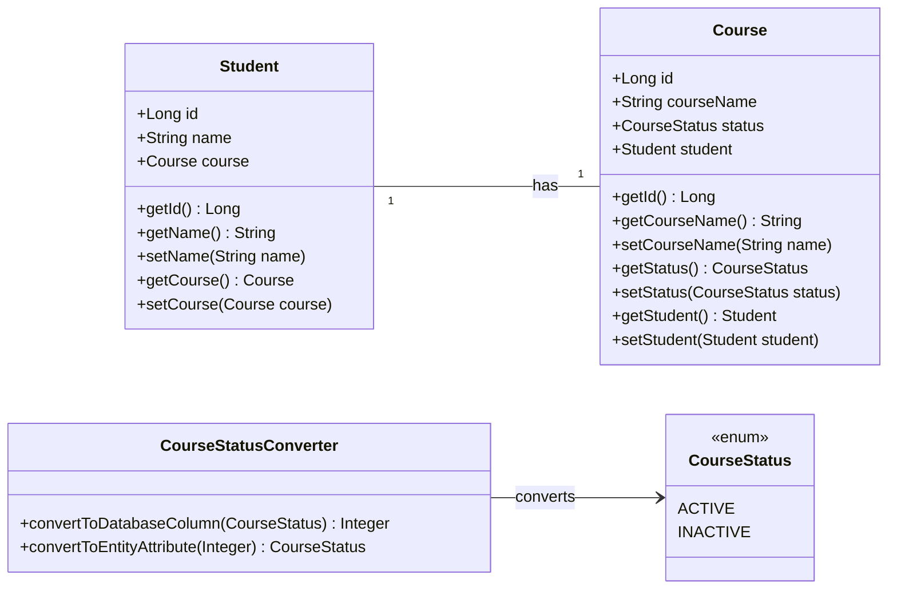

# ORM with JPA: Converters, Events, and Object-Level Concurrency Control

## Table of Contents
1. [Introduction to JPA](#introduction-to-jpa)
2. [Converters](#converters)
    - [Example: Converting LocalDate to String](#example-converting-localdate-to-string)
3. [Events](#events)
    - [Example: Logging Entity Changes](#example-logging-entity-changes)
4. [Object-Level Concurrency Control](#object-level-concurrency-control)
    - [Example: Optimistic Locking with Versioning](#example-optimistic-locking-with-versioning)

## Introduction to JPA

Java Persistence API (JPA) is a specification for accessing, persisting, and managing data between Java objects and a relational database. JPA is a part of the Java EE platform and can be used with frameworks like Hibernate, EclipseLink, and others.

## Converters

JPA Converters are used to customize how Java objects are mapped to database columns and vice versa. They allow developers to define conversions between entity attribute types and database column types. This is useful when your Java objects and the database columns use different data types or formats.

For example, if you have an enumeration, a custom class, or a non-standard type that needs to be stored in a standard format in the database (like String or Integer), JPA converters handle the transformation.

## How Do Conveters Work?

To implement a JPA Converter:

    1. Define a class that implements the javax.persistence.AttributeConverter<X, Y> interface, where X is the entity attribute type and Y is the database column type.
    2. Use annotations like @Converter and @Convert to apply the converter in the entity class.To implement a JPA Converter:


### Example: Converting LocalDate to String

Let’s use Student and Course entities to demonstrate how JPA Converters work. In this example, the CourseStatus enumeration is used for course statuses, which are stored as integers in the database.



#### Step-by-Step Example

1. Course
 ```java
    package com.example.jpa.entity;

import jakarta.persistence.*;

@Entity
public class Course {

    @Id
    @GeneratedValue(strategy = GenerationType.IDENTITY)
    private Long id;

    private String courseName;

    @Convert(converter = CourseStatusConverter.class)
    private CourseStatus status;

    @OneToOne
    @JoinColumn(name = "student_id")
    private Student student;

    public Course() {}

    public Course(String courseName, CourseStatus status) {
        this.courseName = courseName;
        this.status = status;
    }

    // Getters and setters...
}

  ```

2. Student.java

```java
package com.example.jpa.entity;

import jakarta.persistence.*;

@Entity
public class Student {

    @Id
    @GeneratedValue(strategy = GenerationType.IDENTITY)
    private Long id;

    private String name;

    @OneToOne(mappedBy = "student", cascade = CascadeType.ALL)
    private Course course;

    public Student() {}

    public Student(String name) {
        this.name = name;
    }

    // Getters and setters...
}


```
3. 
```java
package com.example.jpa.entity;

import jakarta.persistence.AttributeConverter;
import jakarta.persistence.Converter;

@Converter(autoApply = true)
public class CourseStatusConverter implements AttributeConverter<CourseStatus, Integer> {

    @Override
    public Integer convertToDatabaseColumn(CourseStatus status) {
        if (status == null) return null;
        return (status == CourseStatus.ACTIVE) ? 1 : 0;
    }

    @Override
    public CourseStatus convertToEntityAttribute(Integer dbData) {
        if (dbData == null) return null;
        return (dbData == 1) ? CourseStatus.ACTIVE : CourseStatus.INACTIVE;
    }
}


```
```java
package com.example.jpa.entity;

public enum CourseStatus {
    ACTIVE,
    INACTIVE
}

```
3.  Main
```java
import com.example.jpa.entity.Student;
import jakarta.persistence.EntityManager;
import jakarta.persistence.EntityManagerFactory;
import jakarta.persistence.Persistence;

public class Application {
    public static void main(String[] args) {
        EntityManagerFactory entityManagerFactory = Persistence.createEntityManagerFactory("examplePU");
        EntityManager entityManager = entityManagerFactory.createEntityManager();

        // Start a transaction
        entityManager.getTransaction().begin();

        // Create a new Student
        Student student = new Student("John Doe");
        entityManager.persist(student);

        // Commit the transaction
        entityManager.getTransaction().commit();

        // Close EntityManager
        entityManager.close();
        entityManagerFactory.close();
    }
}


```
4.  persistence.xml: persistence.xml is used to define the configuration for JPA. It typically resides in the src/main/resources/META-INF/ directory.

Here’s an example of how your persistence.xml would look:
```xml
<?xml version="1.0" encoding="UTF-8"?>
<persistence xmlns="http://xmlns.jcp.org/xml/ns/persistence"
             version="2.1">
    <persistence-unit name="examplePU" transaction-type="RESOURCE_LOCAL">
        <!-- Specify the entity classes -->
        <class>com.example.jpa.entity.Student</class>
        <class>com.example.jpa.entity.Course</class>
        <class>com.example.jpa.entity.CourseStatusConverter</class>

        <!-- JPA properties -->
        <properties>
            <!-- JDBC Database Connection properties -->
            <property name="jakarta.persistence.jdbc.driver" value="com.mysql.cj.jdbc.Driver" />
            <property name="jakarta.persistence.jdbc.url" value="jdbc:mysql://localhost:3306/mydbconv" />
            <property name="jakarta.persistence.jdbc.user" value="root" />
            <property name="jakarta.persistence.jdbc.password" value="Test12" />

            <!-- Hibernate as JPA provider -->
            <property name="hibernate.dialect" value="org.hibernate.dialect.MySQLDialect" />
            <property name="hibernate.hbm2ddl.auto" value="update" />
            <property name="hibernate.show_sql" value="true" />
            <property name="hibernate.format_sql" value="true" />
        </properties>
    </persistence-unit>
</persistence>
```
5. POM.xml: 
```xml
<project xmlns="http://maven.apache.org/POM/4.0.0"
         xmlns:xsi="http://www.w3.org/2001/XMLSchema-instance"
         xsi:schemaLocation="http://maven.apache.org/POM/4.0.0 http://maven.apache.org/xsd/maven-4.0.0.xsd">
    <modelVersion>4.0.0</modelVersion>

    <groupId>com.example</groupId>
    <artifactId>jpa-example</artifactId>
    <version>1.0-SNAPSHOT</version>

    <properties>
        <maven.compiler.source>17</maven.compiler.source> <!-- Java version -->
        <maven.compiler.target>17</maven.compiler.target>
        <project.build.sourceEncoding>UTF-8</project.build.sourceEncoding>
    </properties>

    <dependencies>
        <!-- JPA Dependency (Jakarta Persistence API) -->
        <dependency>
            <groupId>jakarta.persistence</groupId>
            <artifactId>jakarta.persistence-api</artifactId>
            <version>3.1.0</version>
        </dependency>

        <!-- Hibernate as the JPA implementation -->
        <dependency>
            <groupId>org.hibernate.orm</groupId>
            <artifactId>hibernate-core</artifactId>
            <version>6.2.5.Final</version> <!-- Ensure it matches your Java/JPA version -->
        </dependency>

        <!-- MySQL Connector -->
        <dependency>
            <groupId>mysql</groupId>
            <artifactId>mysql-connector-java</artifactId>
            <version>8.0.33</version>
        </dependency>

        <!-- Logging (SLF4J + Logback) -->
        <dependency>
            <groupId>org.slf4j</groupId>
            <artifactId>slf4j-api</artifactId>
            <version>2.0.13</version>
        </dependency>
        <dependency>
            <groupId>ch.qos.logback</groupId>
            <artifactId>logback-classic</artifactId>
            <version>1.5.6</version>
        </dependency>

        <!-- JUnit for Testing -->
        <dependency>
            <groupId>junit</groupId>
            <artifactId>junit</artifactId>
            <version>4.13.2</version>
            <scope>test</scope>
        </dependency>
    </dependencies>

    <build>
        <plugins>
            <!-- Compiler Plugin -->
            <plugin>
                <groupId>org.apache.maven.plugins</groupId>
                <artifactId>maven-compiler-plugin</artifactId>
                <version>3.10.1</version>
                <configuration>
                    <source>17</source>
                    <target>17</target>
                </configuration>
            </plugin>

            <!-- Surefire Plugin for running unit tests -->
            <plugin>
                <groupId>org.apache.maven.plugins</groupId>
                <artifactId>maven-surefire-plugin</artifactId>
                <version>3.2.5</version>
            </plugin>
        </plugins>
    </build>

</project>


```

# Events
In JPA (Java Persistence API), an event refers to a lifecycle callback method that is triggered at specific points in an entity’s lifecycle, such as when it is created, updated, deleted, or loaded from the database. These events allow developers to hook into the lifecycle of an entity and execute custom logic when these events occur. JPA provides support for several lifecycle events via annotations or by implementing EntityListener classes.

Here’s an elaborate explanation of JPA events and how they work:

1. Entity Lifecycle Events in JPA
Entity lifecycle events occur at different stages of an entity’s lifecycle when interacting with the EntityManager (e.g., when an entity is persisted, updated, or removed). These events include:

- @PrePersist: Triggered before an entity is persisted (saved) to the database. It is typically used to initialize values or set defaults before the entity is inserted into the database.

- @PostPersist: Triggered after an entity has been persisted (saved). This is used when you need to perform actions after a successful insertion into the database, like logging or auditing.

- @PreUpdate: Triggered before an entity is updated. It can be used to modify data before the update is committed to the database.

- @PostUpdate: Triggered after an entity has been updated in the database.

- @PreRemove: Triggered before an entity is removed (deleted) from the database. This can be used to perform cleanup operations or validation before deletion.

- @PostRemove: Triggered after an entity has been removed from the database.

- @PostLoad: Triggered after an entity has been loaded from the database (but before the transaction is completed). It can be used to initialize transient fields or perform calculations after loading.

2. How to Use JPA Lifecycle Annotations
These events can be implemented directly in the entity class or using a separate listener class.
