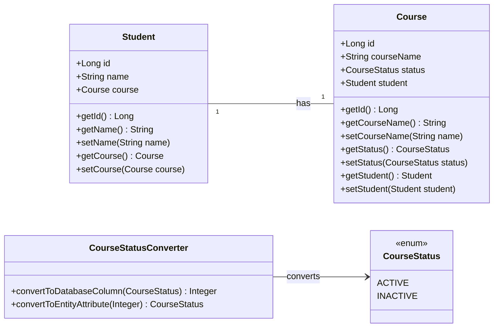
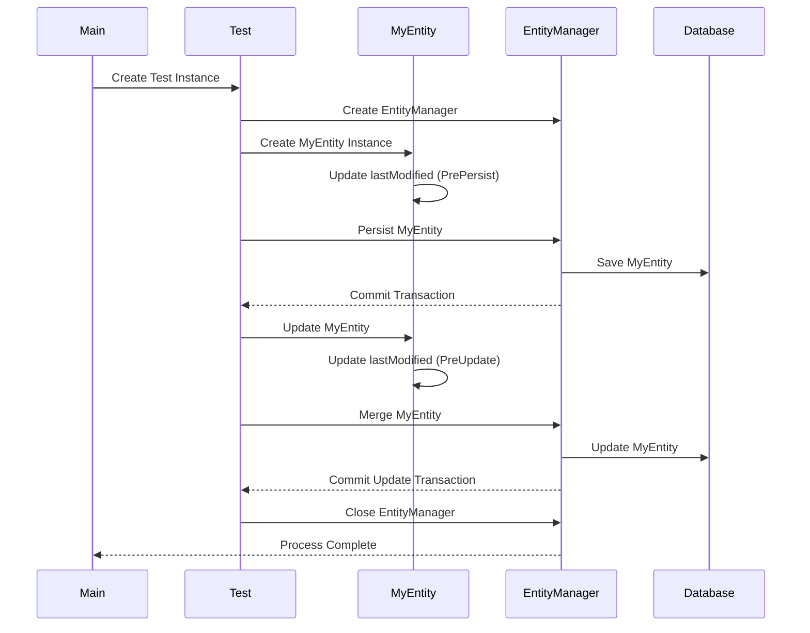
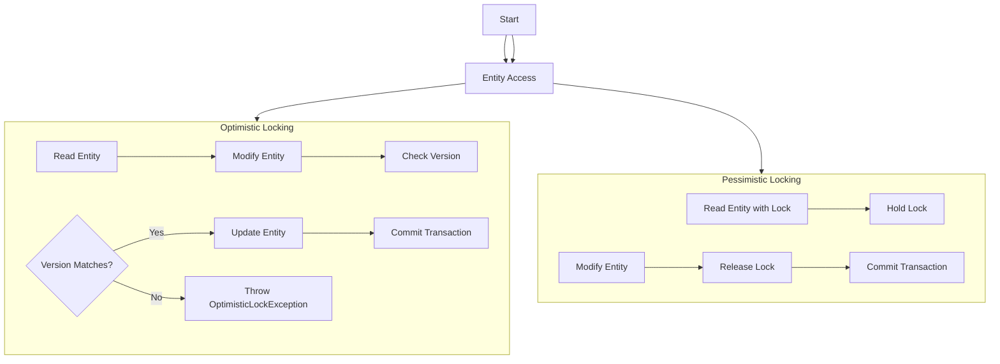
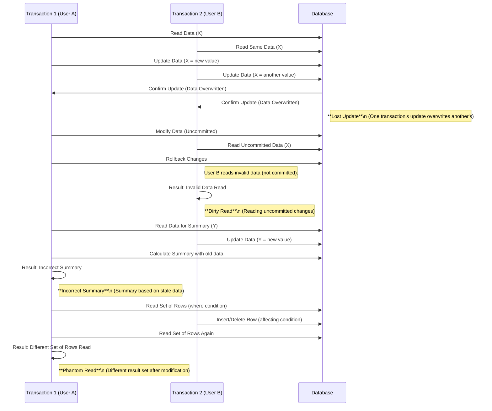

# ORM with JPA: Converters, Events, and Object-Level Concurrency Control

## Table of Contents
1. [Introduction to JPA](#introduction-to-jpa)
2. [Converters](#converters)
    - [Example: Converting LocalDate to String](#example-converting-localdate-to-string)
3. [Events](#events)
    - [Example: Logging Entity Changes](#example-logging-entity-changes)
4. [Object-Level Concurrency Control](#object-level-concurrency-control)
    - [Example: Optimistic Locking with Versioning](#example-optimistic-locking-with-versioning)

## Introduction to JPA

Java Persistence API (JPA) is a specification for accessing, persisting, and managing data between Java objects and a relational database. JPA is a part of the Java EE platform and can be used with frameworks like Hibernate, EclipseLink, and others.

## Converters

JPA Converters are used to customize how Java objects are mapped to database columns and vice versa. They allow developers to define conversions between entity attribute types and database column types. This is useful when your Java objects and the database columns use different data types or formats.

For example, if you have an enumeration, a custom class, or a non-standard type that needs to be stored in a standard format in the database (like String or Integer), JPA converters handle the transformation.

## How Do Conveters Work?

To implement a JPA Converter:

    1. Define a class that implements the javax.persistence.AttributeConverter<X, Y> interface, where X is the entity attribute type and Y is the database column type.
    2. Use annotations like @Converter and @Convert to apply the converter in the entity class.To implement a JPA Converter:


### Example: Converting LocalDate to String

Let’s use Student and Course entities to demonstrate how JPA Converters work. In this example, the CourseStatus enumeration is used for course statuses, which are stored as integers in the database.



#### Step-by-Step Example

1. Course
 ```java
    package com.example.jpa.entity;

import jakarta.persistence.*;

@Entity
public class Course {

    @Id
    @GeneratedValue(strategy = GenerationType.IDENTITY)
    private Long id;

    private String courseName;

    @Convert(converter = CourseStatusConverter.class)
    private CourseStatus status;

    @OneToOne
    @JoinColumn(name = "student_id")
    private Student student;

    public Course() {}

    public Course(String courseName, CourseStatus status) {
        this.courseName = courseName;
        this.status = status;
    }

    // Getters and setters...
}

  ```

2. Student.java

```java
package com.example.jpa.entity;

import jakarta.persistence.*;

@Entity
public class Student {

    @Id
    @GeneratedValue(strategy = GenerationType.IDENTITY)
    private Long id;

    private String name;

    @OneToOne(mappedBy = "student", cascade = CascadeType.ALL)
    private Course course;

    public Student() {}

    public Student(String name) {
        this.name = name;
    }

    // Getters and setters...
}


```
3. 
```java
package com.example.jpa.entity;

import jakarta.persistence.AttributeConverter;
import jakarta.persistence.Converter;

@Converter(autoApply = true)
public class CourseStatusConverter implements AttributeConverter<CourseStatus, Integer> {

    @Override
    public Integer convertToDatabaseColumn(CourseStatus status) {
        if (status == null) return null;
        return (status == CourseStatus.ACTIVE) ? 1 : 0;
    }

    @Override
    public CourseStatus convertToEntityAttribute(Integer dbData) {
        if (dbData == null) return null;
        return (dbData == 1) ? CourseStatus.ACTIVE : CourseStatus.INACTIVE;
    }
}
```
- @Converter(autoApply = true): This annotation indicates that this converter should be applied automatically to all entity attributes of type CourseStatus. You don't need to specify it explicitly for every entity field.
    - autoApply = true: Automatically applies this conversion whenever CourseStatus is encountered in entities.
- AttributeConverter<CourseStatus, Integer>: This specifies that the converter will convert from CourseStatus (the enum) to Integer (for database storage) and vice versa. This means it handles both:
    - Converting the CourseStatus to an Integer when persisting (writing to the database).
    - Converting the Integer from the database back to a CourseStatus when retrieving data (reading from the database).

Purpose: Converts the CourseStatus enum to its corresponding integer value for storage in the database.

**convertToDatabaseColumn Method:**
- Purpose: Converts the CourseStatus enum to its corresponding integer value for storage in the database.
Logic:

    - If the status is ACTIVE, the method returns 1.
    - If the status is INACTIVE, it returns 0.
    - If the status is null (i.e., the field has no value), it returns null, meaning no value will be stored in the database.
- Practical Application: When saving a CourseStatus to the database, ACTIVE will be stored as 1 and INACTIVE as 0.

**convertToEntityAttribute Method:**
- Purpose: Converts the integer value from the database back into the CourseStatus enum.
Logic:
    - If the dbData (database value) is 1, it converts it to CourseStatus.ACTIVE.
    - If the dbData is 0, it converts it to CourseStatus.INACTIVE.
    - If the dbData is null, it returns null, meaning the CourseStatus attribute will not have a value in the entity.
- Practical Application: When reading from the database, 1 is interpreted as ACTIVE and 0 is interpreted as INACTIVE.

```java
package com.example.jpa.entity;

public enum CourseStatus {
    ACTIVE,
    INACTIVE
}

```
- Enum Definition: CourseStatus is an enumeration that represents the possible states of a course. There are two values:
  - ACTIVE: Indicates the course is currently active.
  - INACTIVE: Indicates the course is not active.
- Purpose: This enum is used to maintain the status of a course in the application and maps it to specific values in the database.


3.  Main
```java
import com.example.jpa.entity.Student;
import jakarta.persistence.EntityManager;
import jakarta.persistence.EntityManagerFactory;
import jakarta.persistence.Persistence;

public class Application {
    public static void main(String[] args) {
        EntityManagerFactory entityManagerFactory = Persistence.createEntityManagerFactory("examplePU");
        EntityManager entityManager = entityManagerFactory.createEntityManager();

        // Start a transaction
        entityManager.getTransaction().begin();

        // Create a new Student
        Student student = new Student("John Doe");
        entityManager.persist(student);

        // Commit the transaction
        entityManager.getTransaction().commit();

        // Close EntityManager
        entityManager.close();
        entityManagerFactory.close();
    }
}


```
4.  persistence.xml: persistence.xml is used to define the configuration for JPA. It typically resides in the src/main/resources/META-INF/ directory.

Here’s an example of how your persistence.xml would look:
```xml
<?xml version="1.0" encoding="UTF-8"?>
<persistence xmlns="http://xmlns.jcp.org/xml/ns/persistence"
             version="2.1">
    <persistence-unit name="examplePU" transaction-type="RESOURCE_LOCAL">
        <!-- Specify the entity classes -->
        <class>com.example.jpa.entity.Student</class>
        <class>com.example.jpa.entity.Course</class>
        <class>com.example.jpa.entity.CourseStatusConverter</class>

        <!-- JPA properties -->
        <properties>
            <!-- JDBC Database Connection properties -->
            <property name="jakarta.persistence.jdbc.driver" value="com.mysql.cj.jdbc.Driver" />
            <property name="jakarta.persistence.jdbc.url" value="jdbc:mysql://localhost:3306/mydbconv" />
            <property name="jakarta.persistence.jdbc.user" value="root" />
            <property name="jakarta.persistence.jdbc.password" value="Test12" />

            <!-- Hibernate as JPA provider -->
            <property name="hibernate.dialect" value="org.hibernate.dialect.MySQLDialect" />
            <property name="hibernate.hbm2ddl.auto" value="update" />
            <property name="hibernate.show_sql" value="true" />
            <property name="hibernate.format_sql" value="true" />
        </properties>
    </persistence-unit>
</persistence>
```
5. POM.xml: 
```xml
<project xmlns="http://maven.apache.org/POM/4.0.0"
         xmlns:xsi="http://www.w3.org/2001/XMLSchema-instance"
         xsi:schemaLocation="http://maven.apache.org/POM/4.0.0 http://maven.apache.org/xsd/maven-4.0.0.xsd">
    <modelVersion>4.0.0</modelVersion>

    <groupId>com.example</groupId>
    <artifactId>jpa-example</artifactId>
    <version>1.0-SNAPSHOT</version>

    <properties>
        <maven.compiler.source>17</maven.compiler.source> <!-- Java version -->
        <maven.compiler.target>17</maven.compiler.target>
        <project.build.sourceEncoding>UTF-8</project.build.sourceEncoding>
    </properties>

    <dependencies>
        <!-- JPA Dependency (Jakarta Persistence API) -->
        <dependency>
            <groupId>jakarta.persistence</groupId>
            <artifactId>jakarta.persistence-api</artifactId>
            <version>3.1.0</version>
        </dependency>

        <!-- Hibernate as the JPA implementation -->
        <dependency>
            <groupId>org.hibernate.orm</groupId>
            <artifactId>hibernate-core</artifactId>
            <version>6.2.5.Final</version> <!-- Ensure it matches your Java/JPA version -->
        </dependency>

        <!-- MySQL Connector -->
        <dependency>
            <groupId>mysql</groupId>
            <artifactId>mysql-connector-java</artifactId>
            <version>8.0.33</version>
        </dependency>

        <!-- Logging (SLF4J + Logback) -->
        <dependency>
            <groupId>org.slf4j</groupId>
            <artifactId>slf4j-api</artifactId>
            <version>2.0.13</version>
        </dependency>
        <dependency>
            <groupId>ch.qos.logback</groupId>
            <artifactId>logback-classic</artifactId>
            <version>1.5.6</version>
        </dependency>

        <!-- JUnit for Testing -->
        <dependency>
            <groupId>junit</groupId>
            <artifactId>junit</artifactId>
            <version>4.13.2</version>
            <scope>test</scope>
        </dependency>
    </dependencies>

    <build>
        <plugins>
            <!-- Compiler Plugin -->
            <plugin>
                <groupId>org.apache.maven.plugins</groupId>
                <artifactId>maven-compiler-plugin</artifactId>
                <version>3.10.1</version>
                <configuration>
                    <source>17</source>
                    <target>17</target>
                </configuration>
            </plugin>

            <!-- Surefire Plugin for running unit tests -->
            <plugin>
                <groupId>org.apache.maven.plugins</groupId>
                <artifactId>maven-surefire-plugin</artifactId>
                <version>3.2.5</version>
            </plugin>
        </plugins>
    </build>

</project>


```

# Events
# Events in Java Persistence API (JPA)

Events in Java Persistence API (JPA) are mechanisms that allow developers to react to changes in the state of persistent entities. They serve as the object-level counterpart of database triggers, enabling developers to execute custom logic when specific operations occur on entity objects.

## Key Concepts

### Idea of Events:
- An event listener class is attached to the target entity class. This listener class is responsible for reacting to state changes of the target entity objects.
- When an entity object's state changes in a manner defined by the developer, a callback method in the listener class is automatically invoked.

### Event Types:
JPA provides several types of events that correspond to different lifecycle points of an entity object:

- `@PrePersist` and `@PostPersist`: These events occur **before** and **after** an entity is saved to the database, respectively.
- `@PreUpdate` and `@PostUpdate`: These events occur **before** and **after** an entity is updated in the database, respectively.
- `@PreRemove` and `@PostRemove`: These events occur **before** and **after** an entity is deleted from the database, respectively.
- `@PostLoad`: This event occurs **after** an entity is loaded from the database.

## Example Use Case:
Consider a scenario where you want to perform certain actions every time an entity is saved or updated in the database:




- You can utilize events to achieve this by defining event listener methods annotated with `@PrePersist` and `@PreUpdate`.
- For example, you might want to automatically update a modification timestamp whenever an entity is persisted or updated. You can achieve this by defining `@PrePersist` and `@PreUpdate` event listener methods that set the modification timestamp before saving or updating the entity.
- *POM.xml*
  - In the pom.xml file, include the necessary dependencies for JPA, Hibernate, and MySQL (assuming HeidiSQL is connected to a MySQL database).
Here is an example pom.xml: 
```xml
<project xmlns="http://maven.apache.org/POM/4.0.0"
         xmlns:xsi="http://www.w3.org/2001/XMLSchema-instance"
         xsi:schemaLocation="http://maven.apache.org/POM/4.0.0 http://maven.apache.org/xsd/maven-4.0.0.xsd">
    <modelVersion>4.0.0</modelVersion>

    <groupId>com.example</groupId>
    <artifactId>jpa-events</artifactId>
    <version>1.0-SNAPSHOT</version>

    <dependencies>
        <!-- Hibernate and JPA API -->
        <dependency>
            <groupId>org.hibernate</groupId>
            <artifactId>hibernate-core</artifactId>
            <version>5.6.15.Final</version>
        </dependency>
        <dependency>
            <groupId>javax.persistence</groupId>
            <artifactId>javax.persistence-api</artifactId>
            <version>2.2</version>
        </dependency>
        <!-- MySQL Driver for connecting to the database -->
        <dependency>
            <groupId>mysql</groupId>
            <artifactId>mysql-connector-java</artifactId>
            <version>8.0.33</version>
        </dependency>
    </dependencies>

    <build>
        <plugins>
            <plugin>
                <groupId>org.apache.maven.plugins</groupId>
                <artifactId>maven-compiler-plugin</artifactId>
                <version>3.8.1</version>
                <configuration>
                    <source>11</source>
                    <target>11</target>
                </configuration>
            </plugin>
        </plugins>
    </build>
</project>

```

- ENTITY class
```java
import javax.persistence.*;
import java.util.Date;

@Entity
@Table(name = "my_entity")
public class MyEntity {

    @Id
    @GeneratedValue(strategy = GenerationType.IDENTITY)
    private Long id;

    @Temporal(TemporalType.TIMESTAMP)
    private Date lastModified;

    @Column(nullable = false)
    private String name;

    public MyEntity() {}

    public MyEntity(String name) {
        this.name = name;
    }

    @PrePersist
    @PreUpdate
    public void updateTimestamp() {
        lastModified = new Date();
    }

    // Getters and Setters
    public Long getId() {
        return id;
    }

    public void setId(Long id) {
        this.id = id;
    }

    public Date getLastModified() {
        return lastModified;
    }

    public void setLastModified(Date lastModified) {
        this.lastModified = lastModified;
    }

    public String getName() {
        return name;
    }

    public void setName(String name) {
        this.name = name;
    }
}

```
- persistence.xml
    - Here is an example of what persistence.xml might look like:     
```xml
<?xml version="1.0" encoding="UTF-8"?>
<persistence xmlns="http://xmlns.jcp.org/xml/ns/persistence"
             xmlns:xsi="http://www.w3.org/2001/XMLSchema-instance"
             xsi:schemaLocation="http://xmlns.jcp.org/xml/ns/persistence
             http://xmlns.jcp.org/xml/ns/persistence/persistence_2_2.xsd"
             version="2.2">

    <persistence-unit name="jpa-example" transaction-type="RESOURCE_LOCAL">
        <!-- Specify the JPA provider -->
        <provider>org.hibernate.jpa.HibernatePersistenceProvider</provider>

        <!-- Database connection settings -->
        <properties>
            <property name="javax.persistence.jdbc.url" value="jdbc:mysql://localhost:3306/jpa_event_test"/>
            <property name="javax.persistence.jdbc.user" value="root"/>
            <property name="javax.persistence.jdbc.password" value="Test12"/>
            <property name="javax.persistence.jdbc.driver" value="com.mysql.cj.jdbc.Driver"/>

            <!-- Hibernate settings -->
            <property name="hibernate.dialect" value="org.hibernate.dialect.MySQL8Dialect"/>
            <property name="hibernate.hbm2ddl.auto" value="update"/>
            <property name="hibernate.show_sql" value="true"/>
        </properties>
    </persistence-unit>

</persistence>


```
- Main.class

 - Create an instance of MyEntity.
 - Persist the entity (triggering the @PrePersist event).
 - Modify the entity (triggering the @PreUpdate event).
 - Print the entity’s name and lastModified timestamp to the console.

```java
import javax.persistence.EntityManager;
import javax.persistence.EntityManagerFactory;
import javax.persistence.Persistence;
import javax.persistence.EntityTransaction;

public class Main {

    public static void main(String[] args) {
        // Create EntityManagerFactory using the "jpa-example" persistence unit
        EntityManagerFactory emf = Persistence.createEntityManagerFactory("jpa-example");
        EntityManager em = emf.createEntityManager();

        // Start a transaction
        EntityTransaction transaction = em.getTransaction();
        transaction.begin();

        // Create a new entity
        MyEntity entity = new MyEntity("First Entry");
        em.persist(entity);  // This will trigger @PrePersist

        // Commit the transaction
        transaction.commit();

        System.out.println("Entity Created: " + entity.getName() + ", Last Modified: " + entity.getLastModified());

        // Update the entity (trigger @PreUpdate)
        transaction.begin();
        entity.setName("Updated Entry");
        em.merge(entity);  // This will trigger @PreUpdate
        transaction.commit();

        System.out.println("Entity Updated: " + entity.getName() + ", Last Modified: " + entity.getLastModified());

        // Close EntityManager and EntityManagerFactory
        em.close();
        emf.close();
    }
}

```

----------------------------------------------------------------------------------

# Object-level-concurrency-control

Java Persistence API (JPA) provides mechanisms to manage concurrent access to data in a database. When multiple transactions are trying to access the same data simultaneously, concurrency control is essential to ensure data consistency and integrity.

In JPA, there are two primary strategies for handling concurrency: Optimistic Locking and Pessimistic Locking.




## 1. Optimistic Locking
Optimistic locking assumes that multiple transactions can complete without interfering with each other. It checks for conflicts only when updating the data. If a conflict is detected (e.g., another transaction has modified the data), an exception is thrown, and the transaction can be retried.
**Implementation Steps:**

1. Add a version field to the entity.
2. JPA automatically manages the version field.
3. When updating an entity, JPA checks if the version in the database matches the version in the entity.

```java
import javax.persistence.Entity;
import javax.persistence.Id;
import javax.persistence.Version;

@Entity
public class MyEntity {

    @Id
    private Long id;

    @Version
    private Long version;

    private String data;

    // Getters and Setters
}


```
**How it Works:**

- When an entity is read, it retrieves the current version from the database.
- When the entity is updated, JPA checks if the version in the database is the same as the one in the entity.
   - If they match, the update is successful, and the version is incremented.
   - If they don't match, an OptimisticLockException is thrown.

**2. Pessimistic Locking**
Pessimistic locking assumes that conflicts are likely, so it locks the data when it's being read. This prevents other transactions from modifying the data until the lock is released.

**Implementation Steps:**

- Use JPA's locking annotations or methods when querying data.
Example:

```java
import javax.persistence.Entity;
import javax.persistence.Id;
import javax.persistence.Lock;
import javax.persistence.LockModeType;

@Entity
public class MyEntity {

    @Id
    private Long id;

    private String data;

    // Getters and Setters
}

// In a repository or service class
@Transactional
public MyEntity findEntity(Long id) {
    return entityManager.find(MyEntity.class, id, LockModeType.PESSIMISTIC_WRITE);
}


```
**How it Works:**

- When an entity is fetched with a pessimistic lock, it locks the database row for the duration of the transaction.
- Other transactions trying to access the locked row will be blocked until the lock is released.


## Problems in Database Level Transactions
In database transactions, several concurrency issues can arise, leading to data inconsistency and integrity problems. Here are four common problems:

### Lost Update:

This occurs when two transactions read the same data and then update it based on the value they read. If the first transaction's update is lost because the second transaction overwrites it, the first transaction's changes are effectively ignored. This can lead to inconsistencies in the data.

### Dirty Read:

A dirty read happens when a transaction reads data that has been modified by another transaction that has not yet been committed. If the first transaction rolls back, the second transaction would have read an invalid or temporary state of the data, leading to inaccurate results and potential business logic errors.

### Incorrect Summary:

This problem arises when a transaction calculates an aggregate value (such as a sum or average) based on data that is concurrently being modified by another transaction. If the underlying data changes after the summary is calculated but before the transaction commits, the result may not accurately reflect the intended state, leading to misleading insights.

### Phantom Read:

A phantom read occurs when a transaction reads a set of rows that match a certain condition, and another transaction inserts or deletes rows that would affect the result of that query before the first transaction is complete. As a result, the first transaction may see different results upon subsequent reads, leading to unpredictable behavior and potentially incorrect decisions based on those reads.

#### Summery of the problems

